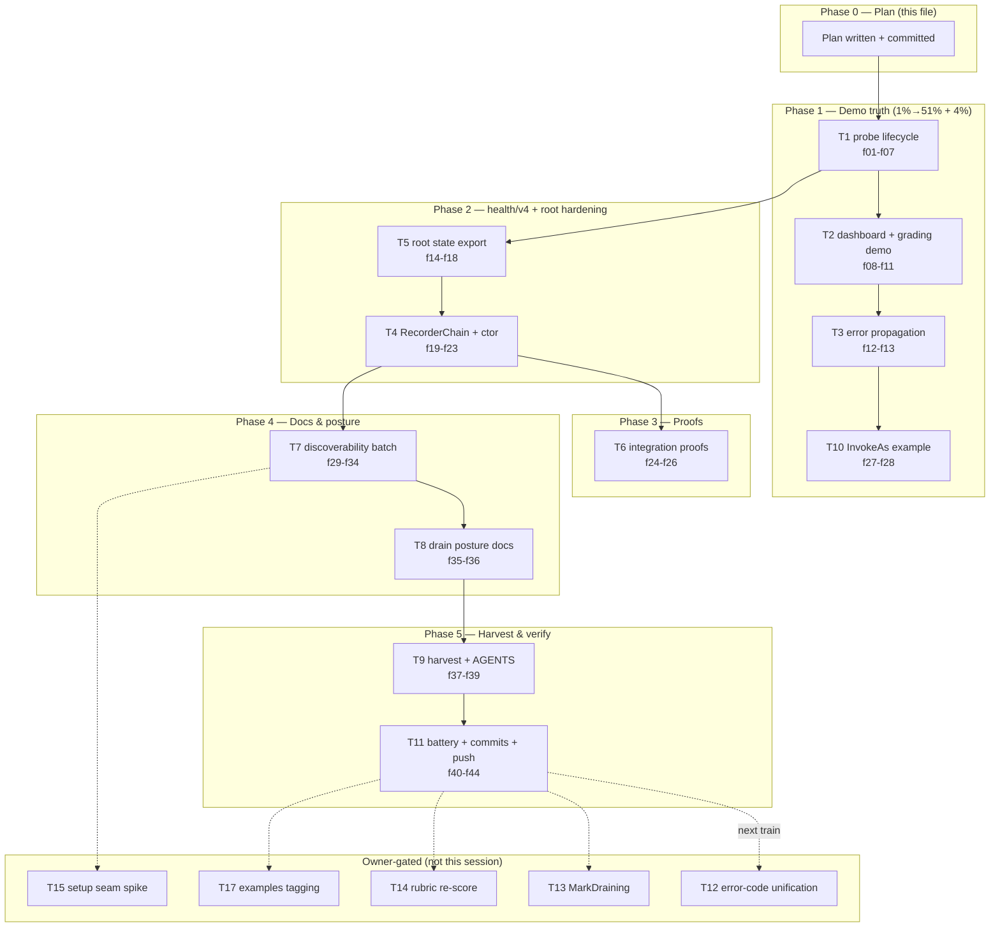

# SUPERB: samber/do × Health — Truth, Composability & Discoverability Pareto Plan

> **Date:** 2026-10-09 16:52 CEST
> **Input sources:** `docs/research/2026-10-08_samber-do-v2-health-checks-deep-review.md` (findings F1–F9, roadmap R1–R8) + `docs/status/2026-10-09_16-21_samber-do-health-deep-review-session.md` (§f 28 items, §g 3 questions).
> **Verdict driving this plan:** bridges superb (8/10), flagship demo false-greens (3× P1), one composability ceiling, one discoverability gap, two owner-gated decisions.
> **Anti-verschlimmbesser contract:** every change must leave the repo verifiably no worse. No wire-string changes without owner approval. No new defaults. Published-module code changes carry CHANGELOG receipts and ride the next train (release bundling is release-time per the 2026-10-09 decision in TODO_LIST).

## 0. Decisions made in this plan

| Question (from status §g) | Decision | Rationale |
| ------------------------- | -------- | ---------- |
| Q1: fix the P1 demo findings? | **EXECUTE NOW** | This dispatch's "keep going until everything works" is the instruction; demo is an examples module — zero published-code risk, no train blocker. |
| Q2: unify projection-health error codes (wire-visible)? | **OWNER-GATED (T12)** — recommendation: align health/v4 onto root's `projection.*` codes (health is the younger, less-deployed surface) in the next minor train, CHANGELOG receipt. NOT executed now. | 503-body strings may be matched by consumer alerting; my grep cannot see consumer dashboards. |
| Q3: setup.Run drain posture? | **EXECUTE docs posture (T8)**: document `RunWithAppkit` as THE production drain path. Code alternative (`Bundle.MarkDraining()`) stays OWNER-GATED (T13). | Docs-only is reversible and true today; code adds surface the owner may not want. |

## 1. Pareto Breakdown

### The 1% that delivers 51%

**T1 — call `probe.Start(ctx)` + mount the real probe routes in `samber-do-demo`.**
One ~30-line change kills the repo's most-copied false-green: the demo's
`/health` becomes real, `/healthz`//`readyz`//`startupz` exist, and the
empty-green `/health-ui` gets a live cache behind it. Everything else in this
plan is worth less than this single fix.

### The 4% that delivers 64%

T1 + **T2** (dashboard lifecycle + critical-services demo) + **T3** (eager-init
error propagation). Together: the flagship demo goes from "health theater" to
the canonical proof of the README wiring — all three P1s dead, verified by
tests that fail on regression.

### The 20% that delivers 80%

T1–T11: demo truth + `health/v4` hardening (RecorderChain, purpose-built
constructor, no string mirroring) + root state export + integration proofs +
full docs discoverability batch + TODO harvest + verification battery. This is
everything executable this session without owner input.

### The other 20% → 100%

T12–T18: the two owner-gated items (wire-visible error-code unification;
`MarkDraining()` code path), rubric re-score, setup↔go-health seam evaluation,
examples-module tagging policy check, research-report outcome annotations, and
the release-train bundling of the published-module deltas (release-time, not
now).

## 2. Comprehensive Plan — medium tasks (30–100 min each)

Sorted by importance/impact/effort/customer-value. Tier: execution Pareto band.

| ID  | Task                                                                                                    | Tier | Impact | Effort | Category      | Depends on |
| --- | ------------------------------------------------------------------------------------------------------- | ---- | ------ | ------ | ------------- | ---------- |
| T1  | Demo probe lifecycle: live-repro F1, `probe.Start` + `AsShutdowner` registration, `RegisterRoutes`, delete static `/health`, regression tests | 1%   | Critical | 90m  | Bug          | —          |
| T2  | Demo dashboard lifecycle (`dash.Start` or `dashboard.Register`), `WithCriticalServices`+`WithVersion`, `/health-ui` ≥7-checks test, README | 4%   | Critical | 60m  | Bug          | T1         |
| T3  | Demo: propagate eager-init `do.Invoke` errors from `NewContainer` (kill slog-and-continue) + failure test | 4%   | High     | 30m  | Bug          | —          |
| T5  | Root: export projection drain-ready states (additive API) + health/v4 consumes them (delete string mirror) + tests + CHANGELOG | 4%   | High     | 60m  | Quality      | —          |
| T4  | health/v4: `RecorderChain` decorator + `NewProbe` on `NewWithHealthCheck` (drop throwaway injector) + tests + CHANGELOG receipt | 4%   | High     | 90m  | Feature      | T5         |
| T6  | integration_test: probe.Start+RegisterRoutes end-to-end proof; auditlog-plugin-as-recorder composition proof | 20%  | High     | 90m  | Test         | T4         |
| T7  | Docs discoverability batch: health/README surface map + do extras; setup/README + root README cross-links; auditlog README wording; flightrecorder + batteries mentions | 20%  | High     | 90m  | Documentation | T4         |
| T8  | setup drain posture: document `RunWithAppkit` as production drain path (Q3 docs decision) | 20%  | Medium   | 30m  | Documentation | —          |
| T9  | Harvest plan rows → TODO_LIST.md; AGENTS.md pointer to research report; gates on touched docs | 20%  | Medium   | 30m  | Cleanup      | all exec   |
| T10 | Demo `InvokeAs[TOTPProvider]` interface-resolution example + test | 20%  | Low      | 30m  | Documentation | T3         |
| T11 | Verification battery: per-module tests, `nix run .#test`, `.#lint`, status/docs gates; phase commits; push | 20%  | Critical | 100m | Verification | T1–T10     |
| T12 | OWNER-GATED: unify projection-health error codes (health→root codes), CHANGELOG, minor train | rest | High  | 60m  | Feature      | owner OK   |
| T13 | OWNER-GATED: `setup.Bundle.MarkDraining()` + healthHandler honoring it (code drain path) | rest | Medium | 90m  | Feature      | owner OK   |
| T14 | Re-score review vs architecture-review rubric; outcome note in research report | rest | Low   | 30m  | Quality      | T11        |
| T15 | Evaluate `setup.Config` seam for serving go-health probes (spike → likely ROADMAP) | rest | Low   | 60m  | Feature      | T7         |
| T17 | Examples-module tagging policy check; document disposition (tag or not) | rest | Low   | 30m  | Process      | T11        |
| T18 | Research-report outcome notes (five-vs-seven phrasing clarification; execution receipts) | rest | Low   | 30m  | Documentation | T11        |

## 3. Fine Breakdown — every task ≤ 12 min

Sorted by importance/impact/effort/customer-value within parent groups.

| ID   | Task (≤12 min)                                                                  | Parent | Impact | Category     |
| ---- | ------------------------------------------------------------------------------- | ------ | ------ | ------------ |
| f01  | Live-repro F1: run demo, curl `/health-ui` + `/health`, capture empty-green evidence | T1  | Critical | Verification |
| f02  | Wire probe lifecycle in container: `probe.Start(ctx)` + register `AsShutdowner` so injector.Shutdown stops loop | T1  | Critical | Bug          |
| f03  | main.go: mount `probe.RegisterRoutes(mux, DefaultRoutes())`; delete static `/health` handler | T1  | Critical | Bug          |
| f04  | Demo test: `/readyz` + `/healthz` 200 post-Start (mux-level, like main wires it) | T1  | Critical | Test         |
| f05  | Demo test: `/health-ui` HTML contains the 7 projection check names post-Start | T1  | Critical | Test         |
| f06  | Demo test: critical projection classification (fail → 503 path unit test w/ fake) | T1  | High     | Test         |
| f07  | Re-run F1 repro → assert fixed (curl shows real checks) | T1  | High     | Verification |
| f08  | Dashboard lifecycle: `dash.Start(ctx)` (+ Shutdown via DI) or `dashboard.Register(injector, probe)` | T2  | Critical | Bug          |
| f09  | `health.NewProbe(svc, WithCriticalServices(...), WithVersion(...))` in provider | T2  | High     | Documentation |
| f10  | Demo test: dashboard SSE/JSON surface answers after Start | T2  | High     | Test         |
| f11  | Demo README: health section (real wiring + endpoint table) | T2  | Medium   | Documentation |
| f12  | NewContainer: return eager-Invoke errors instead of slog-and-continue | T3  | High     | Bug          |
| f13  | Demo test: broken provider → NewContainer errors | T3  | Medium   | Test         |
| f14  | Root: design + implement exported drain-ready state API (consts + `ProjectionDrainReady(status) bool`) | T5  | High     | Feature      |
| f15  | Root unit tests for the exported API | T5  | Medium   | Test         |
| f16  | health/probe.go: consume exported states; delete `statusLive/statusStopped` mirror | T5  | High     | Quality      |
| f17  | health tests green after mirror removal | T5  | Medium   | Test         |
| f18  | Root CHANGELOG [Unreleased] receipt (state export) | T5  | Medium   | Process      |
| f19  | health/v4: implement `RecorderChain(...)` (ordered merge, later wins, nil-safe) | T4  | High     | Feature      |
| f20  | RecorderChain unit tests: precedence, nil elements, empty chain | T4  | High     | Test         |
| f21  | Switch `NewProbe` to `gohealth.NewWithHealthCheck` (drop dummy `do.New()`) | T4  | Medium   | Quality      |
| f22  | Adjust/extend NewProbe tests for new constructor path | T4  | Medium   | Test         |
| f23  | Root CHANGELOG [Unreleased] receipt (health/v4 changes ride own train; note in receipt) | T4  | Medium   | Process      |
| f24  | integration_test: probe.Start+RegisterRoutes E2E proof vs real Service | T6  | High     | Test         |
| f25  | integration_test: plugin-as-recorder composition proof (auditlog observe + injector checks) | T6  | High     | Test         |
| f26  | Run integration_test module suite both modes (workspace) | T6  | High     | Verification |
| f27  | Demo: `InvokeAs[TOTPProvider]` provider/alias example | T10 | Low      | Documentation |
| f28  | Demo test: resolve via `InvokeAs` | T10 | Low      | Test         |
| f29  | health/README: "which surface for which consumer" map table | T7  | High     | Documentation |
| f30  | health/README: samber/do extras (`do.WithHealthCheckTimeout`, `checks` batteries, `WithInstanceID`) | T7  | Medium   | Documentation |
| f31  | setup/README: health section cross-link to health/v4 | T7  | High     | Documentation |
| f32  | root README: module table mention of health/v4 bridge | T7  | Medium   | Documentation |
| f33  | auditlog/README: composition wording fix (one recorder; link RecorderChain) | T7  | High     | Documentation |
| f34  | health/README: flightrecorderhealth trigger mention (fleet pattern) | T7  | Low      | Documentation |
| f35  | setup/README: drain posture — RunWithAppkit = production drain path | T8  | Medium   | Documentation |
| f36  | Verify drain claims against `run_appkit.go` (ReadyCheck, DrainDelay) | T8  | Medium   | Verification |
| f37  | TODO_LIST.md: harvest rows (strike plan items as done; add open: T12/T13/T14/T15/T17) | T9  | High     | Cleanup      |
| f38  | AGENTS.md: one-line pointer to research report (known P1s, plan path) | T9  | Medium   | Documentation |
| f39  | Format touched docs (`nix run .#fmt -- <paths>`) + status gates green | T9  | Medium   | Verification |
| f40  | Per-module test runs (demo, health, root, integration_test) | T11 | Critical | Verification |
| f41  | `nix run .#test` full workspace battery | T11 | Critical | Verification |
| f42  | `nix run .#lint` | T11 | High     | Verification |
| f43  | Phase commits with detailed messages (plan / demo / root+health / integration / docs / TODO+AGENTS) | T11 | Critical | Process |
| f44  | `git push` (pre-push strict gates) + confirm CI started | T11 | Critical | Process |
| f45  | T12 owner-decision packet entry (error-code unification proposal + breakage analysis) | T12 | High     | Process |
| f46  | T13 owner-decision packet entry (MarkDraining vs docs posture) | T13 | Medium   | Process |
| f47  | Load architecture-review rubric; re-score; note deltas | T14 | Low      | Quality      |
| f48  | Research-report outcome note (re-score + five-vs-seven clarification + execution receipts) | T14 | Low      | Documentation |
| f49  | T15 spike notes → ROADMAP entry (setup↔go-health seam) | T15 | Low      | Documentation |
| f50  | Check examples-module tagging policy (go.work member, tags?); document disposition | T17 | Low      | Process |

## 4. Execution graph

Commit boundaries (gotcha-4): Phase 0 plan → Phase 1 demo → Phase 2 code → Phase 3 proofs → Phase 4+5 docs/harvest → single push (f44).

## 5. Verification battery (T11)

1. `GOEXPERIMENT=jsonv2 go test ./... -count=1 -race` in: examples/samber-do-demo, health, root, integration_test.
2. `nix run .#test` (full-workspace, hermetic — the gotcha-30 catch).
3. `nix run .#lint`.
4. Status gates: `check-status-rows.py` + `check-status-annotations.sh` (docs/status touched via TODO harvest? no — only if rows change).
5. `nix run .#fmt -- <touched paths>` per phase.
6. Push passes the strict pre-push release-train + version-drift gates (no version changes expected → green).

## 6. What deliberately does NOT happen this session

- **No wire-string changes** (Q2/T12) — owner-gated.
- **No `MarkDraining()` implementation** (Q3/T13) — docs posture only.
- **No version bumps / tags** — published-module deltas (root state export, health/v4 API) ride the next train at release time with their CHANGELOG receipts already in place.
- **No rewrites of the published research report** — outcome notes are additive.
