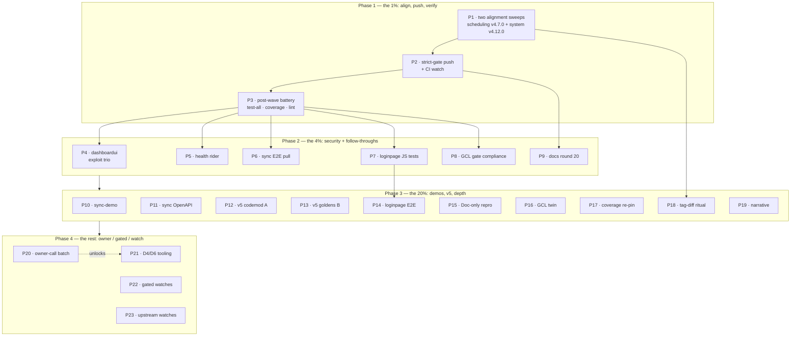

# SUPERB — Post-Wave Alignment, Push, Battery & Security Tail Pareto Plan

**Date:** 2026-10-10 23:42 CEST
**Baseline:** master `b260069a`, **8 unpushed commits** (the systemadapter systemscenario migration `749ddbb5` + proxy resolution `e4f9784f` + daemon carriers) · train state **live-checked this minute: 844 requires / 0 unpublished / 0 replace-exempted / 13 lag** (scheduling v4.6.2→v4.7.0 ×setup+usermgmt; system v4.12.0 consumers — the GCL systemscenario wave PUBLISHED, the gotcha-36 dev-replace is DROPPED) · CI green on `c5bbc693` (17 jobs) · templ-components healed (v1.21.0 aligned 2026-10-08).
**Inputs:** `TODO_LIST.md` 2026-10-09-early state (all open rows absorbed below) · the 2026-10-05 status report's (f)/(g) · plans 10-06→10-09 remainders (dashboardui hardening Phase 1; samber/do×health tails; ADR-0056 sync tails; GCL F22 tails) · live `check-release-train --refresh-cache` output (this session).
**Format note:** `pareto-planning` is HTML-canonical; the operator explicitly requested `.md` + a Mermaid graph. Override honored and recorded (same as the 15-48 and 10-04 plans).

> **GUARD RAIL (operator, standing):** *"If you VERSCHLIMMBESSER this system, I will cut off your balls."*
> Nothing here rips out working code. Foreign/concurrent-session diffs are untouchable (gotcha-4 smoke-check before any commit while a session is active). Tags only via `scripts/tools/verify-tag.sh`. Measurement gates refuse under load. No speculative rewrites — every task maps to an open TODO row.

---

## 0. Pareto breakdown — what is "the result"?

**The result = a zero-lag PUSHED master, battery-verified, with the known exploit-class UI holes closed.** The systemscenario wave just published; every blocker from the 10-09 plans dissolved THIS EVENING. The 8-commit pile includes a module migration that CI has never seen — pushing it green is the gate for everything else.

| Tier | Tasks | Share | Why |
| --- | --- | --- | --- |
| **1%** | P1 alignment sweeps + P2 strict-gate push + P3 post-wave battery | **51%** | Lag 0 + pushed = the migration is consumer-visible, CI proves it, and every deferred battery/bench leg unblocks (the replace-drop made `.#test-all` hermetic-runnable again). |
| **4%** | P4 dashboardui exploit trio + P5 health rider + P6 sync E2E + P7 loginpage JS tests + P8 GCL gate compliance + P9 docs round | **64%** | Closes the only known security-class holes (SSE XSS, CSS injection, CSV formula injection — plan 10-06 "unblocked now"), lands the two follow-through trains' highest tails, and pays the gate debt that blocks the next GCL train. |
| **20%** | P10–P19 (sync demo + OpenAPI, v5 codemod + goldens, loginpage E2E, GCL repro + twin, coverage re-pin, tag-diff ritual, narrative) | **80%** | The oldest honest debts: the v5 owner requirement (Tracks A+B), test-depth on the newest surfaces, and the sweep-bump verification ritual (gotcha 24). |
| **rest** | P20–P23 (owner calls, D4/D6 gates, upstream/v5/demand-gated watches, buildcache) | **100%** | Routed, not forgotten. Owner-gated means owner-gated. |

---

## 1. Table A — Comprehensive plan (30–100 min tasks, ALL open TODO rows, sorted by tier → impact → effort)

| # | Task | TODO ref | Impact | Effort | Tier | Depends | Verifiable done-when |
| --- | --- | --- | --- | --- | --- | --- | --- |
| P1 | **Train-lag alignment sweeps** (recipe from the live gate output): `bump-dep.sh 'go-cqrs-lite/scheduling/v4$' v4.7.0` then `'…/system/v4$' v4.12.0`, one `--commit` sweep each, PASS tables verified | row 26 remainder | **Critical** | S (30m) | 1% | — | `check-release-train --refresh-cache --strict-lag 0` → 844+/0/0/0 |
| P2 | **Strict-gate push of the full pile** (plan + systemscenario migration + sweeps ≈ 11 commits) + CI watch to green | directive #8 | **Critical** | S–M (30–45m) | 1% | P1 | pre-push strict gates green; CI run id recorded; the 4 systemadapter-class jobs green (replace dropped) |
| P3 | **Post-wave verification battery**: `nix run .#test-all` (28 modules, now hermetic-runnable — replace gone) + `.#coverage-gate` re-run (sync/hardening waves unmeasured) + fleet lint sweep; bench-spike ONLY at verified quiet (load < 6 twice) | row 62 | **Critical** | M–L (60–100m) | 1% | P2 | all rc=0 or honest refusal with load numbers; coverage re-pinned if moved |
| P4 | **dashboardui Phase 1 exploit-class trio** (plan 10-06, "unblocked now"): SSE XSS `layout.go:379` (event data into DOM unescaped), AccentColor CSS injection `layout.templ:76`, CSV formula-injection guard `export.go` (=,+,−,@ prefixes) — behind goldens + class-set + both-world tests | row 22 | **Critical** | L (100m) | 4% | — | 3 fixes landed + tests pinning each injection vector; gates green; rides next dashboardui train |
| P5 | **Health train rider**: delete `statusLive/statusStopped/statusFailed` mirrors in `health/probe.go` → consume `cqrshtmx.ProjectionStatus*`; bump health's root require at the next health tag; add the deferred `RecorderChain(Recorder,auditPlugin)` integration_test half (needs the PUBLISHED root tag — gotcha 30) | row 32 tail 1 | High | M (45m) | 4% | root tag | mirrors gone; integration_test chain proof green against the tag |
| P6 | **Sync Playwright E2E pull-loop specs**: batch push on reconnect, offline reads via `window.cqrsSync.getEvents()`, `sync:reset` on backendId change (current 4 specs cover queue/ACK only) | row 39 tail 2 | High | L (60–100m) | 4% | — | 3 new specs green in the e2e suite |
| P7 | **loginpage JS smoke tests**: plain `node:test` harness (zero-dep posture), Base64URL round-trip property test, `serializeAssertion`/`serializeAttestation` shape goldens, wired into the `go test` lane | row 73 | High | M–L (60m) | 4% | — | `go test ./...` triggers the JS suite; green |
| P8 | **GCL gate compliance** (M04–M10 surface): fix the captured 11 findings (gci ×10 `command/*.go` + commandlifecycle tests, gocognit ×1); run the unrun legs (cqrs-lint, coverage) in that repo | row 56 (b) | High | M (45m) | 4% | — | golangci rc=0; cqrs-lint + coverage verdicts recorded |
| P9 | **Round-20 docs-health pass**: annotate + archive the 21-09 T01 report + the 10-05 round-17 report; HARVEST this plan; TODO restamp with the post-wave truth | docs convention | Med | S–M (30–45m) | 4% | P2 | tail ≤ 1; annotations gate green; TODO header current |
| P10 | **`examples/sync-demo`**: runnable demo wiring pull + push + filter + indicator (the guide's snippets executable) | row 39 tail 3 | Med | L (100m) | 20% | — | demo runs; README-cheap to verify |
| P11 | **OpenAPI metadata for `/sync/pull` + `/sync/push`** via the existing builder (wire shapes emitted) | row 39 tail 5 | Med | M (45m) | 20% | — | `WithOpenAPI` output includes both operations; golden/test |
| P12 | **v5 codemod Track A scaffold** (`cqrs-htmx-upgrade`): rules R1–R3 + R9–R10 from the removal inventory, dry-run default, R1 golden consumer fixture | row 100 | **High** | L (100m) | 20% | — | scaffold builds; R1 fixture golden-passes; dry-run report mode works |
| P13 | **v5 Track B data-compat goldens**: record a real v4.13 journal fixture (21 events), decode goldens, upcaster coverage matrix, fold-equivalence harness skeleton | row 100 | **High** | L (100m) | 20% | — | goldens green on v4 bytes |
| P14 | **loginpage Playwright E2E**: real WebAuthn ceremony happy + failure path through the rendered page + a full-page render golden (replaces `strings.Contains`-style assertions) | row 73 | Med | L (60–100m) | 20% | P7 | e2e spec green; golden pins the full render |
| P15 | **go-cqrs-lite "Doc-only" hook misclassification repro** (M7): small Go staged diff through that repo's hook; root cause + upstream ask (coordinate — that repo has an active owner session) | row 71 | Med | M (45m) | 20% | — | repro captured; cause + ask drafted |
| P16 | **GCL `fail()`/`Close()` teardown twin** unification behind one internal function | row 56 (e) | Low | S (30m) | 20% | — | twin gone; metaengine suite still green |
| P17 | **loginpage coverage re-pin** post-adoption (quiet window; coverage gate floor check) | row 97 micro | Med | S (30m) | 20% | P3 | gate green at the new pin |
| P18 | **Gotcha-24 tag-diff ritual** for the undiffed sweep bumps: scheduling v4.6.2→v4.7.0 + system v4.11.0→v4.12.0 (clone tag ranges; confirm no unlabeled code migrations; especially `system` — ADR-0153 was in-flight) | round-19 M5 precedent | Med | S–M (30–45m) | 20% | P1 | both diffs audited; findings recorded or clean |
| P19 | **agents-notes systemscenario narrative** (the 2026-10-09→10 arc: ADR-0153, the go-snaps harness indirects, the migration + replace-drop + proxy resolution) assembled from source reports | AGENTS gotcha 36 long-form | Low | S–M (30–45m) | 20% | — | dated history in agents-notes; gotcha 36 linked |
| P20 | **Owner-call batch (one sitting)**: PapDashboard reply SEND · datastar-demo keep confirm · E005 proposal file approval · GCL cross-repo records approval (its g1) · T12 error-code unify · T13 MarkDraining · OQ28 credential-memo input · OQ11 v5 timeline · module-rename names | rows 98, 95, 88, 90, 32 tails 4–5, 81, ROADMAP OQ | High (owner) | S (30m) | rest | owner | each tick unlocks its row |
| P21 | **D4/D6-gated tooling**: cqrs-lint fleet binary swap (steps + expected B024 re-adds documented) · cqrs-lint strict CI gate (tag decision) · samber/do F12 + go-health F11 upstream filings (owner which/whether) + crush-config lessons.md cross-project entries | rows 60, 89, 32 tails 2–3 | Med | M (45m+) | rest | D4/D6 owner | swap verified fleet-wide; CI lane green; filings live |
| P22 | **Gated/dormant watches** (re-check triggers recorded): V007 cluster-1 (upstream metaengine criterion) · appkit (v5 window) · ProjectionLayer (v5 bundle) · DataStar Tier 4 (demand) · SidebarNav (library zero-JS drawer — criterion 2 still unmet at v1.21.0) · BF1–BF3 (upstream BuildFlow) · `/mnt/buildcache` reclaim (human) | rows 86, 87, 94, 69, 67, 68, 93 | — | gated | rest | per-row | stays routed; each re-check recorded on its row |
| P23 | **Upstream watches**: templ#1449 fix verification in v0.3.1070 + workaround retirement riding the next templ-components train · treefmt-nix#545 · BuildFlow#29 · go-cqrs-lite unpushed daemon commit (its owner's call) | row 34, AGENTS 22 | Low | S | rest | upstream | responses checked each train; shims retired when landed |

**Task count: 23 (≤27). All 30–100 min. Every open TODO row absorbed** (rows 22, 26-rem, 32, 34, 39, 56, 60, 62, 67–100 + D-index + directive #8).

---

## 2. Table B — Micro-task breakdown (≤12 min each, execution-sorted)

| ID | Micro-task | Time | Parent | Done-when |
| --- | --- | --- | --- | --- |
| 1.1 | `git status` smoke-check (foreign WIP? daemon velocity?) + `df -h /mnt/buildcache` | 3m | P1 | clean/known |
| 1.2 | Sweep 1: `bump-dep.sh 'larsartmann/go-cqrs-lite/scheduling/v4$' v4.7.0 --commit` | 8m | P1 | PASS table + commit |
| 1.3 | Sweep 2: `bump-dep.sh 'larsartmann/go-cqrs-lite/system/v4$' v4.12.0 --commit` | 10m | P1 | PASS table + commit |
| 1.4 | `check-release-train --refresh-cache --strict-lag 0` → expect 0/0/0 | 5m | P1 | strict green |
| 2.1 | `wait-tree-quiet` (foreign-session check) before push | 5m | P2 | quiet |
| 2.2 | `git push origin master` (pre-push strict train + version-drift run) | 8m | P2 | pushed |
| 2.3 | CI watch: `gh run list --limit 1` → run id; watch the systemadapter-class + module-architecture + lint jobs | 10m | P2 | run green recorded |
| 2.4 | If CI red: triage first job only (CI surfaces one per job), fix-or-route with evidence | 12m | P2 | disposition recorded |
| 3.1 | Load check ×2 (`uptime`) — battery go/no-go (correctness gates load-insensitive: run regardless) | 3m | P3 | recorded |
| 3.2 | `nix run .#test-all` (28 modules incl. e2e/examples) | 12m | P3 | rc=0 |
| 3.3 | `nix run .#test` race battery (if not implied by 3.2's pass) | 12m | P3 | rc=0 |
| 3.4 | `nix run .#coverage-gate` (15 modules; re-pin if moved — quiet only for re-pin) | 12m | P3 | 15/15 |
| 3.5 | `nix run .#lint` fleet sweep (sync surface + sweeps never linted) | 12m | P3 | 0 issues |
| 3.6 | bench-spike ONLY if load < 6 twice; else honest refusal logged | 5m | P3 | gate green or refusal |
| 4.1 | Read `dashboardui/layout.go:370–390` + the SSE data path; confirm the XSS vector + fix shape (escape or textContent) | 12m | P4 | vector + fix named |
| 4.2 | SSE XSS fix + a pinning test (hostile event payload renders inert) | 12m | P4 | test green |
| 4.3 | AccentColor injection: read `layout.templ:70–80`; validate/escape like loginpage's `validateAccentColor` (adopt, don't duplicate — check for a shared helper) | 10m | P4 | fix chosen |
| 4.4 | AccentColor fix + hostile-accent test | 12m | P4 | test green |
| 4.5 | CSV formula injection: read `export.go`; guard `=`,`+`,`-`,`@` (and tab/CR) prefixes | 10m | P4 | guard written |
| 4.6 | CSV guard + hostile-cell test (both download paths) | 12m | P4 | test green |
| 4.7 | dashboardui gates: goldens + class-set + codegen + both-world tests + lint | 12m | P4 | all green |
| 4.8 | Commit at the boundary (module code — rides next dashboardui train, no out-of-band tag) | 3m | P4 | committed |
| 5.1 | Read `health/probe.go` mirrors + root `ProjectionStatus*` API | 8m | P5 | swap map |
| 5.2 | Delete mirrors → consume root types; fix call sites | 12m | P5 | builds |
| 5.3 | health tests + lint (module-scoped) | 10m | P5 | green |
| 5.4 | At next health tag window: verify-tag + require bump + `RecorderChain` integration_test half | 12m | P5 | proof green |
| 6.1 | Read the 4 existing offline-sync specs + harness shape | 10m | P6 | map written |
| 6.2 | Spec: batch push on reconnect (queue drains, per-command outcomes asserted) | 12m | P6 | green |
| 6.3 | Spec: offline reads via `window.cqrsSync.getEvents()` | 12m | P6 | green |
| 6.4 | Spec: `sync:reset` on backendId change (cache cleared, queue KEPT — decision pin) | 12m | P6 | green |
| 6.5 | e2e suite run + screenshots-if-drifted + commit | 10m | P6 | suite green |
| 7.1 | Scaffold `loginpage/internal/js-tests` node:test harness + `go test` exec wrapper | 12m | P7 | harness runs |
| 7.2 | Base64URL round-trip property test (random bytes ×200) | 12m | P7 | green |
| 7.3 | `serializeAssertion` shape golden | 12m | P7 | green |
| 7.4 | `serializeAttestation` shape golden | 12m | P7 | green |
| 7.5 | Wire into the flake `#test` lane + CI-green check | 10m | P7 | lane green |
| 8.1 | In go-cqrs-lite: fix gci ×10 (`command/*.go` + commandlifecycle tests import grouping) | 12m | P8 | golangci cleaner |
| 8.2 | Fix gocognit ×1 (extract helper) | 12m | P8 | rc=0 |
| 8.3 | Run `cqrs-lint` leg on the M04–M10 surface; record verdict | 10m | P8 | verdict |
| 8.4 | Run coverage leg; record | 10m | P8 | verdict |
| 9.1 | Annotate the 10-10 21-09 T01 report (outcomes) | 10m | P9 | blockquote |
| 9.2 | Annotate the 10-05 20-32 round-17 report (post-wave outcomes) | 10m | P9 | blockquote |
| 9.3 | Archive both; tail-budget check | 5m | P9 | tail ≤ 1 |
| 9.4 | HARVEST this plan into TODO/ROADMAP; restamp TODO header | 12m | P9 | rows current |
| 10.1 | Scaffold `examples/sync-demo` (server + page + filter) | 12m | P10 | builds |
| 10.2 | Pull + push + indicator wiring | 12m | P10 | demo flows |
| 10.3 | Offline toggle + reset button; README | 12m | P10 | documented |
| 10.4 | Demo tests + `#test` lane + commit | 10m | P10 | green |
| 11.1 | Emit `/sync/pull` operation metadata (params: cursor/filter; resp: events + headers) | 12m | P11 | builder test |
| 11.2 | Emit `/sync/push` operation metadata (batch + per-command outcomes) | 12m | P11 | builder test |
| 11.3 | Golden for the emitted spec fragment | 10m | P11 | golden green |
| 12.1 | Scaffold `cmd/cqrs-htmx-upgrade` (dry-run report mode first) | 12m | P12 | builds |
| 12.2 | Rule R1 (CSRF re-export imports → httputil) + unit fixture | 12m | P12 | fixture passes |
| 12.3 | Rules R2–R3 (SSE re-exports, Raw broadcaster) + fixtures | 12m | P12 | fixtures pass |
| 12.4 | Rules R9–R10 (usermgmt alias imports → identity-model) + fixtures | 12m | P12 | fixtures pass |
| 12.5 | R1 golden consumer fixture (round-trips end-to-end) | 12m | P12 | golden green |
| 13.1 | Record a real v4.13 journal fixture (21 events, signed + plain variants) | 12m | P13 | fixture committed |
| 13.2 | 21-event decode goldens against v4 bytes | 12m | P13 | green |
| 13.3 | Upcaster coverage matrix (`identity-model/upcaster.go`) | 12m | P13 | matrix lands |
| 13.4 | Fold-equivalence harness skeleton (v4 folds vs upcasted) | 12m | P13 | skeleton runs |
| 14.1 | Playwright spec skeleton (loginpage + usermgmt test service + virtual authenticator) | 12m | P14 | compiles |
| 14.2 | WebAuthn register→login happy path | 12m | P14 | green |
| 14.3 | Failure path (rejected credential → error surface) | 12m | P14 | green |
| 14.4 | Full-page render golden pinned | 12m | P14 | golden green |
| 15.1 | Clone go-cqrs-lite scratch; stage a small Go diff; run its hook; capture the skip | 12m | P15 | repro captured |
| 15.2 | Root-cause the classifier; draft the upstream ask (verify-before-filing) | 12m | P15 | ask drafted |
| 16.1 | Unify `fail()`/`Close()` twin behind one internal helper; suite green | 12m | P16 | twin gone |
| 17.1 | Quiet-window coverage re-pin for loginpage (gate floor honored) | 10m | P17 | gate green |
| 18.1 | Tag-diff scheduling v4.6.2→v4.7.0 (clone range; audit) | 12m | P18 | verdict |
| 18.2 | Tag-diff system v4.11.0→v4.12.0 (ADR-0153 surface — extra care) | 12m | P18 | verdict |
| 18.3 | Record findings (clean or drift) in TODO row + gotcha-24 ledger style | 8m | P18 | recorded |
| 19.1 | Assemble the systemscenario narrative from the 10-09/10-10 source reports | 12m | P19 | draft |
| 19.2 | Voice-pass + link from gotcha 36 | 10m | P19 | linked |
| 20.1 | Present the owner-call batch (P20 list) as one decision sheet | 12m | P20 | sheet ready |
| 21.1 | (post-D4) fleet cqrs-lint swap ritual per the documented steps | 12m | P21 | version verified |
| 21.2 | (post-D6) cqrs-lint CI lane + self-test confirmation | 12m | P21 | lane green |
| 21.3 | (post-owner) F12/F11 filings + lessons.md entries | 12m | P21 | filed |
| 22.1 | Watch-row sweep: record re-check verdicts (V007 criterion, appkit, T4, SidebarNav, BF) | 10m | P22 | rows updated |
| 23.1 | Check templ v0.3.1070 fix presence (scratch module, text-position repro) | 12m | P23 | verified |
| 23.2 | treefmt-nix#545 + BuildFlow#29 status check; record | 5m | P23 | recorded |

**Fine task count: 86 (≤150). All ≤12 min.**

---

## 3. Execution graph

---

## 4. Verschlimmbesserung guardrails (non-negotiable)

1. **Foreign diffs untouchable** — gotcha-4 smoke-check (`git status` + 5s root build) before any hook-committing commit while a foreign session is active; never revert a diff you didn't author.
2. **The push carries other sessions' commits** — only push after quiescence (`wait-tree-quiet`), through the strict gates, never mid-flight.
3. **Tags ONLY via `scripts/tools/verify-tag.sh`**; never re-push a version at a different commit (gotcha 5); refresh the tag cache before re-gating after ANY fresh tag (gotchas 5/27e).
4. **Sweeps use the exact-anchor `$` form** (the gate's own recipe) — sibling submodules never ride a foreign version; commit per sweep (gotcha 27).
5. **Measurement gates refuse under load** (bench-spike: < 6 twice; coverage re-pin: quiet); correctness gates run regardless.
6. **Module code rides trains** (P4/P5 changes wait for the next family train — no out-of-band tags).
7. **No speculative rewrites**: P12 implements only the inventory's listed rules; Appendix A vetoes (ideas 171/47/166/37/81/82/136) stay closed.
8. **Docs stay truthful**: every closure cites a hash, run id, or file:line; CHANGELOG receipts follow the A8.3 convention (consumer-visible only).

## 5. Verification protocol

- Per code phase: module-scoped build + vet + `-race` tests + golangci-lint, then `nix run .#test` at the wave boundary (gotcha 2: root `./...` is a FALSE green).
- Push phase: `check-release-train --strict-lag 0` + version-drift strict at the boundary; CI run id recorded.
- Sweep phase: per-sweep PASS table + per-module `go mod verify`; hermetic `GOWORK=off go mod tidy -diff` loop (gotcha 27d residue).
- Docs phase: links + freshness + both status gates + scoped `.#fmt`.
- Close-out: `nix run .#check-modules` composite at the first quiet window after Phases 1–2.
