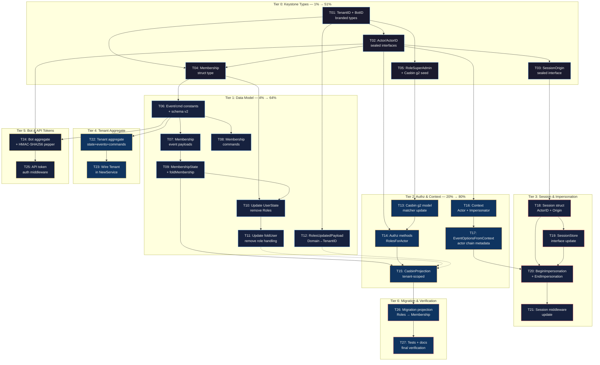

# Identity Model Redesign — Pareto Execution Plan

**Created:** 2026-06-21 07:31 | **Author:** Crush | **Status:** PLANNING → EXECUTION

**Scope:** Implement the Actor/Tenant/Membership/Impersonation redesign from
[`do../../brainstorming/2026-06-21_actor-tenant-impersonation-redesign.html`](../../brainstorming/2026-06-21_actor-tenant-impersonation-redesign.html)

**Constraint:** DO NOT BREAK BUILD. Every task ends with `go build ./...` + `go test ./...` green.

---

## Executive Summary

The current `usermgmt` module has 7 foundational identity model gaps (P1-P7 from the
brainstorming report). This plan implements the redesign incrementally — new types are
added alongside existing ones, wired gradually, and old types removed only when all
references are gone. The build stays green at every commit.

**Impact:** Resolves multi-tenancy, machine identity (bots), impersonation audit trails,
role hierarchy, and the User/Membership role decoupling in one coherent migration.

**Risk:** HIGH — touches 13+ files, changes public API (v2→v3), requires event schema
bump. Mitigated by incremental approach + comprehensive test coverage (500+ existing tests).

---

## Pareto Breakdown

### 1% Effort → 51% Value: Keystone Types

**Why:** Without these 5 type definitions, nothing else compiles. They are the foundation
every other change depends on. Once they exist, the compiler guides you to wire everything.

| # | Task                                       | File             | Impact                                           | Effort |
| - | ------------------------------------------ | ---------------- | ------------------------------------------------ | ------ |
| 1 | Add `TenantID` + `BotID` branded types     | `id.go`          | Typed tenant references replace raw strings (P2) | 15min  |
| 2 | Define `Actor`/`ActorID` sealed interfaces | `id.go`          | Unifies User + Bot under one identity type (P1)  | 30min  |
| 3 | Define `SessionOrigin` sealed interface    | `user.go`        | Enables impersonation tracking (P4)              | 20min  |
| 4 | Define `Membership` struct type            | `user.go`        | Decouples roles from User identity (P5)          | 15min  |
| 5 | Add `RoleSuperAdmin` + Casbin g2 seed      | `authz_types.go` | Enables role hierarchy inheritance (P3)          | 30min  |

### 4% Effort → 64% Value: Data Model Migration

**Why:** Data models are the hardest thing to refactor. Getting the event-sourced model
right — Membership as a first-class entity, roles off UserState — locks in the architecture.
Everything downstream (projections, authz, queries) follows from this.

| #  | Task                                        | File(s)                | Impact                               | Effort |
| -- | ------------------------------------------- | ---------------------- | ------------------------------------ | ------ |
| 6  | New event/command constants + schema bump   | `es_constants.go`      | Schema v2 foundations                | 30min  |
| 7  | Membership event payloads                   | `es_events.go` (new)   | Event-sourced membership lifecycle   | 30min  |
| 8  | Membership commands                         | `es_commands.go` (new) | Command-side of membership lifecycle | 30min  |
| 9  | MembershipState + foldMembership            | `es_state.go` (new)    | Pure fold for membership aggregate   | 45min  |
| 10 | Update UserState: remove Roles field        | `es_state.go`          | Roles are no longer User state       | 45min  |
| 11 | Update foldUser: remove role handling       | `es_state.go`          | Clean separation of concerns         | 30min  |
| 12 | Update RolesUpdatedPayload: Domain→TenantID | `es_events.go`         | Typed domain in existing events      | 30min  |

### 20% Effort → 80% Value: Authorization, Context & Audit

**Why:** With types + data model in place, extending authorization and context propagation
delivers a FUNCTIONAL system: multi-tenant RBAC, actor-chain audit trail, role hierarchy.
This is where the redesign becomes usable.

| #  | Task                                          | File(s)                   | Impact                                           | Effort |
| -- | --------------------------------------------- | ------------------------- | ------------------------------------------------ | ------ |
| 13 | Casbin g2 role hierarchy in model matcher     | `authz_types.go`          | super_admin > admin > user > viewer inheritance  | 30min  |
| 14 | Authz methods: RolesForActor, tenant-scoped   | `authz_roles.go`          | Actor-based authorization queries                | 45min  |
| 15 | CasbinProjection: tenant-scoped policies      | `es_casbin_projection.go` | Correct policy derivation from Membership events | 60min  |
| 16 | Context: WithActor + WithImpersonator         | `context.go`              | Actor chain in context (P7)                      | 30min  |
| 17 | EventOptionsFromContext: actor chain metadata | `context.go`              | Event store IS the audit trail (P7)              | 30min  |

### Remaining 80% Effort → Final 20% Value: Full System

| #  | Task                                            | File(s)                          | Impact                                        | Effort |
| -- | ----------------------------------------------- | -------------------------------- | --------------------------------------------- | ------ |
| 18 | Update Session struct: ActorID + Origin         | `user.go`                        | Session carries actor + impersonation origin  | 30min  |
| 19 | Update SessionStore interface                   | `store.go`                       | Session creation with origin/tenant           | 30min  |
| 20 | Implement BeginImpersonation + EndImpersonation | `service_impersonation.go` (new) | Full impersonation lifecycle + guards         | 60min  |
| 21 | Update session middleware: actor+impersonator   | `middleware.go`                  | HTTP → context propagation                    | 45min  |
| 22 | Create Tenant aggregate (state+events+cmds)     | `es_tenant_*.go` (new)           | Full tenant lifecycle (create/suspend/delete) | 90min  |
| 23 | Wire Tenant aggregate in NewService             | `service_core.go`                | Service-level tenant management               | 45min  |
| 24 | Bot aggregate + HMAC-SHA256 pepper hash         | `es_bot_*.go` (new)              | Machine identity + secure token storage       | 60min  |
| 25 | API token authentication middleware             | `middleware.go`                  | Bearer token → Bot resolution                 | 45min  |
| 26 | Migration projection: Roles → Membership        | `es_migration.go` (new)          | Backward compat for existing event stores     | 60min  |
| 27 | Update all tests + integration + docs           | various                          | Full test coverage + documentation            | 90min  |

---

## Comprehensive Plan — 27 Tasks (30-100min each)

Sorted by execution priority (dependency order + impact).

### Tier 0: Keystone Types (1% → 51%)

| ID  | Task                                       | Priority | Impact | Effort | Depends On | Files                              |
| --- | ------------------------------------------ | -------- | ------ | ------ | ---------- | ---------------------------------- |
| T01 | Add `TenantID` + `BotID` branded types     | P0       | 10     | 15min  | —          | `id.go`                            |
| T02 | Define `Actor`/`ActorID` sealed interfaces | P0       | 10     | 30min  | T01        | `id.go`                            |
| T03 | Define `SessionOrigin` sealed interface    | P0       | 8      | 20min  | T02        | `user.go`                          |
| T04 | Define `Membership` struct type            | P0       | 9      | 15min  | T01,T02    | `user.go`                          |
| T05 | Add `RoleSuperAdmin` + seed role hierarchy | P0       | 9      | 30min  | T01        | `authz_types.go`, `authz_roles.go` |

### Tier 1: Data Model (4% → 64%)

| ID  | Task                                             | Priority | Impact | Effort | Depends On | Files                             |
| --- | ------------------------------------------------ | -------- | ------ | ------ | ---------- | --------------------------------- |
| T06 | New event/cmd constants + schema bump            | P1       | 8      | 30min  | T04        | `es_constants.go`                 |
| T07 | Membership event payloads                        | P1       | 8      | 30min  | T06        | `es_membership_events.go` (new)   |
| T08 | Membership commands                              | P1       | 8      | 30min  | T06        | `es_membership_commands.go` (new) |
| T09 | MembershipState + foldMembership                 | P1       | 9      | 45min  | T07        | `es_membership_state.go` (new)    |
| T10 | Update UserState: remove Roles, add MembershipID | P1       | 9      | 45min  | T04,T09    | `es_state.go`                     |
| T11 | Update foldUser: remove role event handling      | P1       | 8      | 30min  | T10        | `es_state.go`                     |
| T12 | Update RolesUpdatedPayload: Domain→TenantID      | P1       | 7      | 30min  | T01        | `es_events.go`                    |

### Tier 2: Authorization & Context (20% → 80%)

| ID  | Task                                          | Priority | Impact | Effort | Depends On | Files                     |
| --- | --------------------------------------------- | -------- | ------ | ------ | ---------- | ------------------------- |
| T13 | Casbin g2 role hierarchy in model matcher     | P2       | 8      | 30min  | T05        | `authz_types.go`          |
| T14 | Authz methods: RolesForActor, tenant-scoped   | P2       | 8      | 45min  | T02,T13    | `authz_roles.go`          |
| T15 | CasbinProjection: tenant-scoped policies      | P2       | 9      | 60min  | T09,T14    | `es_casbin_projection.go` |
| T16 | Context: WithActor + WithImpersonator         | P2       | 8      | 30min  | T02        | `context.go`              |
| T17 | EventOptionsFromContext: actor chain metadata | P2       | 9      | 30min  | T16        | `context.go`              |

### Tier 3: Session & Impersonation

| ID  | Task                                            | Priority | Impact | Effort | Depends On  | Files                            |
| --- | ----------------------------------------------- | -------- | ------ | ------ | ----------- | -------------------------------- |
| T18 | Update Session struct: ActorID + Origin         | P3       | 7      | 30min  | T03         | `user.go`                        |
| T19 | Update SessionStore interface                   | P3       | 7      | 30min  | T18         | `store.go`                       |
| T20 | Implement BeginImpersonation + EndImpersonation | P3       | 8      | 60min  | T18,T19,T17 | `service_impersonation.go` (new) |
| T21 | Update session middleware                       | P3       | 7      | 45min  | T20         | `middleware.go`                  |

### Tier 4: Tenant Aggregate

| ID  | Task                                | Priority | Impact | Effort | Depends On | Files                  |
| --- | ----------------------------------- | -------- | ------ | ------ | ---------- | ---------------------- |
| T22 | Create Tenant aggregate             | P4       | 6      | 90min  | T06        | `es_tenant_*.go` (new) |
| T23 | Wire Tenant aggregate in NewService | P4       | 6      | 45min  | T22        | `service_core.go`      |

### Tier 5: Bot & API Tokens

| ID  | Task                                    | Priority | Impact | Effort | Depends On | Files                                  |
| --- | --------------------------------------- | -------- | ------ | ------ | ---------- | -------------------------------------- |
| T24 | Bot aggregate + HMAC-SHA256 pepper hash | P4       | 6      | 60min  | T02,T06    | `es_bot_*.go` (new), `crypto.go` (new) |
| T25 | API token authentication middleware     | P4       | 5      | 45min  | T24        | `middleware.go`                        |

### Tier 6: Migration & Verification

| ID  | Task                                     | Priority | Impact | Effort | Depends On | Files                   |
| --- | ---------------------------------------- | -------- | ------ | ------ | ---------- | ----------------------- |
| T26 | Migration projection: Roles → Membership | P4       | 7      | 60min  | T15        | `es_migration.go` (new) |
| T27 | Update all tests + integration + docs    | P4       | 8      | 90min  | ALL        | various                 |

---

## Detailed Breakdown — 95 Tasks (max 15min each)

Each task is atomic: one file change, one test addition, or one verification step.

### Tier 0: Keystone Types (T01-T05) → 15 sub-tasks

| ID   | Sub-task                                                                  | Est   |
| ---- | ------------------------------------------------------------------------- | ----- |
| 01.1 | Add `tenantBrand` struct + `TenantID` type alias                          | 5min  |
| 01.2 | Add `botBrand` struct + `BotID` type alias                                | 5min  |
| 01.3 | Add `NewTenantID()` + `NewBotID()` constructors                           | 5min  |
| 02.1 | Define `ActorKind` iota enum (ActorUser, ActorBot)                        | 5min  |
| 02.2 | Define `Actor` sealed interface + `actor()` seal method                   | 10min |
| 02.3 | Define `ActorID` sealed interface + `actorID()` seal                      | 10min |
| 02.4 | Make `UserID` implement `ActorID`                                         | 5min  |
| 03.1 | Define `SessionOrigin` sealed interface                                   | 5min  |
| 03.2 | Define `DirectLogin{ AuthenticatedAs ActorID }`                           | 5min  |
| 03.3 | Define `Impersonation{ By ActorID; Reason string; At time.Time }`         | 5min  |
| 03.4 | Add `SessionOrigin.IsImpersonation()` helper                              | 5min  |
| 04.1 | Define `Membership{ ActorID; TenantID; Roles []Role; AddedAt time.Time }` | 5min  |
| 04.2 | Add `Membership.HasRole(Role)` helper                                     | 5min  |
| 04.3 | Add `Membership.HasAnyRole(...Role)` helper                               | 5min  |
| 05.1 | Add `RoleSuperAdmin Role = "super_admin"` constant                        | 5min  |
| 05.2 | Add `defaultRoleHierarchy()` returning g2 seed policies                   | 10min |
| 05.3 | Apply role hierarchy in `NewAuthz()` alongside defaults                   | 10min |
| 05.4 | Write unit tests for role hierarchy inheritance                           | 10min |

### Tier 1: Data Model (T06-T12) → 22 sub-tasks

| ID   | Sub-task                                                                                 | Est   |
| ---- | ---------------------------------------------------------------------------------------- | ----- |
| 06.1 | Add `aggregateTypeMembership = "Membership"` constant                                    | 3min  |
| 06.2 | Add `aggregateTypeTenant = "Tenant"` constant                                            | 3min  |
| 06.3 | Add event constants: `eventMemberAdded`, `eventMemberRolesChanged`, `eventMemberRemoved` | 5min  |
| 06.4 | Add cmd constants: `cmdAddMember`, `cmdUpdateMemberRoles`, `cmdRemoveMember`             | 5min  |
| 06.5 | Bump `currentSchemaVersion` to 2                                                         | 3min  |
| 06.6 | Add `allMembershipEventTypes` slice                                                      | 3min  |
| 06.7 | Build + verify no compile errors (constants are additive)                                | 8min  |
| 07.1 | Create `es_membership_events.go` with `MemberAddedPayload`                               | 10min |
| 07.2 | Add `MemberRolesChangedPayload`                                                          | 10min |
| 07.3 | Add `MemberRemovedPayload`                                                               | 5min  |
| 07.4 | Write JSON round-trip tests for membership payloads                                      | 10min |
| 08.1 | Create `es_membership_commands.go` with `AddMemberCmd`                                   | 10min |
| 08.2 | Add `UpdateMemberRolesCmd`                                                               | 10min |
| 08.3 | Add `RemoveMemberCmd`                                                                    | 5min  |
| 08.4 | Write command Type()/AggregateID() tests                                                 | 10min |
| 09.1 | Create `es_membership_state.go` with `MembershipState` struct                            | 10min |
| 09.2 | Implement `foldMembership(state, evt)` — 3 event cases                                   | 15min |
| 09.3 | Write property tests for foldMembership invariants                                       | 15min |
| 10.1 | Remove `Roles []Role` field from `UserState`                                             | 5min  |
| 10.2 | Add backward-compat alias method `UserState.GetRoles()` that returns empty (deprecated)  | 5min  |
| 10.3 | Fix compile errors in `es_decide.go` (RolesUpdated guard)                                | 10min |
| 10.4 | Build green (may need to stub/alias old Roles access)                                    | 10min |
| 11.1 | Remove `eventRolesUpdated` case from `foldUser`                                          | 5min  |
| 11.2 | Remove `eventUserRegistered` role initialization                                         | 5min  |
| 11.3 | Fix compile errors in callers referencing `state.Roles`                                  | 10min |
| 12.1 | Change `RolesUpdatedPayload.Domain string` → `TenantID TenantID`                         | 10min |
| 12.2 | Add upcaster function `upcastRolesUpdatedV1toV2(raw)`                                    | 10min |
| 12.3 | Register upcaster in `unmarshalPayload` dispatcher                                       | 5min  |
| 12.4 | Write upcaster unit test                                                                 | 10min |

### Tier 2: Authorization & Context (T13-T17) → 19 sub-tasks

| ID   | Sub-task                                                               | Est   |
| ---- | ---------------------------------------------------------------------- | ----- |
| 13.1 | Add `g2 = _, _` to Casbin `role_definitions`                           | 5min  |
| 13.2 | Update matcher: `g(r.sub, p.sub, r.dom) \|\| g2(r.sub, p.sub)`         | 10min |
| 13.3 | Test: super_admin inherits admin permissions                           | 10min |
| 14.1 | Add `RolesForActor(actorID ActorID, tenantID TenantID)`                | 10min |
| 14.2 | Add `ImplicitRolesForActor(actorID, tenantID)`                         | 10min |
| 14.3 | Add `ImplicitPermissionsForActor(actorID, tenantID)`                   | 10min |
| 14.4 | Deprecate `RolesForUser` (alias to `RolesForActor`)                    | 5min  |
| 15.1 | Update `EventTypes()` to include membership events                     | 5min  |
| 15.2 | Implement `handleMemberAdded`: `AddGroupPolicy` in tenant domain       | 15min |
| 15.3 | Implement `handleMemberRolesChanged`: diff + update                    | 15min |
| 15.4 | Implement `handleMemberRemoved`: remove all tenant roles               | 10min |
| 15.5 | Fix domain fallback hack (remove `es_casbin_projection.go:69-72`)      | 10min |
| 15.6 | Write projection integration test                                      | 15min |
| 16.1 | Define `actorKey{}` + `impersonatorKey{}` context keys                 | 5min  |
| 16.2 | Implement `WithActor(ctx, ActorID)` / `ActorFromContext`               | 10min |
| 16.3 | Implement `WithImpersonator(ctx, ActorID)` / `ImpersonatorFromContext` | 10min |
| 17.1 | Extend `EventOptionsFromContext` to include `event.WithActor`          | 10min |
| 17.2 | Add impersonator to event metadata when present                        | 10min |
| 17.3 | Write test: context with impersonator → event metadata                 | 10min |

### Tier 3: Session & Impersonation (T18-T21) → 15 sub-tasks

| ID   | Sub-task                                                                       | Est   |
| ---- | ------------------------------------------------------------------------------ | ----- |
| 18.1 | Change `Session.UserID` → `Session.ActorID ActorID`                            | 5min  |
| 18.2 | Add `Session.Origin SessionOrigin` field                                       | 5min  |
| 18.3 | Add `Session.TenantID TenantID` field                                          | 5min  |
| 18.4 | Update `NewSession()` signature                                                | 10min |
| 18.5 | Fix compile errors in SessionStore + middleware                                | 10min |
| 19.1 | Update `SessionStore.Create` to accept `Session` directly                      | 10min |
| 19.2 | Update `InMemorySessionStore`                                                  | 10min |
| 19.3 | Update `SQLSessionStore`                                                       | 10min |
| 19.4 | Run session store contract tests                                               | 10min |
| 20.1 | Create `service_impersonation.go`                                              | 5min  |
| 20.2 | Implement `BeginImpersonation(target ActorID, reason string)`                  | 15min |
| 20.3 | Implement `EndImpersonation(token string)`                                     | 10min |
| 20.4 | Add security guards (super_admin only, no self-impersonation, no cross-tenant) | 15min |
| 20.5 | Write impersonation tests                                                      | 15min |
| 21.1 | Update `NewSessionMiddleware` to extract Actor + Origin                        | 10min |
| 21.2 | Store Actor + Impersonator in context                                          | 10min |
| 21.3 | Update `UserIDFromRequest` bridge for ActorID                                  | 10min |
| 21.4 | Write middleware integration test                                              | 15min |

### Tier 4: Tenant Aggregate (T22-T23) → 8 sub-tasks

| ID   | Sub-task                                                       | Est   |
| ---- | -------------------------------------------------------------- | ----- |
| 22.1 | Create `es_tenant_state.go` with `TenantState` + `foldTenant`  | 15min |
| 22.2 | Create `es_tenant_events.go` with `TenantCreatedPayload`, etc. | 15min |
| 22.3 | Create `es_tenant_commands.go` with `CreateTenantCmd`, etc.    | 15min |
| 22.4 | Implement `decideTenant` pure decision functions               | 15min |
| 22.5 | Register tenant commands in dispatch                           | 15min |
| 22.6 | Write tenant fold property tests                               | 15min |
| 23.1 | Add `TenantDecider()` to Service                               | 15min |
| 23.2 | Wire tenant repository + projection in `NewService`            | 15min |

### Tier 5: Bot & API Tokens (T24-T25) → 8 sub-tasks

| ID   | Sub-task                                                       | Est   |
| ---- | -------------------------------------------------------------- | ----- |
| 24.1 | Create `es_bot_state.go` with `BotState` + `foldBot`           | 15min |
| 24.2 | Create bot events: `BotRegisteredPayload`, `BotDeletedPayload` | 15min |
| 24.3 | Implement `HashToken(token, pepper)` using HMAC-SHA256         | 10min |
| 24.4 | Implement `VerifyToken(token, storedMAC, pepper)`              | 10min |
| 24.5 | Write HMAC hash/verify tests                                   | 10min |
| 25.1 | Implement `APITokenMiddleware` (Bearer → Bot resolution)       | 15min |
| 25.2 | Wire API token middleware alongside session middleware         | 10min |
| 25.3 | Write API token auth tests                                     | 15min |

### Tier 6: Migration & Verification (T26-T27) → 8 sub-tasks

| ID   | Sub-task                                                    | Est   |
| ---- | ----------------------------------------------------------- | ----- |
| 26.1 | Create `es_migration.go` with migration projection struct   | 10min |
| 26.2 | Implement `MigrateRolesToMemberships` projection handler    | 15min |
| 26.3 | Write migration test: replay old events → Membership events | 15min |
| 27.1 | Update existing tests for ActorID/Membership types          | 15min |
| 27.2 | Update integration_test module                              | 15min |
| 27.3 | Update README + FEATURES + AGENTS.md                        | 15min |
| 27.4 | Write ADR for identity model redesign                       | 15min |
| 27.5 | Final build + lint + test + race across ALL modules         | 15min |

---

## Execution Graph (Mermaid)



---

## Risk Analysis

| Risk                                 | Likelihood | Impact   | Mitigation                                                       |
| ------------------------------------ | ---------- | -------- | ---------------------------------------------------------------- |
| Breaking existing event payloads     | HIGH       | HIGH     | Schema v2 + upcasters. Old events replay correctly.              |
| Public API breakage (v2→v3)          | CERTAIN    | MEDIUM   | This is a v3.0.0 release. Document in CHANGELOG.                 |
| CasbinProjection double-assignment   | MEDIUM     | HIGH     | Migration projection runs once, then Membership events take over |
| foldUser removing Roles breaks tests | HIGH       | MEDIUM   | Update tests in same task. Old tests test old behavior.          |
| UserID ↔ ActorID type confusion      | MEDIUM     | HIGH     | Sealed interfaces prevent cross-assignment at compile time       |
| Event store migration on prod data   | LOW        | CRITICAL | Migration projection is opt-in. Document upgrade path.           |

---

## Anti-Verschlimmbesserung Checklist

Before each commit, verify:

- [ ] `go build ./...` passes (root + all submodules)
- [ ] `go test ./... -count=1 -race` passes (all modules)
- [ ] `golangci-lint run` passes (0 issues)
- [ ] No new files without tests
- [ ] No types added without usage (YAGNI)
- [ ] No old types removed while still referenced
- [ ] Event schema upcasters handle v1 → v2
- [ ] Casbin model change is backward compatible (g2 is additive)
- [ ] No magic strings — all new IDs are branded types

---

## Critical Path

The critical path (longest dependency chain) is:

```
T01 → T02 → T04 → T06 → T07 → T09 → T10 → T11 → T15 → T26 → T27
```

This is **11 tasks deep**. All other tasks can be parallelized around this spine.

**Parallelizable groups** (can be done simultaneously):

- Group A: T05 (Casbin seed) — independent after T01
- Group B: T03 (SessionOrigin) — independent after T02
- Group C: T12 (payload update) — independent after T01
- Group D: T16+T17 (context) — independent after T02
- Group E: T22+T23 (Tenant) — independent after T06
- Group F: T24+T25 (Bot) — independent after T02+T06

---

## Build Verification Commands

```bash
# Root module
GONOSUMCHECK='github.com/larsartmann/*' go test ./... -count=1 -race

# usermgmt submodule
cd usermgmt && GOWORK=off GONOSUMCHECK='github.com/larsartmann/*' go test ./... -count=1 -race

# integration_test module
cd integration_test && GOWORK=off GONOSUMCHECK='github.com/larsartmann/*' go test ./... -count=1 -race

# Lint
golangci-lint run && (cd usermgmt && golangci-lint run)

# Or via nix (preferred):
nix run .#test
nix run .#lint
```
