# Pareto Plan: Verification Debt Closure + Documentation + MySQL + Future Capabilities

**Date:** 2026-07-31 19:47
**Input sources:** Self-review §d-f (50 items), TODO_LIST.md (current open), ROADMAP.md (open/evaluated items), sprint execution debt
**Scope:** ALL remaining work after the 2-session sprint (T01-T18 implementation + T01-T35 debt closure)

---

## Context: What happened

Two sessions executed an 18-task Pareto plan and then a 65-task debt closure plan. The first session shipped 18 features/fixes but introduced a lint regression. The second session fixed the lint gate (69→0 issues), synced living docs, wrote missing tests, and verified all 4 nix gates green — but stopped at 35/65 tasks and left verification debt (untested E2E, skipped `go mod tidy`, ignored failing gates). This plan covers the 50-item backlog from the self-review plus TODO_LIST and ROADMAP open items.

### Already evaluated and REJECTED (do NOT plan)

| Item                                        | ROADMAP verdict                   | Reason                                                                                                                                                       |
| ------------------------------------------- | --------------------------------- | ------------------------------------------------------------------------------------------------------------------------------------------------------------ |
| `deriver` for event→command cascades        | **Not a fit** (2026-07-30)        | Tenant cleanup violates deriver purity contract (must read mutable read model). Session revocation is a direct store call, not a command.                    |
| Re-export go-cqrs-lite middleware factories | **Do NOT re-export** (2026-07-30) | Would pull ~29 new deps (full OTel SDK, failsafe-go, modernc.org/sqlite). Consumers already wire with one import. Docs + examples are the correct mechanism. |
| Durable expiry via `scheduling`             | **NOT needed** (2026-07-30)       | Every expiry mechanism has lazy checks (correctness preserved on restart). SQL store handles multi-instance for sessions.                                    |
| Redis adapters                              | **Not Planned**                   | Multi-instance ephemeral-store adapters belong in go-cqrs-lite or consumer code. Low demand.                                                                 |
| TOTP admin views in adminui                 | **Not Planned**                   | Library is passwordless-first: WebAuthn + OAuth2 only.                                                                                                       |
| v5 usermgmt decomposition                   | **Deferred to v5**                | No consumer benefit while everything shares one go.mod. Re-open when dep-tree reduction is requested.                                                        |

---

## Step 1: Pareto Breakdown

### The 1% that delivers 51%

These four tasks are trivially small, fix real verification gaps, and unblock trust in everything else:

| #     | Task                                      | Why it's 1%→51%                                                                                                                                                       | Effort |
| ----- | ----------------------------------------- | --------------------------------------------------------------------------------------------------------------------------------------------------------------------- | ------ |
| **A** | **Run `nix run .#e2e` and verify**        | The E2E flake.nix fix (runtimeInputs) was applied but NEVER TESTED. This is the #1 verification failure from the self-review. If it's still broken, the fix is a lie. | 10 min |
| **B** | **Run `go mod tidy` on all 18 modules**   | Dependency hygiene. storage/v4 version drift (v4.4.0 vs v4.5.0) was detected by check-modules. Unresolved drift risks build reproducibility issues.                   | 12 min |
| **C** | **Update TODO_LIST (remove stale items)** | 3 items are already done (state-cache test, OnProjectionFailed test, MySQL classifier). Living docs must be accurate or they're noise.                                | 8 min  |
| **D** | **Fix `errorfamily` nix app**             | The gate silently fails (`unknown command "errorfamily" for "branching-flow"`). Ignoring failing gates was explicitly identified as a process failure.                | 10 min |

### The 4% that delivers 64%

Adding these six tasks covers the documentation and verification gaps:

| #     | Task                                                   | Why                                                                                                                  | Effort |
| ----- | ------------------------------------------------------ | -------------------------------------------------------------------------------------------------------------------- | ------ |
| **E** | **Document WithStateCache in leveraging guide**        | WithStateCache is now wired by default — consumers need to know. Guide doesn't mention it.                           | 12 min |
| **F** | **Document OnProjectionFailed in projection-health**   | New opt-in callback. Guide doesn't mention it.                                                                       | 12 min |
| **G** | **Write `docs/guides/mysql-setup.md`**                 | MySQL event-store support shipped but is completely undocumented. Consumers can't use what they can't discover.      | 12 min |
| **H** | **Run cqrs-lint `--strict --verbose` across modules**  | Verification gate never run. May surface findings.                                                                   | 10 min |
| **I** | **Cover `overviewStats` ProjectionHost branch**        | 51.1% coverage — ProjectionHost health-computation branches uncovered. Needs a test with a projectionhost.Host mock. | 12 min |
| **J** | **Cover `dlqIndexHandler` ProjectionHost link branch** | 58.3% coverage — ProjectionHost link rendering uncovered. Needs a test with a host.                                  | 10 min |

### The 20% that delivers 80%

Adding these high-impact items completes the quality core:

| #     | Task                                               | Why                                                                                                               | Effort |
| ----- | -------------------------------------------------- | ----------------------------------------------------------------------------------------------------------------- | ------ |
| **K** | **WithStateCache benchmark**                       | Performance improvement is unquantified. Benchmark: first Execute (cold) vs second Execute (cache hit).           | 12 min |
| **L** | **Lockout EvictStale over-time test**              | Eviction goroutine is wired but never tested for actual eviction over time.                                       | 12 min |
| **M** | **UserDelete cascade SQL-backed test**             | Cascade was tested with in-memory read models only. SQL-backed test verifies projection processes cleanup events. | 12 min |
| **N** | **State cache invalidation-after-write test**      | Verify cache is busted on command dispatch (not just on service restart).                                         | 10 min |
| **O** | **Update event-store-storage-health.md for MySQL** | Guide mentions Postgres + SQLite only. MySQL is now supported.                                                    | 8 min  |
| **P** | **Update README.md for MySQL support**             | Consumer-facing docs should mention MySQL.                                                                        | 5 min  |
| **Q** | **Run `nix flake check`**                          | Never run this session. Full nix evaluation.                                                                      | 10 min |
| **R** | **Run `nix run .#check-codegen` (templ drift)**    | Verify no templ codegen drift.                                                                                    | 8 min  |

### The other 20% (to reach 100%)

| #      | Task                                                      | Effort |
| ------ | --------------------------------------------------------- | ------ |
| **S**  | TOTP replay-window test (document behavior)               | 10 min |
| **T**  | MySQLDialect DDL fuzz test                                | 12 min |
| **U**  | Architecture eval: configurable lockout interval          | 10 min |
| **V**  | Architecture eval: UserDelete cascade error handling      | 8 min  |
| **W**  | Architecture eval: configurable state cache capacity      | 8 min  |
| **X**  | Architecture eval: MySQLDialect UPSERT                    | 10 min |
| **Y**  | Cascade cleanup shared helper (DeleteTenant + DeleteUser) | 10 min |
| **Z**  | kv.Cache for SQL-backed read model (ROADMAP Low)          | 10 min |
| **AA** | Phantom-version CI gate in .buildflow.yml                 | 10 min |
| **BB** | cqrs-lint CI gate in .buildflow.yml                       | 8 min  |
| **CC** | Composite readiness checker (~50 LOC)                     | 12 min |
| **DD** | JSON debug endpoint (~30 LOC)                             | 10 min |
| **EE** | Verify go-cqrs-lite storage/v4.5.0 tag cleanliness        | 10 min |
| **FF** | NewMySQLSetup convenience constructor                     | 12 min |
| **GG** | MySQL session store dialect                               | 10 min |
| **HH** | MySQL snapshot store support                              | 12 min |
| **II** | MySQL UPSERT for idempotency                              | 10 min |
| **JJ** | MySQL checkpoint store                                    | 10 min |
| **KK** | Write `docs/migrations/adding-mysql.md`                   | 12 min |
| **LL** | MySQL integration test (docker-based)                     | 12 min |
| **MM** | CQRS admin CLI prototype                                  | 12 min |
| **NN** | AGENTS.md: NewUserID/SyntheticUserID gotcha               | 8 min  |
| **OO** | AGENTS.md: MySQLDialect details                           | 5 min  |
| **PP** | Audit dashboardui constants.go vs templ-components        | 10 min |
| **QQ** | go-sql-driver/mysql as tested dependency                  | 8 min  |

---

## Step 2: Comprehensive Plan (30-100 min granularity)

Sorted by impact (desc) → effort (asc) → customer-value (desc).

| ID  | Task                                                                   | Pareto | Impact                              | Effort | Value                     | Depends on |
| --- | ---------------------------------------------------------------------- | ------ | ----------------------------------- | ------ | ------------------------- | ---------- |
| T01 | Verify E2E flake.nix actually works (`nix run .#e2e`)                  | 1%     | 🔴 Critical (verification trust)    | 30 min | Every consumer E2E run    | —          |
| T02 | Run `go mod tidy` on all 18 modules + resolve version drift            | 1%     | 🔴 Critical (build reproducibility) | 30 min | All modules               | —          |
| T03 | Update TODO_LIST — remove stale items, add remaining                   | 1%     | 🔴 Critical (living doc accuracy)   | 30 min | All future sessions       | —          |
| T04 | Fix `errorfamily` nix app + verify compliance                          | 1%     | 🔴 Critical (gate integrity)        | 30 min | Error handling compliance | —          |
| T05 | Guide docs: WithStateCache + OnProjectionFailed + MySQL setup          | 4%     | 🟠 High (consumer DX)               | 60 min | All consumers             | —          |
| T06 | Coverage gaps: overviewStats + dlqIndexHandler ProjectionHost branches | 4%     | 🟠 High (coverage gate margin)      | 30 min | dashboardui quality       | —          |
| T07 | cqrs-lint strict verification + fix findings                           | 4%     | 🟠 High (lint thoroughness)         | 30 min | Code quality              | —          |
| T08 | Testing: lockout eviction + UserDelete SQL + cache invalidation        | 20%    | 🟠 High (correctness)               | 60 min | Data integrity            | —          |
| T09 | WithStateCache benchmark + TOTP replay test                            | 20%    | 🟡 Medium (perf + security)         | 30 min | Perf + security clarity   | —          |
| T10 | Documentation: README + storage-health + AGENTS.md updates             | 20%    | 🟡 Medium (consumer DX)             | 30 min | Consumer discoverability  | —          |
| T11 | Full nix verification: flake check + codegen + docs freshness          | 20%    | 🟡 Medium (release readiness)       | 30 min | Release confidence        | T02        |
| T12 | Architecture evaluations: lockout + cascade + cache + UPSERT           | rest   | 🟡 Medium (design decisions)        | 60 min | API design                | —          |
| T13 | MySQL full-backend expansion (setup + stores + UPSERT + checkpoint)    | rest   | 🟢 Low (new backend)                | 90 min | MySQL consumers           | —          |
| T14 | CI gates: phantom-version + cqrs-lint strict                           | rest   | 🟡 Medium (CI hygiene)              | 30 min | Merge quality             | T07        |
| T15 | Operational tooling: readiness checker + debug endpoint + CLI          | rest   | 🟢 Low (ops DX)                     | 60 min | Operations                | —          |
| T16 | Upstream coordination: verify v4.5.0 tag + publish bug check           | rest   | 🟡 Medium (upstream hygiene)        | 30 min | Build reproducibility     | T02        |
| T17 | MySQL integration test + fuzz test                                     | rest   | 🟡 Medium (MySQL confidence)        | 45 min | MySQL consumers           | T13        |
| T18 | Code quality polish: constants audit + AGENTS.md gotchas               | rest   | 🟢 Low (polish)                     | 30 min | Code quality              | —          |

**Totals:** 18 tasks, ~12.2 hours estimated.

---

## Step 3: Fine-Grained Breakdown (max 12 min each)

Each task decomposed into atomic steps. Sorted within parent task by execution order.

| Sub-ID | Parent | Step                                                        | Est    | Validates                |
| ------ | ------ | ----------------------------------------------------------- | ------ | ------------------------ |
| S01a   | T01    | Run `nix run .#e2e` — observe output                        | 10 min | E2E passes or fails      |
| S01b   | T01    | If fails: debug and fix (pnpm install, playwright install)  | 12 min | E2E passes               |
| S02a   | T02    | Run `go mod tidy` on root module                            | 3 min  | Dependency resolution    |
| S02b   | T02    | Run `go mod tidy` on all 17 sub-modules                     | 8 min  | Dependency resolution    |
| S02c   | T02    | Resolve storage/v4 version drift (align all to v4.5.0)      | 5 min  | Consistent versions      |
| S02d   | T02    | Verify `go build ./...` after tidy                          | 3 min  | Build still passes       |
| S03a   | T03    | Remove stale TODO items (state-cache test, OnFailed test)   | 3 min  | Living doc accuracy      |
| S03b   | T03    | Remove stale TODO item (MySQL classifier)                   | 2 min  | Living doc accuracy      |
| S03c   | T03    | Add new items from self-review not yet in TODO_LIST         | 5 min  | Complete backlog         |
| S04a   | T04    | Read errorfamily nix app definition in flake.nix            | 3 min  | Understand the break     |
| S04b   | T04    | Fix: correct branching-flow invocation or replace           | 8 min  | Gate works               |
| S04c   | T04    | Run fixed errorfamily check                                 | 3 min  | 0 violations             |
| S05a   | T05    | Add WithStateCache note to leveraging-go-cqrs-lite.md       | 12 min | Consumer DX              |
| S05b   | T05    | Add OnProjectionFailed to projection-health-monitoring.md   | 12 min | Consumer DX              |
| S05c   | T05    | Write docs/guides/mysql-setup.md                            | 12 min | MySQL consumer DX        |
| S06a   | T06    | Read overviewStats handler + write ProjectionHost test      | 12 min | Branch coverage          |
| S06b   | T06    | Read dlqIndexHandler + write ProjectionHost link test       | 10 min | Branch coverage          |
| S07a   | T07    | Run cqrs-lint --strict --verbose on all modules             | 10 min | Lint thoroughness        |
| S07b   | T07    | Fix any findings (or suppress with documented reason)       | 12 min | Clean strict mode        |
| S08a   | T08    | Lockout EvictStale over-time test (sleep + verify eviction) | 12 min | Correctness              |
| S08b   | T08    | UserDelete cascade SQL-backed test                          | 12 min | Data integrity           |
| S08c   | T08    | State cache invalidation-after-write test                   | 10 min | Perf correctness         |
| S09a   | T09    | Write WithStateCache benchmark (cold vs warm Execute)       | 12 min | Perf quantification      |
| S09b   | T09    | Write TOTP replay-window test (document behavior)           | 10 min | Security clarity         |
| S10a   | T10    | Update README.md: MySQL support mention                     | 5 min  | Consumer discoverability |
| S10b   | T10    | Update event-store-storage-health.md for MySQL              | 8 min  | Doc completeness         |
| S10c   | T10    | Update AGENTS.md: NewUserID/SyntheticUserID gotcha          | 8 min  | Session context          |
| S10d   | T10    | Update AGENTS.md: MySQLDialect details                      | 5 min  | Session context          |
| S11a   | T11    | Run `nix flake check`                                       | 10 min | Full nix evaluation      |
| S11b   | T11    | Run `nix run .#check-codegen` (templ drift)                 | 8 min  | Codegen integrity        |
| S11c   | T11    | Run `nix run .#check-docs-freshness` and fix drift          | 8 min  | Doc accuracy             |
| S12a   | T12    | Evaluate: configurable lockout eviction interval            | 10 min | API design decision      |
| S12b   | T12    | Evaluate: UserDelete cascade partial errors                 | 8 min  | API design decision      |
| S12c   | T12    | Evaluate: configurable state cache capacity                 | 8 min  | API design decision      |
| S12d   | T12    | Evaluate: MySQLDialect UPSERT                               | 10 min | MySQL completeness       |
| S12e   | T12    | Evaluate: cascade cleanup shared helper                     | 10 min | Code quality             |
| S12f   | T12    | Evaluate: kv.Cache for SQL read model                       | 10 min | Perf optimization        |
| S13a   | T13    | Add NewMySQLSetup convenience constructor                   | 12 min | MySQL consumer DX        |
| S13b   | T13    | Add MySQL session store dialect support                     | 10 min | MySQL completeness       |
| S13c   | T13    | Add MySQL snapshot store support                            | 12 min | MySQL completeness       |
| S13d   | T13    | Implement MySQL UPSERT for idempotency                      | 10 min | MySQL completeness       |
| S13e   | T13    | Add MySQL checkpoint store                                  | 10 min | MySQL completeness       |
| S14a   | T14    | Add phantom-version CI gate to .buildflow.yml               | 10 min | Build reproducibility    |
| S14b   | T14    | Add cqrs-lint strict CI gate to .buildflow.yml              | 8 min  | Lint enforcement         |
| S15a   | T15    | Implement composite readiness checker                       | 12 min | Ops DX                   |
| S15b   | T15    | Implement JSON debug endpoint                               | 10 min | Debug DX                 |
| S15c   | T15    | Prototype CQRS admin CLI design                             | 12 min | Ops DX                   |
| S16a   | T16    | Verify go-cqrs-lite storage/v4.5.0 tag contents             | 10 min | Upstream integrity       |
| S16b   | T16    | Check publish bug affects storage/v4.5.0                    | 8 min  | Build reproducibility    |
| S17a   | T17    | Write MySQLDialect DDL fuzz test                            | 12 min | MySQL robustness         |
| S17b   | T17    | Write MySQL integration test (docker-based)                 | 12 min | MySQL confidence         |
| S17c   | T17    | Write docs/migrations/adding-mysql.md                       | 12 min | MySQL consumer DX        |
| S17d   | T17    | Evaluate go-sql-driver/mysql as tested dependency           | 8 min  | MySQL confidence         |
| S18a   | T18    | Audit dashboardui constants.go vs templ-components          | 10 min | Code quality             |
| S18b   | T18    | Extract shared badge constants if duplication found         | 10 min | DRY                      |

**Totals:** 54 sub-tasks, ~10.8 hours estimated.

---

## Execution Order (Dependency Graph)

```mermaid
graph TD
    %% Pareto 1% — do first, no deps
    T01[T01: Verify E2E<br/>30min 🔴]
    T02[T02: go mod tidy + drift<br/>30min 🔴]
    T03[T03: Update TODO_LIST<br/>30min 🔴]
    T04[T04: Fix errorfamily gate<br/>30min 🔴]

    %% Pareto 4% — do second
    T05[T05: Guide docs<br/>60min 🟠]
    T06[T06: Coverage gaps<br/>30min 🟠]
    T07[T07: cqrs-lint strict<br/>30min 🟠]

    %% Pareto 20% — parallel track
    T08[T08: Correctness tests<br/>60min 🟠]
    T09[T09: Benchmark + TOTP test<br/>30min 🟡]
    T10[T10: Doc updates<br/>30min 🟡]
    T11[T11: Full nix verification<br/>30min 🟡]
    T12[T12: Architecture evals<br/>60min 🟡]

    %% Rest 20%
    T13[T13: MySQL full backend<br/>90min 🟢]
    T14[T14: CI gates<br/>30min 🟡]
    T15[T15: Ops tooling<br/>60min 🟢]
    T16[T16: Upstream verify<br/>30min 🟡]
    T17[T17: MySQL tests + docs<br/>45min 🟡]
    T18[T18: Code quality polish<br/>30min 🟢]

    %% Dependencies
    T02 --> T11
    T07 --> T14
    T13 --> T17

    %% Styling
    classDef p1 fill:#f9e8e8,stroke:#e74c3c,stroke-width:2px
    classDef p4 fill:#fef3e2,stroke:#f39c12,stroke-width:2px
    classDef p20 fill:#e8f5e9,stroke:#27ae60,stroke-width:2px
    classDef rest fill:#e3f2fd,stroke:#3498db,stroke-width:1px

    class T01,T02,T03,T04 p1
    class T05,T06,T07 p4
    class T08,T09,T10,T11,T12 p20
    class T13,T14,T15,T16,T17,T18 rest
```

### Parallel execution strategy

**Track 1 (verification, no deps):** T01, T02, T03, T04
**Track 2 (documentation, no deps):** T05, T10
**Track 3 (testing, no deps):** T06, T08, T09
**Track 4 (verification chain):** T02 → T11 → T16
**Track 5 (lint chain):** T07 → T14
**Track 6 (MySQL expansion):** T13 → T17
**Track 7 (independent):** T12, T15, T18

---

## Anti-Verschlimmbesserung Checklist

Before each task, verify:

1. **Does ROADMAP already reject this?** → Checked. 6 items excluded.
2. **Does it break the library principle?** → No mandatory defaults. All new features opt-in.
3. **Does it add deps consumers didn't ask for?** → MySQL expansion (T13) adds go-sql-driver/mysql only if consumer chooses MySQL.
4. **Is the "fix" actually fixing something?** → T01 (E2E verify) is explicitly "prove the fix works," not "apply another untested fix."
5. **Does it pass build + test + lint after?** → Each task ends with verification.
6. **Does it respect existing patterns?** → T15 (readiness checker) follows existing handler patterns. T13 follows NewSQLiteSetup pattern.
