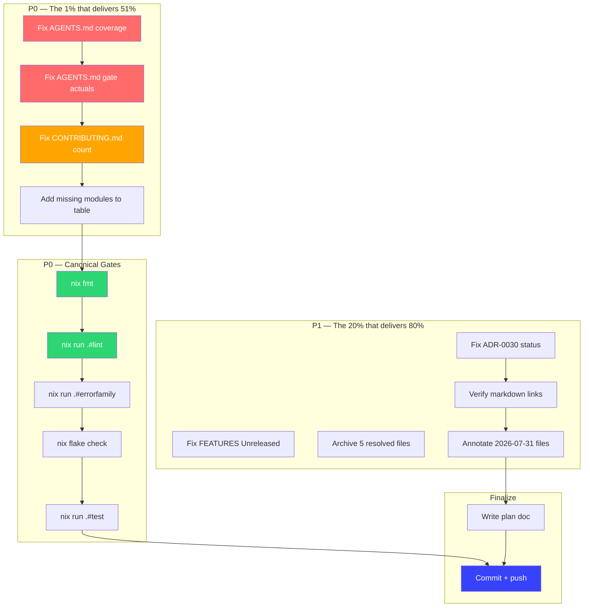

# Planning Doc — Docs-Health Debt Closure & Verification

**Date:** 2026-08-01 14:58 CEST
**Context:** Self-review of the docs-health + update-old-docs session revealed gaps. This plan closes them.

---

## Pareto Breakdown

### The 1% that delivers 51%

**AGENTS.md** — loaded into every AI session. Stale coverage numbers + wrong module count = every future session starts with bad data.

### The 4% that delivers 64%

1. AGENTS.md (coverage, module count, lint count)
2. CONTRIBUTING.md (module count 15→18)
3. Canonical nix gates (verify state truly clean)
4. Fix FEATURES.md `[Unreleased]` qualifier

### The 20% that delivers 80%

Items 1-4, plus: archive resolved files, fix ADR-0030 status, annotate 2026-07-31 files, verify markdown links.

### Remaining 20% (to reach 100%)

DOMAIN_LANGUAGE freshness, HTML CSP compliance, CHANGELOG reorganization, TODO_LIST items (tracked separately).

---

## Execution Status

| #   | Task                                      | Status  | Evidence                                        |
| --- | ----------------------------------------- | ------- | ----------------------------------------------- |
| M1  | Fix AGENTS.md coverage line               | ✅ Done | `93.7%/81.6%/84.0%`                             |
| M2  | Fix AGENTS.md coverage gate actuals       | ✅ Done | `81.6%`                                         |
| M3  | Fix CONTRIBUTING.md module count          | ✅ Done | `18 modules`                                    |
| M4  | Add missing modules to CONTRIBUTING table | ✅ Done | middleware-demo, observability-demo, e2e/server |
| M5  | Run `nix fmt`                             | ✅ Done | 0 changed                                       |
| M6  | Run `nix run .#lint` (all modules)        | ✅ Done | 0 issues across all 10 modules                  |
| M7  | Fix FEATURES.md `[Unreleased]`            | ✅ Done | Removed qualifier                               |
| M8  | Archive 5 resolved files                  | ✅ Done | `git mv` to `docs/status/archived/`             |
| M9  | Fix ADR-0030 status                       | ✅ Done | Proposed → Superseded (by ADR 0040)             |
| M10 | Verify internal markdown links             | ✅ Done | All links resolve (14 doc-relative links)        |
| M11 | Fix broken links (if any)                  | ✅ Done | No broken links found                            |
| M12 | Annotate 9 `2026-07-31` files              | ✅ Done | All 9 annotated (6 in 15-08, 3 in 15-06)        |
| M13 | Run `nix run .#test`                       | ✅ Done | All 11 module groups pass with -race             |
| M14 | Run `nix run .#errorfamily`               | ✅ Done | All pass                                        |
| M15 | Run `nix flake check`                     | ✅ Done | All checks passed                               |
| M16 | Write this plan doc                       | ✅ Done | This file                                       |
| M17 | Commit + push                              | ✅ Done | 8 commits pushed (`46fea9f..0c2212a`)            |

---

## Mermaid.js Execution Graph

---

## Pre-Existing Tracked Debt (NOT this session's scope)

These items are already in TODO_LIST.md or ROADMAP.md. Included for completeness.

| #   | Task                              | Source                   | Effort |
| --- | --------------------------------- | ------------------------ | ------ |
| E1  | Upgrade cqrs-lint v0.2.2 → latest | TODO_LIST P2             | 15m    |
| E2  | MySQL integration test (docker)   | TODO_LIST P2             | 2h+    |
| E3  | State cache invalidation test     | TODO_LIST P2             | 30m    |
| E4  | catalog-demo smoke test           | TODO_LIST P2 (harvested) | 15m    |
| E5  | errorfamily gate comment-aware    | TODO_LIST P2 (harvested) | 30m    |
| E6  | loginpage/CHANGELOG.md            | TODO_LIST P3 (harvested) | 15m    |
| E7  | Phantom-version CI gate           | TODO_LIST P3             | 15m    |
| E8  | cqrs-lint strict CI gate          | TODO_LIST P3             | 15m    |
| E9  | HTML CSP compliance (9 files)     | Pre-existing             | 30m    |
| E10 | DOMAIN_LANGUAGE.md freshness      | Pre-existing             | 15m    |
