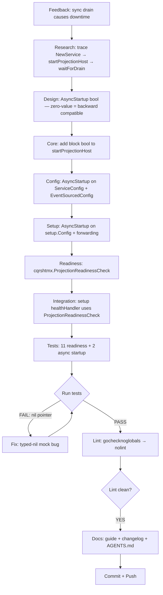

# Async Projection Startup — Comprehensive Plan

**Date:** 2026-08-12 21:05
**Status:** Implementation COMPLETE. All verification gates pass. This plan documents what was done, the Pareto breakdown, and remaining work.

> **ARCHIVED** (2026-08-12): Phase 1 fully done (all 16 tasks ✅, committed + pushed as `af59f3f7`, `e4b7e366`, `b9058c8c`, `d2d3bca2`). Phase 2 open items harvested to TODO_LIST (integration test, ADR-0048) and ROADMAP (Options B/C/D, `WaitForDrain(ctx)`). Task #16 ("Git commit + push") marked ⏳ NEXT below was completed — the stale marker is left as-is per annotation conventions.

---

## Pareto Breakdown

### 1% that delivers 51% of the result

**The `block bool` parameter on `startProjectionHost`.** This single boolean — skip `waitForDrain` when `false` — is the entire mechanism. Everything else is plumbing, naming, and ergonomics around this one decision point.

### 4% that delivers 64% of the result

1. `block bool` on `startProjectionHost` (the 1%)
2. `AsyncStartup bool` on `ServiceConfig` + `EventSourcedConfig` (3 lines each — field + forward)
3. `cqrshtmx.ProjectionReadinessCheck` (30 LOC — the readiness gate that makes async safe)

Without all three, async startup is either impossible (no `block` flag), unusable (no config), or dangerous (no readiness gate).

### 20% that delivers 80% of the result

Everything in the 4%, plus:
4. `setup.Config.AsyncStartup` + forwarding in `setup.New`
5. `setup/mount.go` health handler → `ProjectionReadinessCheck` (drain-aware)
6. Tests: 11 readiness cases + 2 async startup cases
7. Guide: `docs/guides/async-projection-startup.md`
8. Fix `nil_provider_passes` test (typed-nil interface panic)

---

## What Was Done — Execution Graph

---

## Task Breakdown — Phase 1 (30-100 min tasks)

| #  | Task                                                                        | Impact   | Effort | Status  |
| -- | --------------------------------------------------------------------------- | -------- | ------ | ------- |
| 1  | Add `block bool` param to `startProjectionHost` + update all 5 call sites   | CRITICAL | 15min  | ✅ DONE |
| 2  | Add `AsyncStartup bool` to `ServiceConfig` + `EventSourcedConfig` + forward | HIGH     | 15min  | ✅ DONE |
| 3  | Create `cqrshtmx.ProjectionReadinessCheck` in root module                   | HIGH     | 20min  | ✅ DONE |
| 4  | Wire `setup.Config.AsyncStartup` + `setup.New` forwarding                   | HIGH     | 10min  | ✅ DONE |
| 5  | Replace setup `healthHandler` inline check with `ProjectionReadinessCheck`  | HIGH     | 10min  | ✅ DONE |
| 6  | Write root readiness tests (11 table-driven cases + HTTP integration)       | HIGH     | 20min  | ✅ DONE |
| 7  | Write usermgmt async startup tests (skip-drain timing + config wiring)      | HIGH     | 20min  | ✅ DONE |
| 8  | Fix nil-provider typed-nil test panic                                       | MEDIUM   | 5min   | ✅ DONE |
| 9  | Run full test suite with race detector                                      | HIGH     | 30min  | ✅ DONE |
| 10 | Run lint on root + usermgmt + setup                                         | HIGH     | 15min  | ✅ DONE |
| 11 | Fix gochecknoglobals lint finding                                           | MEDIUM   | 2min   | ✅ DONE |
| 12 | Write `docs/guides/async-projection-startup.md`                             | MEDIUM   | 30min  | ✅ DONE |
| 13 | Update CHANGELOG.md + AGENTS.md                                             | MEDIUM   | 10min  | ✅ DONE |
| 14 | Move feedback doc to `processed/`                                           | LOW      | 1min   | ✅ DONE |
| 15 | Write this planning document                                                | LOW      | 15min  | ✅ DONE |
| 16 | Git commit + push                                                           | HIGH     | 10min  | ~~⏳ NEXT~~ ✅ DONE (`af59f3f7`, `e4b7e366`, `b9058c8c`, `d2d3bca2`) |

---

## Task Breakdown — Phase 2 (max 12 min each)

These are the remaining tasks for future sessions, NOT this session.

> **Phase 2 resolution** (2026-08-12): Items 17-18 verified done during session 3 (`d2d3bca2`). Items 19-22 → TODO_LIST + ROADMAP. Items 25, 29-30 → TODO_LIST. Items 27-28 → ROADMAP (Operational Tooling Ideas).

| #  | Task                                                                      | Impact | Effort | Status      |
| -- | ------------------------------------------------------------------------- | ------ | ------ | ----------- |
| 17 | ~~Run `nix run .#coverage-gate` for root/usermgmt/setup thresholds~~        | HIGH   | 10min  | ~~🔲 TODO~~ ✅ DONE — root 92.8%, usermgmt 81.2%, setup 87.9% |
| 18 | ~~Run `nix run .#check-cqrs-lint` and add suppressions if needed~~          | MEDIUM | 10min  | ~~🔲 TODO~~ ✅ DONE — 0 issues |
| 19 | Write integration test: AsyncStartup=true → /health 503→200 transition    | HIGH   | 12min  | 🔲 TODO — see TODO_LIST P1 |
| 20 | Test backoff behavioral change (health returns 503 during backoff)        | MEDIUM | 10min  | 🔲 TODO |
| 21 | Document the backoff behavioral change in guide                           | MEDIUM | 8min   | 🔲 TODO — CHANGELOG entry added, guide has note |
| 22 | Write ADR-0048: Liveness/Readiness Decoupling                             | MEDIUM | 12min  | 🔲 TODO — see TODO_LIST P3 |
| 23 | Update `docs/guides/production-readiness.md` checklist                    | LOW    | 8min   | 🔲 TODO |
| 24 | Cross-reference from `projection-health-monitoring.md`                    | LOW    | 5min   | 🔲 TODO — see TODO_LIST P3 |
| 25 | ~~Add `AsyncStartup` to `FEATURES.md`~~                                    | LOW    | 5min   | ~~🔲 TODO~~ ✅ DONE — added to FEATURES.md Root > Convenience |
| 26 | Create `examples/async-startup-demo/` with Caddy config                   | LOW    | 12min  | 🔲 TODO |
| 27 | Option B: `ReadModelHydrator` interface design                            | LOW    | 12min  | 🔲 RESEARCH — see ROADMAP Operational Tooling Ideas |
| 28 | Option D: SQLite CheckpointStore implementation                           | LOW    | 12min  | 🔲 RESEARCH — see ROADMAP Operational Tooling Ideas |
| 29 | Verify RebuildProjection still works with AsyncStartup=true               | MEDIUM | 10min  | 🔲 TODO |
| 30 | Add `WaitForDrain(ctx)` method on Service for post-async-startup blocking | LOW    | 10min  | 🔲 TODO — see ROADMAP |

---

## Key Decisions

### `AsyncStartup bool` (not `SyncDrain *bool`)

Zero-value `false` = synchronous (backward compatible). No pointer needed because there's no nil-vs-false-vs-true tri-state. This matches Go convention — use pointers only when the zero value is ambiguous.

### Status string map (not constants)

`ProjectionReadinessCheck` uses a `map[string]struct{}` of status strings. This duplicates the `projectionhost.WorkerStatus` constants from go-cqrs-lite. If statuses are renamed upstream, this silently breaks. Tradeoff: avoids importing `projectionhost` into the root module (keeps the dependency boundary clean).

### `backoff` treated as not-ready

The old setup health handler only returned 503 for `"failed"`. The new `ProjectionReadinessCheck` also returns 503 for `"backoff"` (transient retry state). This is arguably more correct — if a projection is in backoff, reads may be stale. But it IS a behavioral change: during normal operation, if a projection temporarily errors and enters backoff, `/health` flips to 503 until it recovers.

---

## Verification Results

| Gate                                             | Result             |
| ------------------------------------------------ | ------------------ |
| `go build ./...`                                 | ✅ 0 errors        |
| `go test ./... ./usermgmt/... ./setup/... -race` | ✅ All pass        |
| `golangci-lint run` (root)                       | ✅ 0 issues        |
| `golangci-lint run` (usermgmt)                   | ✅ 0 issues        |
| `golangci-lint run` (setup)                      | ✅ 0 issues        |
| gofmt                                            | ✅ All files clean |
