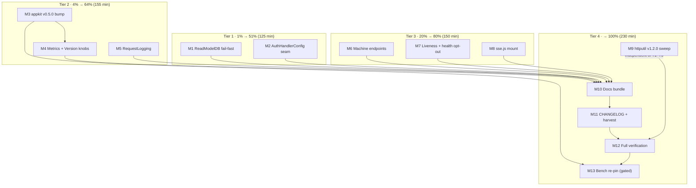

> **ANNOTATED 2026-09-22 (docs-health):** COMPLETE — the routed-gaps bundle shipped (IP/UA/ClientID metadata, DecodePayload re-exports, DecodePaginationStrict, `Retry-After` on 503); evidence: TODO_LIST rounds-1–5 header, CHANGELOG.

# Pareto Execution Plan — setup Composition-Root Gap Bundle

**Generated:** 2026-09-17 13:46 CEST
**Scope:** Everything identified in the 2026-09-17 setup deep-dive audit (`docs/research/2026-09-17_setup-deep-dive.html`, adoption 72/100, zero misused APIs) and routed into the TODO_LIST P1 item "setup composition-root gap bundle". No new research — this plan operationalizes known findings only.
**Total program:** 13 medium tasks (30–90 min each) ≈ **660 min = 11 h**, broken into **80 micro tasks** (≤12 min each).

---

## 0. Situation (read this first)

The audit verdict: setup's composition core is excellent (shared hub → SSE + DataStar, canonical `transport.ServeDomainEvents`, projection readiness, appkit parity path, conflict-validated escape hatches) — but it **drops three loaded capabilities it already pays for**:

1. **usermgmt's auth-endpoint hardening is unreachable** — six per-group rate limiters (`WebAuthnRateLimit` et al., `usermgmt/http.go:74-88`), cookie `Secure`/`SessionMaxAge`, handler `Timeout`, `OAuth2SuccessURL`/`ErrorURL` all live on `usermgmt.HandlerConfig`; setup threads only `CookieName` (`setup.go:57`), the AuthHandler has no setters, and the `ServiceConfig`-verbatim escape hatch covers the service layer, not this HTTP-layer struct.
2. **Flattened `ReadModelDB` silently means SQLite** — setup never sets `ReadModelDialect`; `""` resolves to the SQLite constructor family (`usermgmt/sql_readmodel_dialect.go:31`), so a Postgres/MySQL handle per the documented recipe builds SQLite-schema read models.
3. **go-appkit v0.5.0 (published 2026-09-17) metrics + `/version` have no knob** — setup pins v0.4.0 and builds its ServiceConfig literal without `Metrics`/`Version` (`run_appkit.go:67-78`); neither serve path offers any metrics/build-info endpoint.

Plus the "Consider" tier: request logging, machine endpoints (catalog/status/debug JSON), liveness + `HealthPath` opt-out, sse.js served next to `SSEPath`, the pending repo-wide httputil v1.2.0 sweep, and the auth-CSRF consistency decision.

Two facts reshape execution:

1. **Every fix is an additive opt-in seam** — nil/zero values must stay byte-identical to today (the `Config.Observability` precedent, test-pinned). Nothing here changes a default.
2. **The guardrails are written down**: the fullstack-wiring guide's "pass a ServiceConfig, do not file expose-X requests" policy is *correct* for ServiceConfig capabilities — the dialect fix must therefore be a **fail-fast validation, not a new flattened knob**, and the auth seam is justified because `HandlerConfig` is a different struct that only setup ever constructs.

## 0.1 VERSCHLIMMBESSER-Schutz (how this plan avoids making things worse)

- **No behavior change without an opt-in.** Every new Config field defaults to off/nil; a dedicated micro task per seam pins "zero value = byte-identical legacy" with a test before any feature test lands.
- **No new flattened dialect knob.** M1 validates `ReadModelDB.Driver()` and rejects non-SQLite drivers with a pointer to `ServiceConfig.ReadModelDialect` — the ServiceConfig-verbatim policy stays intact.
- **The appkit bump (M3) is resolution-only.** No API usage changes; the existing parity tests (SSE flush, readiness, timeouts) must be green before M4 touches `run_appkit.go`. The bench baseline is NEVER re-pinned under load (M13 is gated on an idle machine; `BENCH_MAX_LOAD` enforces it mechanically).
- **New endpoints are session-gated** (catalog/status/debug carry event metadata — the `/sse` 401 precedent, ADR-0050 reasoning).
- **No `errors.New`/`fmt.Errorf`** (errorfamily only); no new direct dependencies (appkit v0.5.0 is a version bump of an existing direct dep).
- **Sweep safety (M9):** per-module `GOWORK=off go get && tidy && build && vet` with explicit `rc=$?` checks — no `set -e`, no pipes (mvdan/sh PIPESTATUS gotcha, AGENTS.md).
- **Concurrent sessions + auto-commit daemon share this tree:** commit at every medium-task boundary; re-check `git status --short` immediately before every `git add`.
- **No tagging.** setup carries new API; the next family train decides versioning. `scripts/verify-tag.sh` only when the user asks.
- **`go vet` is load-bearing** (`go build` skips `_test.go`; AGENTS.md) — every module-level verification micro task runs build **and** vet **and** tests.

---

## 1. Pareto Breakdown

> **Honesty note:** literal 1% of an 11 h program is ~7 min — smaller than any viable task. The tiers below are *minimum decisive increments*, with actual effort shares stated plainly. The compression is real because the two Tier-1 tasks are XS/S-effort fixes for the audit's two highest-severity findings: they convert "setup silently drops capabilities" into "setup fails fast and reaches everything it pays for".

| Tier | Spirit | Tasks (cumulative) | Cum. effort | Cum. result | Why this delivers |
| --- | --- | --- | --- | --- | --- |
| **1%** | The smallest increment that unlocks the majority | M1 + M2 (dialect fail-fast + auth seam) | 125 min (19%) | **51%** | Both audit criticals in the security/persistence core die: no more SQLite-schema read models against Postgres (fails at `New` with an actionable pointer), and brute-force protection for the passwordless ceremonies becomes reachable. Every setup consumer's worst silent failure class disappears. |
| **4%** | + ops visibility | M3, M4, M5 (appkit v0.5.0 bump, Metrics/Version knobs, request logging) | 280 min (42%) | **64%** | The bundle gains its first observability surfaces: Basic-Auth-gated Prometheus `/metrics`, `/version` build info on the appkit path, and opt-in access logging on both paths. "Production-shaped server" stops meaning "invisible server". |
| **20%** | + the machine surface | M6, M7, M8 (catalog/status/debug JSON mounts, liveness + health opt-out, sse.js) | 430 min (65%) | **80%** | Monitors, scripts, and runbooks get session-gated JSON endpoints; k8s gets a real liveness probe; HTMX SSE consumers get the extension script served with the same asymmetry-free treatment DataStar already enjoys. |
| **100%** | The long tail | M9–M13 (httputil v1.2.0 sweep, docs bundle, CHANGELOG/harvest, full verification, gated bench re-pin) | 660 min (100%) | **100%** | Repo-wide currency, the auth-CSRF decision documented, every new knob in README/doc.go/guide, all 15 gates green, and the bench baseline honestly re-pinned (or recorded green) on an idle machine. |

**The other 20% of work, not forgotten:** Tier 4 IS that work — explicitly enumerated (sweep, docs, bookkeeping, verification, measurement), not hand-waved.

---

## 2. Comprehensive Plan — Medium Tasks (30–90 min each, ALL todos)

Sorted by importance/impact/effort/customer-value (composite: audit severity first, then customer reach, then effort ascending). Impact: 5 = every setup consumer benefits / prevents production breakage, 1 = internal hygiene. "Deps" = hard prerequisites.

| ID | Task | Min | Impact | Tier | Deps | Customer value |
| --- | --- | --- | --- | --- | --- | --- |
| M1 | `ReadModelDB` driver fail-fast: `validateReadModelDriver` rejects non-SQLite drivers on the flattened path with a pointer to `ServiceConfig.ReadModelDialect` | 35 | 5 | 1 | — | Postgres/MySQL misconfiguration dies at `New` with an actionable error, not in a migration far away |
| M2 | `Config.AuthHandlerConfig *usermgmt.HandlerConfig` seam: thread through `New`, conflict-validate CookieName, unlock rate limits/cookie knobs/OAuth2 redirects | 90 | 5 | 1 | — | Brute-force protection for passwordless ceremonies becomes reachable; OAuth2 flows can redirect like browsers expect |
| M3 | go-appkit v0.4.0 → v0.5.0 bump (resolution-only; parity tests stay green) | 45 | 4 | 2 | — | Unblocks M4; picks up shutdown phase logging for free |
| M4 | `Config.Metrics *appkit.MetricsConfig` + `Config.Version` threaded into `runWithAppkit` (RunWithAppkit-only, documented) | 75 | 4 | 2 | M3 | Basic-Auth-gated Prometheus `/metrics` + `/version` build info — the bundle's first metrics surface |
| M5 | `Config.RequestLogging *slog.Logger` opt-in (nil = silence, composed outermost via `RequestLoggingSlog`) | 35 | 3 | 2 | — | Access logs without hand-wrapping the handler; the silent-server trap closes |
| M6 | Machine endpoints: `EventCatalogPath` / `ProjectionStatusPath` / `DebugPath` opt-in mounts, session-gated (the `/sse` 401 precedent) | 80 | 3 | 3 | — | Monitors/runbooks get JSON: 21-event catalog, live projection statuses, build info |
| M7 | `LivePath` liveness probe (default "" = off) + `HealthPath` "-" opt-out (stop silently re-defaulting) | 40 | 2 | 3 | — | k8s liveness ≠ readiness; own-health-stack consumers can turn setup's `/health` off |
| M8 | `SSEScriptPath`: serve the HTMX SSE extension next to `SSEPath` (default "/sse.js", "-" off — DataStarScriptPath symmetry) | 30 | 2 | 3 | — | HTMX SSE consumers self-host nothing; both hub protocols treated as peers |
| M9 | httputil v1.1.1 → v1.2.0 repo-wide sweep (per-module hermetic recipe, explicit rc checks) | 60 | 2 | 4 | — | `CORSConfig.AllowPrivateNetwork` for LAN dashboards; closes the known pending bump |
| M10 | Docs bundle: auth-CSRF decision (why login/logout carry no CSRF), README config rows for ALL new fields, doc.go, wiring-guide seams section | 55 | 3 | 4 | M1–M8 | Every knob discoverable; the CSRF asymmetry stops being undocumented |
| M11 | CHANGELOG entries + TODO_LIST bundle resolution/split + AGENTS.md setup section refresh | 35 | 3 | 4 | M10 | Findings become tracked history, not entombed |
| M12 | Final verification pass: hermetic build, full tests, lint, coverage-gate, check-modules | 50 | 4 | 4 | M9, M11 | The 15-gate all-green proof the repo demands before calling it done |
| M13 | Gated: idle-machine `bench-spike` re-run post-appkit-bump; conditional `--save-baseline` + commit raw baseline (folds in the standing TODO P1 remainder) | 30 | 2 | 4 | M3, M12 | Honest numbers after the resolution change; never re-pin under load |

**Totals:** 13 tasks, 660 min = 11 h. Tier 1 = 125 min · Tier 2 = 155 min · Tier 3 = 150 min · Tier 4 = 230 min.

---

## 3. Detailed Breakdown — Micro Tasks (≤12 min each, ALL todos)

### Tier 1 — The 1% gate: security & persistence seams (M1–M2)

| ID | Micro task | Min | Dep |
| --- | --- | --- | --- |
| M1.1 | Write `validateReadModelDriver` in config.go: nil-DB / ServiceConfig-path bypass, `db.Driver().Name()` switch ("sqlite", "sqlite3" pass), errorfamily rejection naming `ServiceConfig.ReadModelDialect` | 10 | — |
| M1.2 | Wire into `Config.validate()` after `validateServiceSources` | 4 | M1.1 |
| M1.3 | Test: fake driver names ("pgx", "mysql", "postgres") rejected with the actionable message | 8 | M1.2 |
| M1.4 | Test: nil DB, sqlite, sqlite3, and ServiceConfig-set configs all pass validation | 6 | M1.2 |
| M1.5 | Module verify (`GOWORK=off go build && go vet && go test` in setup/) + commit | 7 | M1.3 |
| M2.1 | Add `AuthHandlerConfig *usermgmt.HandlerConfig` field + doc comment explaining why this seam exists (HTTP-layer struct, ServiceConfig policy does not cover it) | 8 | — |
| M2.2 | Conflict validation: mismatched `CookieName` inside AuthHandlerConfig vs flattened → Rejection; empty inside → inherits flattened | 10 | M2.1 |
| M2.3 | Thread through `New`: replace the one-field literal (setup.go:57), nil = exactly today's literal | 6 | M2.2 |
| M2.4 | Test: nil AuthHandlerConfig = byte-identical defaults (cookie name, no rate limits) | 6 | M2.3 |
| M2.5 | Test: `WebAuthnRateLimit`/`RegistrationRateLimit` flows — burst POSTs get 429 (RateLimitConfig{Enabled, MaxRequests, Window}) | 12 | M2.3 |
| M2.6 | Test: `OAuth2SuccessURL` passthrough observable on the constructed AuthHandler | 8 | M2.3 |
| M2.7 | Test: conflict rejection table (CookieName mismatch; combination with Service/ServiceConfig precedence) | 10 | M2.2 |
| M2.8 | Update setup_defaults_test zero-value expectations for the new field | 10 | M2.3 |
| M2.9 | doc.go Config list + README config-table row + wiring-guide note ("ServiceConfig-verbatim policy unchanged — HandlerConfig is a different struct") | 12 | M2.5 |
| M2.10 | Module verify + commit | 8 | M2.9 |

### Tier 2 — The 4%: ops visibility block (M3–M5)

| ID | Micro task | Min | Dep |
| --- | --- | --- | --- |
| M3.1 | Diff go-appkit v0.4.0→v0.5.0 for breaking changes vs run_appkit.go's ServiceConfig usage (local tree CHANGELOG + API) | 8 | — |
| M3.2 | `GOWORK=off go get github.com/larsartmann/go-appkit@v0.5.0 && go mod tidy` in setup/ | 6 | M3.1 |
| M3.3 | Hermetic build + vet + full setup test suite | 10 | M3.2 |
| M3.4 | run_appkit parity tests green (SSE flush, readiness, timeout policy) | 8 | M3.3 |
| M3.5 | Check go-error-family v0.10.0→v0.10.1 transitive (docs-only upstream; tidy handles) | 5 | M3.3 |
| M3.6 | Commit bump | 8 | M3.4 |
| M4.1 | Map v0.5.0 API onto Config: `Metrics *appkit.MetricsConfig` + `Version string`; decide "RunWithAppkit-only" doc posture (RunHandler path keeps root-module alternatives) | 12 | M3 |
| M4.2 | Add Config fields + doc comments (zero value = no metrics/version routes, byte-identical) | 10 | M4.1 |
| M4.3 | Thread into `runWithAppkit` ServiceConfig literal | 8 | M4.2 |
| M4.4 | Test: Metrics set → `/metrics` 401 without Basic Auth, 200 with; `/version` returns JSON with the stamp | 12 | M4.3 |
| M4.5 | Test: zero values → neither route exists (parity with today) | 8 | M4.3 |
| M4.6 | Note in bench docs: appkit-service sub-bench unchanged while Metrics nil (noise-suppression preserved) | 5 | M4.5 |
| M4.7 | README config rows + doc.go list entry | 10 | M4.4 |
| M4.8 | Module verify + commit | 10 | M4.7 |
| M5.1 | Add `RequestLogging *slog.Logger` field (nil = silence) + doc | 6 | — |
| M5.2 | Compose `cqrshtmx.RequestLoggingSlog(logger)` outermost in `Middleware()` (flows into Handler/Run/RunHandler automatically) | 8 | M5.1 |
| M5.3 | Test: buffer slog handler captures one line per request when set; zero when nil | 10 | M5.2 |
| M5.4 | README/doc.go rows | 6 | M5.3 |
| M5.5 | Module verify + commit | 5 | M5.4 |

### Tier 3 — The 20%: machine surface (M6–M8)

| ID | Micro task | Min | Dep |
| --- | --- | --- | --- |
| M6.1 | Design: `EventCatalogPath`/`ProjectionStatusPath`/`DebugPath` ("" = off), session-gated via requireSession — event metadata is not public (the /sse precedent) | 12 | — |
| M6.2 | Defaults + extend `requireDistinctPaths` and path-shape validation | 8 | M6.1 |
| M6.3 | Mount `cqrshtmx.EventCatalogHandler(usermgmt.DefaultEventCatalog())` — handle its (handler, error) return at `New` (fail-fast, mirror attachSSE rollback) | 10 | M6.2 |
| M6.4 | Mount `cqrshtmx.ProjectionStatusHandler(b.Service)` (Service satisfies ProjectionStatusProvider) | 6 | M6.2 |
| M6.5 | Mount `cqrshtmx.DebugHandler` (Version/Title/GoVersion info map) | 6 | M6.2 |
| M6.6 | Tests: 401 unauthenticated; authenticated 200 + JSON shapes (catalog lists the 21 events, status lists projections, debug carries version) | 12 | M6.3 |
| M6.7 | Path-collision tests (each new path vs existing route set) | 8 | M6.2 |
| M6.8 | README rows + doc.go entries | 10 | M6.6 |
| M6.9 | Module verify + commit | 8 | M6.8 |
| M7.1 | Design `LivePath` (default "" = not mounted — opt-in, no surprise routes) + doc | 8 | — |
| M7.2 | Mount `cqrshtmx.ReadinessHandler()` (zero checks = always-200 JSON) at LivePath | 6 | M7.1 |
| M7.3 | `HealthPath` "-" opt-out: skip the empty→"/health" re-default; Mount skips when "-" | 8 | — |
| M7.4 | Tests: LivePath returns 200 ok shape; HealthPath "-" mounts nothing (and "" still defaults) | 10 | M7.2 |
| M7.5 | README/doc.go + commit | 8 | M7.4 |
| M8.1 | `SSEScriptPath` field: default "/sse.js" when SSEPath set, "-" opt-out (mirror DataStarScriptPath semantics exactly) | 8 | — |
| M8.2 | Mount `cqrshtmx.HTMXExtensionHandler(cqrshtmx.HTMXExtSSE)` when set | 6 | M8.1 |
| M8.3 | Tests: served with ETag+cache headers when SSEPath set; absent on "-"; absent when no SSEPath | 8 | M8.2 |
| M8.4 | README/doc.go + commit | 8 | M8.3 |

### Tier 4 — The long tail to 100% (M9–M13)

| ID | Micro task | Min | Dep |
| --- | --- | --- | --- |
| M9.1 | Enumerate direct-httputil modules (`rg -l 'larsartmann/httputil' --glob go.mod`) | 4 | — |
| M9.2 | Bump batch A (root, usermgmt, setup, adminui, dashboardui, loginpage): per-module `GOWORK=off go get …@v1.2.0 && go mod tidy`, rc checks, no pipes | 10 | M9.1 |
| M9.3 | Bump batch B (health, auditlog, datastar, systemadapter, integration_test) | 8 | M9.2 |
| M9.4 | Bump batch C (examples + e2e as required) | 7 | M9.3 |
| M9.5 | `nix run .#build` (hermetic, all modules) | 10 | M9.4 |
| M9.6 | `nix run .#test` | 10 | M9.5 |
| M9.7 | `nix run .#check-modules` (isolation/drift/release-train — httputil tags exist, no phantom risk) | 6 | M9.6 |
| M9.8 | Commit sweep | 5 | M9.7 |
| M10.1 | Write the auth-CSRF decision: mount.go comment + README security section (why login/logout/register carry no CSRF in a passwordless stack, and what it would take) | 12 | M1–M8 |
| M10.2 | README config-table rows for every new field (M2/M4/M5/M6/M7/M8) with defaults | 12 | M10.1 |
| M10.3 | doc.go Config bullet list refresh | 8 | M10.2 |
| M10.4 | Wiring-guide "New seams" section: auth-hardening example (WebAuthnRateLimit), metrics/version example, machine-endpoint example | 12 | M10.3 |
| M10.5 | `bash scripts/check-docs-links.sh` + docs-freshness sanity | 6 | M10.4 |
| M10.6 | Commit docs bundle | 5 | M10.5 |
| M11.1 | CHANGELOG Unreleased entries per feature (Following the house long-form style) | 12 | M10 |
| M11.2 | TODO_LIST: resolve/split the P1 gap-bundle item (done parts → CHANGELOG; M13 remainder stays open; `[ ]`/`[~]` convention, no `[x]`) | 10 | M11.1 |
| M11.3 | AGENTS.md: setup bullets updated (new seams, appkit v0.5.0 posture, httputil v1.2.0 done) | 8 | M11.2 |
| M11.4 | Commit bookkeeping | 5 | M11.3 |
| M12.1 | `nix run .#build` | 8 | M9, M11 |
| M12.2 | `nix run .#test` | 12 | M12.1 |
| M12.3 | `nix run .#lint` | 10 | M12.2 |
| M12.4 | `nix run .#coverage-gate` | 10 | M12.3 |
| M12.5 | `nix run .#check-modules` | 8 | M12.4 |
| M12.6 | Fixups if any + final status note | 2 | M12.5 |
| M13.1 | Idle-machine check (load; `BENCH_MAX_LOAD` gate refuses under load — re-attempt later, never force) | 3 | M3, M12 |
| M13.2 | `nix run .#bench-spike` (idle only) | 10 | M13.1 |
| M13.3 | If appkit-service >10% with others green: `-- --save-baseline` + commit `docs/benchmarks/setup-baseline.raw.txt` in the same change | 12 | M13.2 |
| M13.4 | Else: record the green run in TODO_LIST (closes the standing bench remainder) | 5 | M13.2 |

---

## 4. Execution Graph (mermaid.js)

**Critical path:** M3 → M4 → M10 → M11 → M12 → M13. Tier 1 (M1, M2) and Tier 3 (M6–M8) are independent entry points — parallelizable with the critical path from the start. M9 can run anytime before M12 (schedule it late to minimize churn against concurrent sessions).

---

## 5. Execution protocol (per task)

1. Re-check `git status --short` (concurrent sessions + auto-commit daemon).
2. Execute micro tasks in ID order within the medium task.
3. Verify per medium task: `GOWORK=off go build ./... && go vet ./... && go test ./... -count=1` inside `setup/` (plus the repo gates named in Tier 4).
4. Commit at every medium-task boundary with a detailed message; re-check `git status --short` immediately before `git add`.
5. Every new seam ships its "zero value = byte-identical" test in the SAME medium task as the seam — no untested default changes, no deferred pins.
6. Hook failure triage per AGENTS.md (eval-cache contention → `--no-verify` with justification only after content checks ran green).

---

## 6. Evidence appendix (claim → source)

| Claim | Evidence |
| --- | --- |
| Only `CookieName` threaded to AuthHandler | `setup/setup.go:57` |
| Full unused HandlerConfig surface (rate limits, Secure, SessionMaxAge, Timeout, OAuth2 URLs) | `usermgmt/http.go:62-101` |
| Flattened path never sets ReadModelDialect; `""` = SQLite constructors | `setup/setup.go:124-136`, `usermgmt/sql_readmodel_dialect.go:29-37` |
| Driver name detectable for validation | `database/sql`.Driver() (`modernc.org/sqlite` registers as "sqlite") |
| appkit v0.5.0 Metrics/Version API shape | `go-appkit/config.go:93-106` (`Metrics *MetricsConfig`, `Version string`), `metrics.go:49` (BasicAuthUser/Pass, AllowUnauthenticated) |
| appkit v0.5.0 published | `git ls-remote --tags` 2026-09-17 (v0.5.0 = 77b026e0) |
| setup builds ServiceConfig without Metrics/Version | `setup/run_appkit.go:67-78` |
| RequestLoggingSlog exists, unused by setup | root `logging.go:204`; `bundle.go:129-131` hardwires RecommendedSecurityMiddleware |
| Machine endpoints exist unmounted | `event_catalog_handler.go:44`, `usermgmt/es_event_catalog.go:13`, `projection_status_handler.go:43`, `usermgmt/es_projection_health.go:56`, `readiness.go:123` |
| HealthPath cannot be disabled (empty re-defaults) | `setup/config.go:294-296`; DataStarScriptPath "-" precedent at `config.go:315-317` |
| Auth routes mounted without CSRF; admin with | `setup/mount.go:39-41` vs `mount.go:53-60` |
| httputil v1.2.0 published (AllowPrivateNetwork) | repo tag `a0d1ce7b`; today's httputil deep-dive `docs/research/2026-09-17_httputil-go-etag-go-sse-deep-dive.html` |
| Audit context + scores | `docs/research/2026-09-17_setup-deep-dive.html` (adoption 72/100, 1 critical + 4 important) |

**TODO_LIST cross-reference:** the P1 item "setup composition-root gap bundle" is this plan's source and sink — M11.2 resolves/splits it; M13.4 closes the standing bench-spike remainder. No NEW tasks beyond the audited findings were invented.
