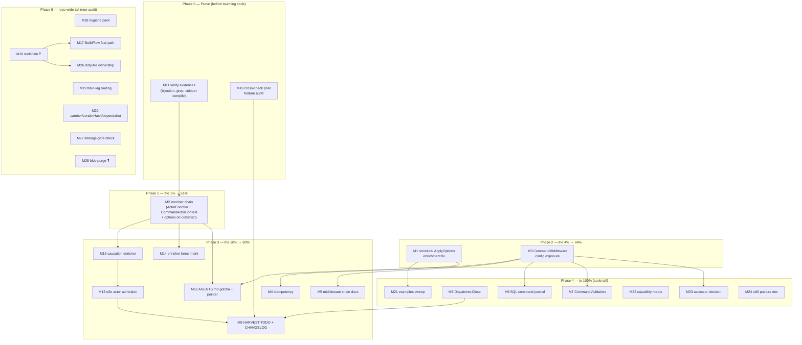

> **ANNOTATED 2026-09-22 (docs-health):** COMPLETE — the command-audit chain shipped 2026-09-18 (`commandAuditMiddleware` + repository enrichers wired in `NewService`, zero consumer code); the two-item tail (bench-spike, requestContextEnricher upstreaming) lives in TODO_LIST.

# Command-Audit Pareto Execution Plan

**Date:** 2026-09-17 20:28 CEST
**Source input:** this session's command-utilization audit (`docs/research/2026-09-17_go-cqrs-lite-command-deep-dive.html`, score 62/100) and its follow-through backlog (status report `docs/status/2026-09-17_20-18_command-utilization-audit-session-status.md` §f, 40 items).
**Standing guard:** VERSCHLIMMBESSER-Verbot — every task below is wiring/verification of already-designed upstream capability or documentation. No new abstractions, no API redesigns, no rewrites. Anything that smells like a redesign is explicitly routed through Lars (marked ❓).

---

## Step 1 — Pareto Breakdown

### The 1% that delivers 51%

**M2 — Wire the audit-trail chain in usermgmt** (`decider.WithEnricher(event.ActorEnricher)` on `repositoryOptions` + `dispatcher.Use(middleware.CommandActorContext())` in `NewService` + apply `CommandOptionsFromContext(ctx)` onto constructed commands before dispatch). ~25 lines across 3 files + tests. This single change converts every one of ~25 dispatch sites from emitting *anonymous* events to *actor-attributed* events — which is the exact capability the library's auditlog bridge, dashboardui audit views, and AGENTS.md "WithActor integration" bullet already advertise but never exercise. Zero new concepts, all upstream-documented pairing (go-cqrs-lite event/actor_context.go:35-49, middleware/actor.go:18-49).

### The 4% that delivers 64% (the 1% + these two)

- **M1 — Structural `ApplyOptions` enrichment fix in root** (handler.go:347-351): swap the concrete `*command.BasicCommand` assertion for `interface{ ApplyOptions(...command.Option) }`. One-line semantic change + regression test; makes HTTP-derived metadata reach every embedded-`BasicCommand` command (all 20 identity-model types) instead of silently skipping them.
- **M3 — Expose `CommandMiddleware []command.Middleware`** on `ServiceConfig`/`EventSourcedConfig` (+ `setup.Config` passthrough) and `dispatcher.Use(...)` it. Turns the library's bare 20-command pipeline into a consumer-configurable one (retry, circuit breaker, metrics, tracing) using factories that already exist and are already proven by two examples.

### The 20% that delivers 80% (the above + these)

- **M15** causation enricher (events link back to their command ID) — rides the same wiring as M2.
- **M13** E2E test: actor-attributed events visible in auditlog/dashboard views — turns M2's claim into a permanent guarantee.
- **M11** prove the audit's three weak evidences (20/20 bijection, middleware grep, snippet compile) — protects the report from being wrong.
- **M12** AGENTS.md: enrichment-skip footgun gotcha + report pointer — stops the next session from rediscovering this.
- **M9** HARVEST: file findings into `TODO_LIST.md` + CHANGELOG entry — the living-doc half of this plan.
- **M5** recommended production middleware-chain docs (completes M3's story).
- **M4** `CommandIdempotency` on register/verify/OAuth paths (rides M3's hook).
- **M14** dispatch-path enricher benchmark (b.Loop + benchstat, repo bench policy).
- **M10** cross-check prior `go-cqrs-lite-feature-audit.html` (overlap/contradiction check + cross-links).

### The other 20% to get to 100% (the long tail)

- **M6** optional SQL command journal producer (dashboard command-audit alive by default) — biggest remaining item, needs a mini-ADR first.
- **M7** `CommandValidation` for uniform syntactic 400s; **M8** `Dispatcher.Close()` in `Service.Close`.
- **M21–M24** post-fix cleanups: examples sweep for now-redundant manual `CommandOptionsFromContext`, capability matrix into the leverage guide, `Service.Dispatcher()` accessor decision, cqrs-htmx skill command-posture doc.
- **M16–M20, M25–M27** repo-wide tail noticed this session (toolchain tug-of-war ❓, BuildFlow docs-only pre-commit cost, gomod/vendor/README hygiene, train-lag routing, samber-linter/vendorHash/dependabot, setup-demo blob purge ❓, foreign-dirty-file ownership, findings-gate restoration check). None block the core; several need Lars (❓).

---

## Step 2 — Comprehensive Plan (medium granularity, 30–100 min per task)

Sorted by importance / impact / customer-value (score = Impact × CustomerValue, tier as tiebreaker). Effort = focused-minutes estimate.

| #   | Task                                                                                       | Tier       | Imp | Impact | CV | Effort | Score | Deps | Verification                                             |
| --- | ------------------------------------------------------------------------------------------ | ---------- | --- | ------ | -- | ------ | ----- | ---- | -------------------------------------------------------- |
| 1   | M2 — Wire enricher chain (ActorEnricher + CommandActorContext + options-on-construct)        | 1% → 51%   | 5   | 5      | 5  | 90     | 25    | M11  | New tests: event metadata carries actor + correlation    |
| 2   | M1 — Root structural ApplyOptions enrichment + regression tests                             | 4% → 64%   | 5   | 5      | 4  | 45     | 20    | —    | Embedded-wrapper enrichment unit test green              |
| 3   | M3 — CommandMiddleware config exposure (Service/EventSourced/setup) + tests                 | 4% → 64%   | 4   | 4      | 4  | 60     | 16    | —    | Nil-default backward-compat test; middleware-order test  |
| 4   | M15 — CommandCausationEnricher adoption + test                                              | 20% → 80%  | 4   | 3      | 4  | 45     | 12    | M2   | Event metadata carries causation/command ID             |
| 5   | M13 — E2E actor-attribution through auditlog + dashboard                                    | 20% → 80%  | 4   | 4      | 4  | 90     | 16    | M2   | Fullstack test asserts actor in audit views             |
| 6   | M11 — Prove weak evidences: 20/20 bijection script, corrected middleware grep, snippet comp | 20% → 80%  | 4   | 3      | 3  | 45     | 9     | —    | Scripts/checks committed + report annotated             |
| 7   | M12 — AGENTS.md: enrichment-skip gotcha + deep-dive report pointer                          | 20% → 80%  | 3   | 3      | 3  | 30     | 9     | M1   | AGENTS.md diff reviewed; D005-safe phrasing             |
| 8   | M9 — HARVEST: TODO_LIST entries + CHANGELOG entry for the audit                             | 20% → 80%  | 3   | 3      | 3  | 30     | 9     | —    | TODO_LIST has zero `[x]`; CHANGELOG append-only          |
| 9   | M5 — Recommended production middleware chain docs (leverage guide + ordering guide xref)   | 20% → 80%  | 3   | 3      | 3  | 30     | 9     | M3   | check-docs-freshness green                               |
| 10  | M4 — CommandIdempotency on auth mutations + store decision note                             | 20% → 80%  | 3   | 4      | 3  | 75     | 12    | M3   | Duplicate command-ID short-circuit test                 |
| 11  | M14 — Dispatch-path enricher benchmark (b.Loop, benchstat)                                  | 20% → 80%  | 2   | 2      | 3  | 45     | 6     | M2   | bench in `*_bench_test.go`, no `time.Since` blocks      |
| 12  | M10 — Cross-check prior feature-audit report + cross-links                                  | 20% → 80%  | 3   | 2      | 3  | 45     | 6     | —    | Contradiction list resolved or annotated                |
| 13  | M7 — CommandValidation for uniform syntactic 400s                                           | tail       | 2   | 2      | 2  | 45     | 4     | M3   | Handler validation survey → collapsed checks           |
| 14  | M8 — Dispatcher.Close in Service.Close + post-close error test                              | tail       | 2   | 1      | 2  | 30     | 2     | —    | Post-close dispatch returns errorfamily error           |
| 15  | M6 — SQL command journal producer (mini-ADR first) + dashboard live audit                   | tail       | 3   | 3      | 3  | 100    | 9     | M3   | Journal config → dashboard audit populated e2e         |
| 16  | M21 — Examples sweep: drop now-redundant manual option application                          | tail       | 2   | 2      | 2  | 30     | 4     | M1   | Examples build + tests green after removal             |
| 17  | M22 — Capability matrix into leveraging-go-cqrs-lite.md as checklist                        | tail       | 2   | 2      | 2  | 30     | 4     | —    | Guide section added, doc check green                    |
| 18  | M23 — Decide Service.Dispatcher() accessor vs stay private (❓ if API question)              | tail       | 2   | 2      | 2  | 30     | 4     | M3   | Decision note in AGENTS.md or ADR stub                 |
| 19  | M24 — cqrs-htmx skill: per-module command posture note                                      | tail       | 1   | 2      | 2  | 30     | 4     | —    | SKILL.md reference updated                              |
| 20  | M18 — Hygiene: README version claim, vendor dir decision, gomod double-count note, D005-ish | tail       | 2   | 2      | 2  | 45     | 4     | —    | cqrs-lint warnings drop; hermetic build green           |
| 21  | M16 — Toolchain tug-of-war resolution ❓ (pin vs coordinated bump)                          | repo-tail  | 4   | 3      | 3  | 60     | 9     | ❓    | Workspace + hermetic builds green; hook not red         |
| 22  | M17 — BuildFlow docs-only pre-commit fast-path (report upstream)                            | repo-tail  | 2   | 2      | 2  | 30     | 4     | —    | Issue drafted with this session's evidence              |
| 23  | M19 — Route 56 train-lag entries into next family train (templ-components v1.18.0 wave)     | repo-tail  | 2   | 2      | 2  | 60     | 4     | —    | check-release-train lag list shrinks                    |
| 24  | M20 — samber-linter 88% failure, nix vendorHash, dependabot cap notes                       | repo-tail  | 1   | 1      | 1  | 60     | 1     | —    | Findings filed upstream/TODO                            |
| 25  | M27 — Check go-structure-linter suppression feature status (findings-gate restore cond.)    | repo-tail  | 1   | 1      | 1  | 30     | 1     | —    | Restoration condition re-evaluated                      |
| 26  | M26 — Foreign dirty files: coordinate ownership with sibling session                        | repo-tail  | 2   | 1      | 1  | 30     | 1     | M16  | Working tree clean with attribution intact             |
| 27  | M25 — setup-demo 27MB blob purge from pushed history ❓ (needs explicit approval)            | repo-tail  | 2   | 2      | 1  | 100    | 2     | ❓    | Only with Lars's approval; force-push runbook           |

**Totals:** 27 tasks, ≈ 21.5 h focused effort (core M1–M15 ≈ 12.5 h; tail ≈ 9 h).

---

## Step 3 — Fine Breakdown (max 12 min per task)

Every medium task decomposed into atomic ≤12 min units. Sorted by parent priority (parent # from Step 2), then execution order within the parent.

| #    | Task (atomic)                                                                       | Parent | min | Output / Verification                              |
| ---- | ------------------------------------------------------------------------------------- | ----- | --- | -------------------------------------------------- |
| 1    | Write `optionApplier` interface, swap assertion in handler.go:348                     | M1    | 5   | Root builds                                        |
| 2    | Unit test: embedded-`BasicCommand` wrapper gets enriched                              | M1    | 12  | Test asserts metadata present                      |
| 3    | Unit test: plain `*BasicCommand` still enriched (no regression)                        | M1    | 8   | Test green                                         |
| 4    | Run root suite + lint (GOWORK=off too)                                                 | M1    | 12  | 0 issues, tests pass                               |
| 5    | Add `decider.WithEnricher(event.ActorEnricher)` to repositoryOptions (snapshot.go:90)  | M2    | 5   | usermgmt builds                                    |
| 6    | `dispatcher.Use(middleware.CommandActorContext())` in NewService                       | M2    | 5   | Builds                                             |
| 7    | Helper `enrichCmd(ctx, cmd)` applying `CommandOptionsFromContext`; wire user/tenant/membership/bot dispatch sites | M2 | 12  | All 4 service files touched                        |
| 8    | Wire helper into oauth2/totp/email-verification dispatch sites                         | M2    | 12  | grep: no bare `Dispatch(ctx, New...` without enrich |
| 9    | Test: dispatched command carries actor; emitted event metadata has actor               | M2    | 12  | Fold + metadata assertions green                   |
| 10   | Test: HTTP correlation ID lands in event metadata                                      | M2    | 12  | Test green                                         |
| 11   | Full usermgmt suite + hermetic build + vet                                             | M2    | 12  | All green                                          |
| 12   | Add `CommandMiddleware []command.Middleware` to ServiceConfig                           | M3    | 5   | Builds                                             |
| 13   | Mirror field on EventSourcedConfig + thread to dispatcher factory                      | M3    | 12  | Both paths wired                                   |
| 14   | `dispatcher.Use(config.CommandMiddleware...)` in NewService + EventSourcedSetup         | M3    | 8   | Builds                                             |
| 15   | Thread through setup.Config (flatten path + Service path)                              | M3    | 12  | setup tests pass                                   |
| 16   | Tests: nil default = bare dispatcher (backward-compat); order preserved                | M3    | 12  | Tests green                                        |
| 17   | Build + tests + lint all three modules                                                 | M3    | 12  | 0 issues                                           |
| 18   | Add `CommandCausationEnricher` next to actor wiring                                    | M15   | 8   | Builds                                             |
| 19   | Test: event metadata carries causation/command ID                                      | M15   | 12  | Test green                                         |
| 20   | Integration seed: dispatch with actor via HTTP, read auditlog view                     | M13   | 12  | Fixture seeded                                     |
| 21   | Assert actor string in auditlog output                                                 | M13   | 12  | Test green                                         |
| 22   | Same assertion against dashboardui audit view                                          | M13   | 12  | Test green                                         |
| 23   | Script: command constants ↔ RegisterTyped bijection check                              | M11   | 12  | Script output = 20/20 both directions              |
| 24   | Re-run middleware grep at correct repo-root paths; settle 0/13 claim                   | M11   | 5   | Claim confirmed or report annotated                |
| 25   | Compile-verify report snippets in scratch module                                       | M11   | 12  | Snippets compile                                    |
| 26   | Annotate report: "API-verified, compiled" note                                         | M11   | 5   | HTML updated                                       |
| 27   | Read prior feature-audit report, list overlaps/contradictions (part 1)                  | M10   | 12  | Diff list started                                  |
| 28   | Finish diff list; resolve or annotate contradictions                                   | M10   | 12  | Both reports cross-linked                           |
| 29   | AGENTS.md: add enrichment-skip footgun gotcha (D005-safe phrasing)                     | M12   | 12  | Entry in Gotchas                                   |
| 30   | AGENTS.md: pointer line to the command deep-dive report                                | M12   | 5   | Entry added                                        |
| 31   | CHANGELOG entry for the audit (append-only)                                            | M9    | 8   | Entry appended                                     |
| 32   | TODO_LIST: add open items (M1–M27 relevant subset, `[ ]`/`[~]` only)                   | M9    | 12  | Convention-clean                                   |
| 33   | Write "recommended production chain" section in leveraging-go-cqrs-lite.md             | M5    | 12  | Section drafted                                    |
| 34   | Cross-ref from dispatch-middleware-ordering.md + doc check                             | M5    | 8   | check-docs-freshness green                         |
| 35   | Idempotency store decision note (memory default, SQL option)                           | M4    | 12  | Note in guide/ADR stub                             |
| 36   | Wire CommandIdempotency via CommandMiddleware on register/verify/OAuth                 | M4    | 12  | Builds                                             |
| 37   | Test: duplicate command ID short-circuits                                              | M4    | 12  | Test green                                         |
| 38   | Bench: b.Loop dispatch with/without enricher chain                                     | M14   | 12  | `*_bench_test.go` committed                        |
| 39   | Run benchstat comparison, note result in plan/report                                   | M14   | 12  | Numbers recorded                                   |
| 40   | Survey handler-level validations (usermgmt HTTP handlers)                              | M7    | 12  | Survey list                                        |
| 41   | Wire CommandValidation for syntactic checks; collapse dupes                            | M7    | 12  | Builds, tests green                                |
| 42   | Add dispatcher.Close to Service.Close (errorfamily wrap)                                | M8    | 8   | Builds                                             |
| 43   | Test: post-close dispatch returns clean Rejection/Infrastructure error                 | M8    | 12  | Test green                                         |
| 44   | Mini-ADR: command journal schema (type, stream ref, payload, metadata)                 | M6    | 12  | ADR stub committed                                 |
| 45   | PersistedCommand write path behind EventSourcedConfig flag                             | M6    | 12  | Builds                                             |
| 46   | SQL journal store implementation (part 1: schema + save)                               | M6    | 12  | Store saves                                        |
| 47   | SQL journal store implementation (part 2: seek/load + tests)                           | M6    | 12  | Tests green                                        |
| 48   | E2E: dashboard command audit populated from journal                                    | M6    | 12  | Test green                                         |
| 49   | Examples sweep: remove redundant manual option application                            | M21   | 12  | Examples build + tests green                       |
| 50   | Add 12-row capability matrix to leverage guide as checklist                            | M22   | 12  | Guide updated                                      |
| 51   | Draft Service.Dispatcher() accessor decision (or route ❓)                              | M23   | 12  | Decision note                                      |
| 52   | cqrs-htmx skill: per-module command posture note                                       | M24   | 12  | SKILL.md updated                                   |
| 53   | Fix README stale version claim (v4.6.0 → current)                                      | M18   | 5   | cqrs-lint warning gone                             |
| 54   | Decide examples/middleware-showcase/vendor/ fate (commit vs gitignore)                 | M18   | 12  | 25 vendor findings resolved                        |
| 55   | Draft gomod-check double-count upstream note                                           | M18   | 12  | Note drafted/filed                                 |
| 56   | Fix AGENTS.md "v4.10.0+ vs v4.10.0" phrasing                                           | M18   | 8   | Warning gone                                       |
| 57   | Ask Lars: toolchain policy (pin 1.26.7 vs coordinated 1.27.1 bump) ❓                  | M16   | 5   | Answer                                             |
| 58   | Apply chosen toolchain fix (GOTOOLCHAIN pin or full bump)                              | M16   | 12  | Workspace + hermetic builds green                  |
| 59   | Verify: pre-commit hook no longer red from directive mismatch                          | M16   | 12  | Hook green on docs-only commit                     |
| 60   | Draft BuildFlow docs-only pre-commit fast-path issue (evidence attached)               | M17   | 12  | Issue drafted                                      |
| 61   | File BuildFlow issue / add known-tool-bug note                                         | M17   | 12  | Filed or noted                                     |
| 62   | templ-components sweep to v1.18.0 (adminui/dashboardui/health/examples) part 1         | M19   | 12  | Module set 1 tidy+build                            |
| 63   | templ-components sweep part 2 (remaining examples + integration_test indirects note)   | M19   | 12  | Train-lag shrinks                                  |
| 64   | Other train lags (go-appkit, go-retry, go-health, codec, branded-id…)                  | M19   | 12  | Lag list re-run                                    |
| 65   | samber-linter failure-rate investigation (part 1: reproduce)                           | M20   | 12  | Repro noted                                        |
| 66   | samber-linter part 2: exclude or fix decision                                          | M20   | 12  | Decision recorded                                  |
| 67   | nix vendorHash refresh + dependabot cap note                                           | M20   | 12  | Warnings addressed/noted                           |
| 68   | Check go-structure-linter suppression feature status                                   | M27   | 12  | Restoration condition re-evaluated                 |
| 69   | Coordinate foreign dirty files with sibling session                                    | M26   | 12  | Ownership settled                                  |
| 70   | Ask Lars: setup-demo blob purge approval ❓ + runbook if yes                            | M25   | 12  | Decision + plan                                    |

**Totals:** 70 atomic tasks, ≈ 12.6 h at ≤12 min granularity. Phases 1–2 (tasks 1–17) alone ≈ 3 h.

---

## Execution Graph

**Critical path:** M11 → M2 → M15 → M13 → M9 (≈ 4.5 h). Everything in P2 runs parallel to P1's tail. P5 is fully parallel, never blocks P1–P4, and two tasks are ❓ Lars-gated.

---

## Standing Rules for Execution

1. Commit at phase boundaries (daemon race); `git status --short` immediately before every commit attempt.
2. Every code task ends with `GOEXPERIMENT=jsonv2 go build ./... && go vet ./...` in its module (GOWORK=off for hermetic) + module tests.
3. No new abstractions. If a task reveals a design question (M23, M6 ADR, M16), stop and route ❓ — do not improvise API.
4. TODO_LIST gets `[ ]`/`[~]` only; completed work goes to CHANGELOG.
5. Do not touch the sibling session's dirty files until M26 settles ownership.
