> **ANNOTATED 2026-09-22 (docs-health):** EXECUTED — the N16/N17 hardening pass landed 2026-09-19 (CSP-safe slider listeners, forms.Input filter bar, render benches); evidence: AGENTS.md dashboardui N16/N17 note, `docs/benchmarks/dashboardui-render-2026-09-19.md`.

# Run-3 Execution Plan — Verify · Ship · See · Harden (dashboardui adoption aftermath)

**Generated:** 2026-09-18 16:09 CEST
**Input universe:** the 50 next steps in `docs/status/2026-09-18_05-42_dashboardui-adoption-run-2-complete.md` (all referenced items below cite that list) plus the documented Run-2 exclusions (cursor pagination, SidebarNav/AppShell, ListNote, Grid, ThemeScript).
**Total program:** 17 medium tasks (30–100 min) ≈ **1,190 min ≈ 19.8 h**, broken into **131 micro tasks** (≤12 min each).
**Starting state (verified 2026-09-18 16:09):** dashboardui 0 lint findings, tests green hermetic + workspace, go 1.26.7 aligned in go.mod + go.work (sibling restored at `0b3facd6`), tree clean, 4 goldens, integration_test green.

---

## 0. Situation (read this first)

Run 2 adopted 15 of 22 templ-components capabilities. What is NOT true yet: **nobody has seen the UI**, the adoption is **not shipped** (no tag, no release-train check), and a layer of test debt (vacuous assertions, a permanently-skipping CSP test, a recreated bench baseline) sits on top. Run 3 converts inventory into value: **verify what we built, ship it, look at it, then harden the remaining seams.**

## 0.1 VERSCHLIMMBESSER-Schutz (how this plan avoids making things worse)

- **Ship ≠ rewrite.** No component swaps this run unless a browser finding forces one; every finding gets a fix task scoped to the finding.
- **The sibling session is live.** Check `git log -1` + `head -5 go.mod` before any go.mod/go.work work; hermetic (GOWORK=off) is the default verification, workspace runs are additive gates.
- **No history rewrites, no force push.** The daemon-shredded heuristic commits stay; the runbook note (N12) documents attribution instead.
- **Tag only via `scripts/verify-tag.sh`** with a committed, clean module tree (AGENTS.md rule); never raw `git tag`.
- **Commit at every green boundary** — the daemon absorbs uncommitted work in 30–60 s windows; Run 2 lost ~10 tasks' narrative history to it.
- **Playwright additions go into `e2e/`** and must not touch the dashboardui module's go.mod (keep the release train clean).
- **`nix fmt` only on a clean tree** at a named boundary (it formats sibling-touched files too).

---

## 1. Pareto Breakdown

### The 1% that delivers 51% — VERIFY + SHIP

Workspace/release gates + the dashboardui release. Everything Run 2 built is inventory until a consumer can `go get` it and trust it. Items: f#2, f#3, f#4, f#25, f#39 (+f#43 parity spot-check as a gate input). **~4 medium tasks, 205 min.**

### The 4% that delivers 64% — + SEE IT (browser truth)

Playwright screenshots (light/dark/mobile) + 3 e2e specs + the two broken verification pieces (CSP test that never asserts; bench baseline recreated from memory) + coverage gates. Items: f#5, f#6, f#8–f#14, f#7. **~6 medium tasks, 425 min.**

### The 20% that delivers 80% — + harden the seams

Vacuous-assertion sweep (the bug class that caused the M8 false-greens), goldens extension, README + hybrid-adoption guide, runbook/AGENTS notes, TODO_LIST + upstream filings, `nix fmt` boundary. Items: f#1, f#15–f#24, f#27–f#29, f#36. **~5 medium tasks, 390 min.**

### The remaining 20% to 100%

Bench additions, feature follow-ups (PolledRegion, filter-bar forms, theme decision, time-travel a11y), mechanical hygiene (exhaustruct_v5 note, ireturn allowlist, vendor trash). Items: f#30–f#35, f#37, f#38, f#40–f#50. **~2 medium tasks, 170 min.**

---

## 2. Medium Tasks (30–100 min each, importance/impact/effort sorted)

| ID | Medium task | Min | Items covered | Dep |
| --- | --- | ---: | --- | --- |
| **R1 — Verify & Ship (the 1%)** | | | | |
| N1 | Workspace + repo gates: `nix run .#build`, `.#test`, `.#lint` (all modules), `check-release-train`, `check-version-drift --strict`; spot-check `adminui/styles.css` class parity | 60 | f#2, f#3, f#4, f#39, f#43 | — |
| N2 | dashboardui release prep: CHANGELOG `[Unreleased]` → version heading, verify-tag pre-checks, `scripts/verify-tag.sh dashboardui <ver>` | 60 | f#25 | N1 |
| N3 | Train notes: templ-components v1.18.0 train decision memo (what bumps when), integration_test indirect policy restated | 30 | f#26 | N1 |
| N4 | Coverage gates: run `.#coverage-gate` for dashboardui, close any new-code gaps (buttons/tables/definitions) | 55 | f#7 | N1 |
| **R2 — Browser Truth (the 4%)** | | | | |
| N5 | Playwright screenshot harness: all 7 dashboard pages × light/dark/mobile, archived under `docs/screenshots/` | 100 | f#8 | — |
| N6 | e2e spec: status badges + stat cards (ValueIDs, health semantics after M8 fix) | 60 | f#9 | N5 |
| N7 | e2e spec: toasts (write → `dashboardui:toast` → visible) + error pages (404 family rendering) | 70 | f#10 | N5 |
| N8 | e2e spec: sortable tables (click → aria-sort flip + row order) + SSE live-row injection into `#events-tbody` | 70 | f#11, f#14 | N5 |
| N9 | Axe sweep over dashboard pages + fix findings | 70 | f#12 | N5 |
| N10 | Fix `TestCSP_UnsafeInlineNotRequired` (configure `CSPBuilder` so the assertion executes) + rebuild bench hand-rolled baseline from `git show 81088b64:…`, drop `_ = ctx`, re-record artifact | 55 | f#5, f#6 | — |
| **R3 — Harden the Seams (the 20%)** | | | | |
| N11 | Repo-wide vacuous-assertion sweep: page-level `strings.Contains` → element-scoped (`statValueByHTMLID` pattern) across dashboardui leftovers, adminui, setup, integration_test | 100 | f#15 | — |
| N12 | Docs: dashboardui README adoption table + `-update` flow + benchmark pointer; new `docs/guides/hybrid-templ-components-adoption.md` (Grid lesson, class-map scan, ctx contract); runbook daemon-attribution note; AGENTS.md nolint-line-length gotcha | 90 | f#21, f#22, f#23, f#24 | — |
| N13 | Annotate prior artifacts (M28.3 leftover): two status reports + sibling deep-dive HTML get outcome banners | 45 | f#1 | — |
| N14 | TODO_LIST + upstream: ListNote range ask, Grid children doc ask, theme-toggle decision entry, SidebarNav revisit criteria | 55 | f#27, f#28, f#29, f#30 | — |
| N15 | Hygiene boundary: `nix fmt` on clean tree, trash `examples/middleware-showcase/vendor/` if present, detail-page CSP test extension (DLQ/projection detail with fake stores) | 55 | f#36, f#37, f#18 | N11 |
| **R4 — The remaining 20%** | | | | |
| N16 | Bench additions (Button, EmptyState, DefinitionList, Table raw-body) + benchstat analysis + `ireturn` allowlist entry for `templ.Component` (drops 2 nolints) | 75 | f#40, f#41, f#48 | — |
| N17 | Feature follow-ups: `htmx.PolledRegion` evaluation for projection-health panel; filter-bar → `forms.Input`/`Form` swap; time-travel slider a11y pass | 95 | f#31, f#32, f#33, f#35 | N5 |

**Sum:** 1,190 min ≈ 19.8 h.

---

## 3. Micro Tasks (≤12 min each — the full breakdown)

### N1 — Workspace + repo gates (60 min)

| ID | Micro | Min |
| --- | --- | ---: |
| N1.1 | `git log -1` + go-directive check (`head -5 go.mod`, go.work) — confirm 1.26.7 posture holds | 3 |
| N1.2 | `nix run .#build` (workspace, all modules) — capture output | 12 |
| N1.3 | `nix run .#test` — full suite | 12 |
| N1.4 | `nix run .#lint` — all 15 modules, expect 0 | 12 |
| N1.5 | `nix run .#check-release-train` — refresh tag cache if fresh-UNPUBLISHED artifacts appear | 8 |
| N1.6 | `nix run .#check-version-drift --strict` | 5 |
| N1.7 | adminui/styles.css class-parity spot check (daemon commits from run 1) | 8 |
| N1.8 | File any finding as a fix task; if green, record gate snapshot in run notes | — |

### N2 — dashboardui release (60 min)

| ID | Micro | Min |
| --- | --- | ---: |
| N2.1 | Decide version from remote max (`git ls-remote` dashboardui tags) | 5 |
| N2.2 | CHANGELOG `[Unreleased]` → chosen version + date | 5 |
| N2.3 | Commit CHANGELOG (narrative message) | 3 |
| N2.4 | `scripts/verify-tag.sh dashboardui <ver>` (no push) — review its checks output | 12 |
| N2.5 | Re-read the tagged go.mod (no local replaces, published requires) | 5 |
| N2.6 | Push tag + master; verify `go get` resolves the new version hermetically | 12 |
| N2.7 | CHANGELOG: note the stopped=healthy semantic change at the top of Fixed (consumer-visible) | 8 |

### N3 — Train memo (30 min)

| ID | Micro | Min |
| --- | --- | ---: |
| N3.1 | `git ls-remote` templ-components: current family versions | 5 |
| N3.2 | Diff v1.17.0 → v1.18.0 changelogs for breaking/drift in adopted components | 12 |
| N3.3 | Write train memo into TODO_LIST (bump order, integration_test indirects stay behind) | 10 |
| N3.4 | Commit memo | 3 |

### N4 — Coverage gates (55 min)

| ID | Micro | Min |
| --- | --- | ---: |
| N4.1 | `nix run .#coverage-gate` — dashboardui result vs 85.2%/60 gate | 12 |
| N4.2 | Identify uncovered new-code paths (buttons/tables/definitions branches) | 12 |
| N4.3 | Add missing-error-path tests if any uncovered branch is a real error path | 12 |
| N4.4 | Re-run gate; commit if tests added | 8 |

### N5 — Screenshot harness (100 min)

| ID | Micro | Min |
| --- | --- | ---: |
| N5.1 | Check e2e/ Playwright setup + `PLAYWRIGHT_BROWSERS_PATH` state | 8 |
| N5.2 | Add `e2e/server` dashboard route or standalone dashboard server mount for screenshots | 12 |
| N5.3 | Screenshot script: enumerate pages (overview, events, aggregates, projections, DLQ, commands, queries, time-travel, snapshots, detail pages) | 12 |
| N5.4 | Light-theme pass + archive to `docs/screenshots/light/` | 12 |
| N5.5 | Dark-theme pass (`prefers-color-scheme`) + archive | 12 |
| N5.6 | Mobile viewport (375×812) pass + archive | 12 |
| N5.7 | Review pass 1: list visual findings (spacing, contrast, palette mismatches) | 12 |
| N5.8 | Commit harness + screenshots | 8 |

### N6 — e2e badges + stat cards (60 min)

| ID | Micro | Min |
| --- | --- | ---: |
| N6.1 | Spec scaffold: launch dashboard server with seeded events + projection host | 12 |
| N6.2 | Assert stat card ValueIDs present (`stat-total-events`, `stat-system-health`, …) | 8 |
| N6.3 | Assert System Health reflects worker states (drained journal-only = Healthy — the M8 semantics) | 12 |
| N6.4 | Assert status badges render mapped words (healthy/degraded/error) w/ dot spans | 8 |
| N6.5 | Run, fix, commit | 12 |

### N7 — e2e toasts + error pages (70 min)

| ID | Micro | Min |
| --- | --- | ---: |
| N7.1 | Toast spec: trigger a write op (or Hx-Trigger shim), assert toast container receives node | 12 |
| N7.2 | Toast spec: kind mapping (ok→success visual) | 8 |
| N7.3 | 404 spec: unknown path → errorpage.NotFound404 shape + links | 8 |
| N7.4 | Error spec: force 500 path → family card (HTMX bare vs shell) | 12 |
| N7.5 | Run, fix, commit | 12 |

### N8 — e2e sort + SSE (70 min)

| ID | Micro | Min |
| --- | --- | ---: |
| N8.1 | Sort spec: click Time header → aria-sort flips, row order changes, URL has ?sort&dir | 12 |
| N8.2 | Sort spec: toggle direction asc→desc | 8 |
| N8.3 | SSE spec: emit `dashboard:event`, assert row prepended into `#events-tbody` | 12 |
| N8.4 | SSE spec: projection-health partial refresh fires | 12 |
| N8.5 | Run, fix, commit | 12 |

### N9 — Axe sweep (70 min)

| ID | Micro | Min |
| --- | --- | ---: |
| N9.1 | Add axe to Playwright deps + smoke run on overview | 12 |
| N9.2 | Sweep all pages, collect violations JSON | 12 |
| N9.3 | Triage violations: real vs noise (document noise) | 12 |
| N9.4 | Fix real findings (dashboardui code) | 12 |
| N9.5 | Re-run + commit | 12 |

### N10 — Fix the two broken verifications (55 min)

| ID | Micro | Min |
| --- | --- | ---: |
| N10.1 | CSP: configure `NonceConfig{CSPBuilder: httputil.RecommendedCSPWithNonce}` in the test middleware | 8 |
| N10.2 | Assert CSP header present + no unsafe-inline (flip the SKIP to real assertions) | 8 |
| N10.3 | Bench: extract OLD statCard markup from `git show 81088b64:dashboardui/handler_overview.go` | 8 |
| N10.4 | Replace recreated baseline with the historic markup; drop `_ = ctx` | 8 |
| N10.5 | Re-run -count=5, re-record artifact + md | 12 |
| N10.6 | Commit | 5 |

### N11 — Vacuous-assertion sweep (100 min)

| ID | Micro | Min |
| --- | --- | ---: |
| N11.1 | Inventory: grep page-level `strings.Contains(body,` in dashboardui tests; classify honest vs element-scoped-needed | 12 |
| N11.2 | Convert dashboardui leftovers to `statValueByHTMLID`/element-scoped checks | 12 |
| N11.3 | Same inventory for adminui tests | 12 |
| N11.4 | Convert adminui findings | 12 |
| N11.5 | Same for setup tests | 12 |
| N11.6 | Same for integration_test | 12 |
| N11.7 | Run each touched module's suite | 12 |
| N11.8 | Commit per module | 12 |

### N12 — Docs (90 min)

| ID | Micro | Min |
| --- | --- | ---: |
| N12.1 | dashboardui README: adoption table (copy from AGENTS.md), exclusions | 12 |
| N12.2 | README: golden `-update` flow (M23.3) | 8 |
| N12.3 | README: benchmark pointer + interpretation | 8 |
| N12.4 | New guide `docs/guides/hybrid-templ-components-adoption.md`: hybrid path, Grid/children lesson, class-map scan, ctx threading, CSS canary recipe | 12 |
| N12.5 | Guide: ctx threading contract (renderLayout chain, contextcheck) | 8 |
| N12.6 | Runbook: daemon-attribution note (which Run-2 commits are heuristic) | 8 |
| N12.7 | AGENTS.md: nolint-line-length gotcha | 5 |
| N12.8 | Cross-link guide from AGENTS.md dashboardui section; commit | 8 |

### N13 — Annotate prior artifacts (45 min)

| ID | Micro | Min |
| --- | --- | ---: |
| N13.1 | Banner on `2026-09-17_13-12_…audit-status.md`: every finding's outcome | 12 |
| N13.2 | Banner on `2026-09-17_21-03_…run-2.md`: §a–§g resolved | 8 |
| N13.3 | Outcome note on sibling deep-dive HTML (score 14 → ~85, corrections) | 12 |
| N13.4 | Commit | 5 |

### N14 — TODO_LIST + upstream (55 min)

| ID | Micro | Min |
| --- | --- | ---: |
| N14.1 | TODO_LIST: upstream-ask entries (ListNote range, Grid children doc) | 8 |
| N14.2 | TODO_LIST: theme-toggle decision entry (implement vs skip) | 5 |
| N14.3 | TODO_LIST: SidebarNav revisit criteria | 5 |
| N14.4 | File upstream issues in templ-components (verify-before-filing first) | 12 |
| N14.5 | Commit | 5 |

### N15 — Hygiene boundary (55 min)

| ID | Micro | Min |
| --- | --- | ---: |
| N15.1 | Confirm clean tree → `nix fmt` → review diff → commit (or revert if it touches sibling files) | 12 |
| N15.2 | `examples/middleware-showcase/vendor/` — trash if present | 5 |
| N15.3 | Detail-page CSP test: fake DeadLetterStore + snapshot store fixtures | 12 |
| N15.4 | Assert DLQ/projection detail pages: no handler attrs, nonce on scripts | 12 |
| N15.5 | Run + commit | 8 |

### N16 — Bench additions + ireturn (75 min)

| ID | Micro | Min |
| --- | --- | ---: |
| N16.1 | Bench: Button (link + submit) hand-rolled vs hybrid | 12 |
| N16.2 | Bench: EmptyState pair | 8 |
| N16.3 | Bench: DefinitionList pair | 12 |
| N16.4 | Bench: Table raw-body vs data-row paths | 12 |
| N16.5 | Run -count=5 all, benchstat, extend artifact + md | 12 |
| N16.6 | `.golangci.yml`: add `templ.Component` to ireturn allow; delete the 2 nolints in buttons.go | 8 |
| N16.7 | Verify lint 0 + commit | 8 |

### N17 — Feature follow-ups (95 min)

| ID | Micro | Min |
| --- | --- | ---: |
| N17.1 | Read `htmx.PolledRegion` contract; decide vs existing hx-trigger polling | 12 |
| N17.2 | If adopt: swap projection-health panel; else document decision | 12 |
| N17.3 | Filter bar: map inputs to forms.Input props | 12 |
| N17.4 | Filter bar: swap (keep hx-get wiring) + tests | 12 |
| N17.5 | Time-travel slider: aria-valuetext + focus-visible check | 8 |
| N17.6 | Time-travel: fix findings | 8 |
| N17.7 | Full dashboardui verify (build/vet/test/lint) | 12 |
| N17.8 | Commit | 8 |

**Micro sum:** 131 tasks. Every medium task ends with a commit; every green verify commits immediately.

---

## 4. Execution Graph (mermaid.js)

```mermaid
graph TD
    subgraph "1% — Verify & Ship (51%)"
        N1[N1 Workspace+repo gates] --> N2[N2 dashboardui release]
        N1 --> N3[N3 Train memo]
        N1 --> N4[N4 Coverage gates]
    end

    subgraph "4% — Browser Truth (64%)"
        N5[N5 Screenshot harness] --> N6[N6 e2e badges+stats]
        N5 --> N7[N7 e2e toasts+errors]
        N5 --> N8[N8 e2e sort+SSE]
        N5 --> N9[N9 Axe sweep+fixes]
        N10[N10 CSP real test + bench baseline]:::independent
    end

    subgraph "20% — Harden Seams (80%)"
        N11[N11 Vacuous-assertion sweep]:::independent
        N12[N12 Docs: README+guide+runbook]:::independent
        N13[N13 Annotate prior artifacts]:::independent
        N14[N14 TODO_LIST+upstream asks]:::independent
        N11 --> N15[N15 nix fmt boundary + detail CSP]
    end

    subgraph "Remaining — to 100%"
        N16[N16 Bench additions+ireturn]:::independent
        N5 --> N17[N17 PolledRegion+filter forms+slider a11y]
    end

    N1 --> DONE[RELEASED + SEEN + HARDENED]
    N2 --> DONE
    N6 --> DONE
    N7 --> DONE
    N8 --> DONE
    N9 --> DONE
    N12 --> DONE
    N13 --> DONE
    N16 --> DONE
    N17 --> DONE

    classDef independent fill:#e0f2fe,stroke:#0284c7;
```

Independent tasks (N10–N14, N16) parallelize across sessions; N5 blocks N6–N9 and N17.

---

## 5. Risks

| Risk | Mitigation |
| --- | --- |
| Sibling re-bumps go directives mid-run | N1.1 check before every gate; hermetic fallback documented |
| Daemon absorbs uncommitted work | Commit at every green boundary; stage named files only |
| `nix fmt` formats sibling-dirty files | Only run on confirmed-clean tree (N15.1); else defer |
| Upstream asks bounce | verify-before-filing skill first; TODO_LIST keeps local record regardless |
| Playwright env broken (`/mnt/buildcache` browsers) | `PLAYWRIGHT_BROWSERS_PATH=/tmp/pw-browsers` fallback (AGENTS.md) |
| Coverage gate fails on new untested paths | N4 closes before N2 tags the release |
