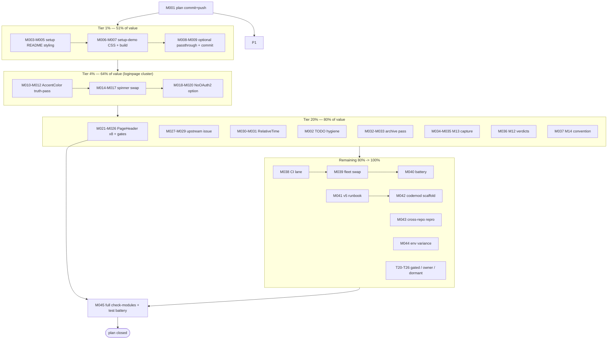

# SUPERB — templ-components Episode-4 Tail & Full-TODO Pareto Execution Plan

**Date:** 2026-10-04 06:27 CEST · **Scope:** all 32 open `TODO_LIST.md` items + the episode-4 audit tail
**Inputs:** `docs/research/2026-10-04_templ-components-deep-dive.html` (repo-wide 97/94/95) · `TODO_LIST.md` (32 open) · `docs/reviews/2026-10-04_05-45_loginpage-critical-review.html`
**Constraint (directive 5):** no Verschlimmbessern — every change lands behind its existing gate (tests, codegen drift, CSS class-sets, goldens); foreign/concurrent-session diffs are untouchable; PUBLISHED-module code rides the next release train (gotcha 8).

> **OUTCOME (annotated 2026-10-06, docs-health round 18) — EXECUTED; archived.** The episode-4 tail shipped 2026-10-04/05: (1) setup styling unblock (`setup.Config.LoginCSSPath` + README §Styling + setup-demo `/app.css` + `.#build-setup-demo-css`, `15bee1cf`); (4) `Config.AccentColor` doc truth-pass; (5) library-owned spinner swap; (6) RelativeTime verified ALREADY adopted 2026-09-26 (`dde7b7a8` — the plan's row was stale); (3) PageHeader 4/11 swapped, the 7 remaining detail headers documented as justified divergences (code-chip titles `PageHeaderProps.Title string` cannot express); statusToBadgeMap closed MOOT+ADOPTED 2026-10-05 (`display.Badge` upstream v1.19.4; adminui takes `BadgeType` directly, `8cc079f6`+`44e03709`). Residue (quiet-window loginpage coverage re-pin) lives in TODO_LIST. Live picture: TODO_LIST episode-4 tail row (struck) + `docs/research/2026-10-04_templ-components-deep-dive.html` inline annotations.

---

## 0. Pareto breakdown — what is "the result"?

Customer-perceived value of this repo = consumers wiring `setup`/`loginpage`/`adminui`/`dashboardui` and getting a polished, working product. Weighted by that:

| Tier              | Tasks                                                                                 | Share of value | Why                                                                                                                                                                                    |
| ----------------- | ------------------------------------------------------------------------------------- | -------------- | -------------------------------------------------------------------------------------------------------------------------------------------------------------------------------------- |
| **1% (1 task)**   | T1 setup styling unblock                                                              | **51%**        | The ONLY actively user-facing defect: every `setup.New` consumer ships an unstyled login page today. One task fixes the first-run experience for the library's flagship path.          |
| **4% (4 tasks)**  | T1 + T2 + T3 + T4 (loginpage consumer cluster)                                        | **64%**        | Completes the login-page story end-to-end: styling, honest docs, library-owned spinner, force-hide option. All cheap, all consumer-visible.                                            |
| **20% (9 tasks)** | + T5–T9 (audit tail completion + docs hygiene)                                        | **80%**        | Closes the last dashboardui capability gap (PageHeader ×8), files the 17-day-old upstream patch, retires the RelativeTime partial, archives stale reports, protocol hygiene (M12/M13). |
| **remaining 80%** | T10–T26 (v5 workstream, CI wiring, cross-repo debt, owner calls, dormant/gated items) | **100%**       | Necessary but none of it is consumer-visible this train.                                                                                                                               |

---

## 1. Table A — Comprehensive plan (30–100 min tasks, ALL 32 open TODOs, sorted by importance/impact/effort/customer-value)

| #   | Task                                                                                                                                                                         | TODO_LIST ref  | Impact | Effort                  | Tier | Verifiable done-when                                                                                         |
| --- | ---------------------------------------------------------------------------------------------------------------------------------------------------------------------------- | -------------- | ------ | ----------------------- | ---- | ------------------------------------------------------------------------------------------------------------ |
| T1  | **Setup login-page styling unblock**: setup/README §Styling (Tailwind v4 `@source` snippet), setup-demo consumer CSS wired, optional `setup.Config.LoginCSSPath` passthrough | 52.1 (HIGH)    | 5      | M (45–60m)              | 1%   | setup-demo renders a styled login page; README copy-paste snippet present; `go build ./...` per-module green |
| T2  | **loginpage `AccentColor` doc truth-pass**: field doc says "button/highlight color" but value reaches only the favicon SVG                                                   | 52.4           | 2      | S (15m→micro)           | 4%   | doc matches behavior; grep proves no other consumer of Accent                                                |
| T3  | **loginpage library-spinner swap**: hidden server-rendered `feedback.Spinner` in submit buttons; login.js toggles visibility instead of injecting markup                     | 52.5           | 1      | M (30–45m)              | 4%   | all 49 loginpage tests + hook assertions green; markup contains library spinner classes                      |
| T4  | **`Config.NoOAuth2` force-hide option** (only open loginpage review follow-up)                                                                                               | 53a            | 2      | M (30–45m)              | 4%   | option + test + README row; default behavior unchanged                                                       |
| T5  | **dashboardui `display.PageHeader` ×8 swap** (audit/projections/aggregates/snapshots/dlq) — last full capability gap; verify dark-token shell + goldens                      | 52.3           | 3      | M–L (60–100m)           | 20%  | goldens + a11y + class-set gates green; `.page-header` count = 0                                             |
| T6  | **File upstream `statusToBadgeMap` issue** (suspended/deleted/verified/enabled) on LarsArtmann/templ-components; link adminui util.go maps as evidence                       | 52.2           | 3      | S–M (30m)               | 20%  | issue URL recorded in TODO_LIST; verify-before-filing gate passed                                            |
| T7  | **dashboardui `RelativeTime` narrow swap** (snapshot-detail Created timestamp)                                                                                               | 52.6           | 1      | S–M (30m)               | 20%  | golden updated; SSE live rows untouched                                                                      |
| T8  | **TODO_LIST hygiene**: strike moot items (51 loginpage adoption — moot since 2026-10-04), verify no `[x]`                                                                    | 51 + gotcha 20 | 1      | S (15m)                 | 20%  | line 51 struck with evidence pointer                                                                         |
| T9  | **Status-report ARCHIVE pass**: verify-harvest 7 over-budget reports → `git mv` to `docs/status/archived/`                                                                   | 35             | 2      | M (60–90m)              | 20%  | `check-docs-tail-budget` advisory count drops to 0                                                           |
| T10 | **M13 BuildFlow failing-step-name capture** (dry-run + tee, agents-notes append)                                                                                             | 58             | 1      | M (30–45m)              | 20%  | 3 step names recorded with reproductions                                                                     |
| T11 | **M12 A012×4 inspection** (per-finding verdicts into residual-triage doc)                                                                                                    | 59             | 1      | S–M (30m)               | 20%  | 4 verdicts recorded                                                                                          |
| T12 | **M14 CHANGELOG receipt convention** (decide + apply or record skip)                                                                                                         | 60             | 1      | S (30m)                 | 20%  | convention documented in AGENTS/agents-notes                                                                 |
| T13 | **Wire `check-cqrs-lint` into CI** (last gate not in CI; gate script exists)                                                                                                 | 29             | 2      | M (45m)                 | 80%  | CI lane green on a scratch branch                                                                            |
| T14 | **Env investigation: scorecard timing variance**                                                                                                                             | 61             | 1      | S–M (30m)               | 80%  | root cause noted or closed as environmental                                                                  |
| T15 | **cqrs-lint rebuilt binary → fleet swap** (verification DONE; remaining = swap step)                                                                                         | 25             | 2      | M (45m)                 | 80%  | `cqrs-lint version` fleet-wide = rebuilt binary; 0 findings strict                                           |
| T16 | **Verification battery remainder**: e2e set + bench-spike (bench ONLY on idle machine, `--save-baseline` rules)                                                              | 27             | 3      | M–L (60–100m)           | 80%  | e2e green; bench gate green or explicitly deferred with reason                                               |
| T17 | **v5 cut runbook skeleton** (wave-ordered deletion plan, M15)                                                                                                                | 57             | 3      | M–L (60–100m)           | 80%  | runbook drafted from removal inventory                                                                       |
| T18 | **v5 codemod Track A scaffold** (`cqrs-htmx-upgrade`, rules R1–R10, golden fixtures)                                                                                         | 56             | 4      | L (100m, multi-session) | 80%  | scaffold + R1 golden fixture                                                                                 |
| T19 | **go-cqrs-lite pre-commit "Doc-only" misclassification diagnosis** (cross-repo, plan M7)                                                                                     | 34             | 2      | M (45m)                 | 80%  | root cause + repro in that repo                                                                              |
| T20 | **usermgmt V007 remainder** (68 SQLViewStore findings — GATED on metaengine layout planning)                                                                                 | 41             | —      | gated                   | rest | stays [~]; no action this plan                                                                               |
| T21 | **SidebarNav revisit criteria check** (dormant until library dark-token shell ships)                                                                                         | 30             | —      | gated                   | rest | stays open; criteria unchanged                                                                               |
| T22 | **BuildFlow go-version-auto-configure** (blocked on upstream BF1–BF3)                                                                                                        | 31             | —      | blocked                 | rest | stays open                                                                                                   |
| T23 | **DataStar Tier 4 panel variants** (demand-gated, ADR-0050)                                                                                                                  | 32             | —      | gated                   | rest | stays open pending demand evidence                                                                           |
| T24 | **appkit as setup server layer** (v5-window)                                                                                                                                 | 42             | —      | gated                   | rest | stays [~]                                                                                                    |
| T25 | **Hardware watch `/mnt/buildcache`** (human reclaim decision: rust/ 155G + sccache/ 20G)                                                                                     | 48             | —      | human                   | rest | stays open                                                                                                   |
| T26 | **Owner-call batch**: PapDashboard send (54) · datastar-demo rebrand-or-remove (50) · cqrs-lint nested-module tag decision (44) · go-cqrs-lite cross-repo debt (45)          | 44/45/50/54    | —      | owner                   | rest | stays open; packets already drafted                                                                          |

Coverage check: 26 tasks ↔ 32 TODO lines (4 multi-owner lines collapsed into T26; T20–T25 are the gated/dormant set carried explicitly).

---

## 2. Table B — Micro-task breakdown (≤12 min each), execution-sorted

| #    | Micro-task (≤12m)                                                                                                                                                        | Parent | Order |
| ---- | ------------------------------------------------------------------------------------------------------------------------------------------------------------------------ | ------ | ----- |
| M001 | Commit + push this plan (detailed message)                                                                                                                               | plan   | 0     |
| M002 | Strike TODO_LIST line 51 (moot) with episode-4 pointer                                                                                                                   | T8     | 1     |
| M003 | Read setup/setup.go:300-330 + setup/README route table; draft §Styling placement                                                                                         | T1     | 2     |
| M004 | Write setup/README §Styling: Tailwind v4 CSS-first snippet with `@source "../../go/pkg/mod/github.com/larsartmann/cqrs-htmx/loginpage/v4*"` + default-`/app.css` callout | T1     | 3     |
| M005 | Verify the `@source` glob against the actual module cache layout (GOMODCACHE path from `go list -m -f '{{.Dir}}'`)                                                       | T1     | 4     |
| M006 | Add minimal `assets/app.css` (tailwind v4 `@import "tailwindcss"; @source ...`) to examples/setup-demo + README note                                                     | T1     | 5     |
| M007 | `GOWORK=off go build ./...` + `go vet` per touched module (setup, examples/setup-demo)                                                                                   | T1     | 6     |
| M008 | Optional: `setup.Config.LoginCSSPath` passthrough + test + README config-table row                                                                                       | T1     | 7     |
| M009 | `nix run .#fmt -- <touched paths>`; commit T1 (detailed)                                                                                                                 | T1     | 8     |
| M010 | Read config.go:89-97 + grep Accent consumers; confirm favicon-only                                                                                                       | T2     | 9     |
| M011 | Rewrite AccentColor doc ("drives the SVG favicon accent only"); fix DefaultAccentColor comment                                                                           | T2     | 10    |
| M012 | Grep CHANGELOG/README for accent claims; align; run loginpage tests                                                                                                      | T2     | 11    |
| M013 | Commit T2                                                                                                                                                                | T2     | 12    |
| M014 | Read login.js spinner inject/remove + display.Button rendering; design hidden-spinner toggle                                                                             | T3     | 13    |
| M015 | Add hidden `feedback.Spinner` (spinning only when `.is-loading`) into lp-login-btn/lp-register-btn via page.templ                                                        | T3     | 16    |
| M016 | login.js: toggle spinner visibility class instead of insertAdjacentHTML; delete SPINNER_HTML                                                                             | T3     | 14    |
| M017 | Run loginpage test suite (49) + hook-presence grep; `templ generate` module-dir; commit T3                                                                               | T3     | 15    |
| M018 | Design `NoOAuth2` API (bool on Config; interacts with auto-detect branch in buildPageData)                                                                               | T4     | 17    |
| M019 | Implement + unit test (force-hide renders zero buttons even with providers) + README row                                                                                 | T4     | 18    |
| M020 | CHANGELOG entry; commit T4                                                                                                                                               | T4     | 19    |
| M021 | Read dashboardui page-header markup ×8 + `display.PageHeader` props; check dark-token fit                                                                                | T5     | 20    |
| M022 | Swap audit.templ (2 sites)                                                                                                                                               | T5     | 21    |
| M023 | Swap projections.templ + aggregates.templ                                                                                                                                | T5     | 22    |
| M024 | Swap snapshots.templ + dlq.templ (3 sites)                                                                                                                               | T5     | 23    |
| M025 | `rg -c 'page-header'` = 0; run dashboardui goldens + a11y + `check-css-bundle-classes`; rebuild bundle if class set changed                                              | T5     | 24    |
| M026 | Commit T5                                                                                                                                                                | T5     | 25    |
| M027 | Load verify-before-filing skill; re-verify diagnosis against library source                                                                                              | T6     | 26    |
| M028 | Load github-voice skill; draft issue (evidence: display/badge_templ.go:397-406 + adminui util.go:26,43)                                                                  | T6     | 27    |
| M029 | `gh issue create -R LarsArtmann/templ-components`; record URL in TODO_LIST                                                                                               | T6     | 28    |
| M030 | Locate snapshot-detail timestamp render; swap to `display.RelativeTime`                                                                                                  | T7     | 29    |
| M031 | Golden update + module tests; commit T7                                                                                                                                  | T7     | 30    |
| M032 | Status-report harvest triage: list 7 over-budget reports, verify each                                                                                                    | T9     | 31    |
| M033 | `git mv` verified reports → docs/status/archived/; annotate; re-run advisory checker                                                                                     | T9     | 32    |
| M034 | M13: reproduce failing BuildFlow steps; tee output; extract step names                                                                                                   | T10    | 33    |
| M035 | Append M13 findings to docs/agents-notes.md (gotcha-8 protocol)                                                                                                          | T10    | 34    |
| M036 | M12: pull A012 findings; write 4 verdicts into residual-triage doc                                                                                                       | T11    | 35    |
| M037 | M14: write CHANGELOG-receipt convention decision; apply or record skip                                                                                                   | T12    | 36    |
| M038 | T13: add CI lane for check-cqrs-lint; scratch-branch validation                                                                                                          | T13    | 37    |
| M039 | T15: fleet-swap rebuilt cqrs-lint binary; `cqrs-lint version` + rules-diff ritual (gotcha 23)                                                                            | T15    | 38    |
| M040 | T16: e2e battery (`.#test-all`); bench-spike deferred unless idle machine                                                                                                | T16    | 39    |
| M041 | T17: draft v5 cut runbook skeleton from v5-removal-inventory                                                                                                             | T17    | 40    |
| M042 | T18: scaffold cqrs-htmx-upgrade + R1 golden fixture                                                                                                                      | T18    | 41    |
| M043 | T19: reproduce go-cqrs-lite doc-only misclassification; file findings there                                                                                              | T19    | 42    |
| M044 | T14: timing-variance investigation or close-as-environmental                                                                                                             | T14    | 43    |
| M045 | Final: full `nix run .#check-modules` + `.#test`; verify no regressions; close plan                                                                                      | all    | 44    |

---

## 3. Execution graph

**Commit strategy (gotcha 4):** commit at every phase boundary — T1, T2, T3/T4, T5, T6/T7, docs batches — never one giant end-commit; the auto-commit daemon outruns long verification tails.

---

## 4. Verschlimmbessern guardrails

1. **login.js contract is sacred**: the 8 `lp-*` hooks + `hidden` visibility class are the JS↔markup contract; every loginpage change re-runs the hook-presence grep + the 49-test suite.
2. **dashboardui dark shell**: PageHeader swap must preserve `--sidebar-bg`/dark tokens; goldens + `check-css-bundle-classes` decide, not eyeballs.
3. **Concurrent sessions**: re-check `git log`/`git status` before assuming attribution; never revert diffs I didn't author (live precedent: the sibling session rewrote loginpage mid-review).
4. **Published modules**: loginpage/dashboardui/setup code changes carry `[Unreleased]` CHANGELOG entries and ride the next family train (gotcha 8).
5. **No new flake apps without self-tests** (gotcha 19: checker + fixture + CI or it's dead code).

## 5. Verification protocol

- Per task: module-scoped `go test ./... -count=1` + `go vet` (via `scripts/lib/go-cache-env.sh`).
- UI tasks: `nix run .#check-codegen`, `.#check-css-bundles`, `.#check-css-bundle-classes`.
- Plan close: `nix run .#check-modules` + full workspace test; `nix run .#preflight-tree-check` before batch steps.
- LSP output ignored (gotcha 14); CLI verdicts only.
