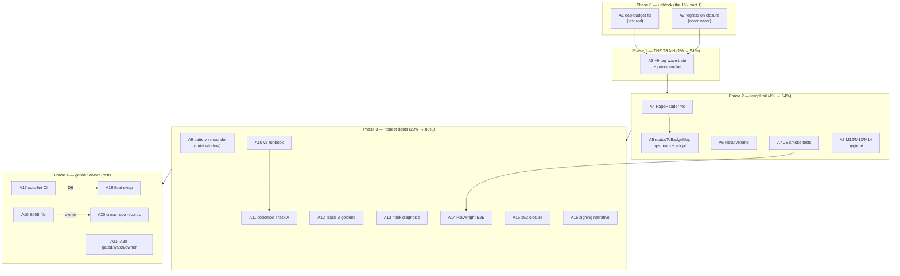

# SUPERB — Round-17 Tail & Green-Train Pareto Execution Plan

**Date:** 2026-10-04 07:45 CEST · **Scope:** every open `TODO_LIST.md` item (post-round-17 docs-health state) + the episode-4 plan remainder (T5–T19) + the round-16 plan's open M-rows
**Baseline:** master `830e4f1f` · **CI red on exactly ONE job** — `module-architecture` (loginpage 7 deps / budget 5, run 37178906141); `test`/`lint`/`build`/`checks`/`security`/`mod-tidy` green · docs gates green (85/450 annotated, tail 0) · 28 modules · signing arc CLOSED (v4.3.3 re-pin `a4eec94b`)
**Inputs:** `TODO_LIST.md` (2026-10-04 round-17 state, ~30 open rows + D1–D11) · [`2026-10-04_06-27_SUPERB-templ-tail-pareto-execution-plan.md`](2026-10-04_06-27_SUPERB-templ-tail-pareto-execution-plan.md) (T1–T4 DONE; T5–T19 carried) · [`2026-10-03_03-49_pareto-round16-owner-unlock-and-v5-readiness.md`](../2026-10-03_03-49_pareto-round16-owner-unlock-and-v5-readiness.md) (M1–M28 open rows) · round-17 harvest (loginpage test-depth, #52 closure, signing narrative)
**Anti-goal (Verschlimmbesserung):** see §4 — every change lands behind its existing gate; foreign/concurrent-session diffs are untouchable; PUBLISHED-module code rides the train (gotcha 8); measurement gates refuse under load.

> **OUTCOME (annotated 2026-10-06, docs-health round 18) — EXECUTED across two sessions; archived.** A1 loginpage dep-budget resolved (row 5→7 with rationale, `6d6f03ef` — the last red CI job, green since run 37392674249); A2 read_model_missing closure verified; A5 statusToBadgeMap resolved (see the templ-tail plan); A8.2/A8.3 receipts (agents-notes named BuildFlow steps; gotcha-20 CHANGELOG convention `64b113b6`); A10 v5-cut runbook skeleton; A29 upstream watch refreshed (`2908bbd0`). Executed 2026-10-04→05 amid heavy concurrent-session churn — full narrative in `docs/status/archived/2026-10-05_20-32_round17-plan-execution-and-divergence-recovery.md`. Residue (A7/A9/A11–A14, owner A17–A28) routed in TODO_LIST rows.

---

## 0. Pareto breakdown — what is "the result"?

**The result = a fully-green master that SHIPS.** A week of finished work (erraudit closures, loginpage rebuild + hardening, setup styling unblock, signing re-pin) is sitting untagged on master — invisible to every consumer until the next train. The single red CI job (loginpage dep-budget) is the only thing standing between master and a wave-ordered train.

| Tier | Tasks | Share of value | Why |
| --- | --- | --- | --- |
| **1%** | A1 dep-budget fix + A2 regression closure + A3 **THE TRAIN** | **51%** | Green master is the gate; the train is the only path by which consumers receive every fix from 2026-09-30 → today. Nothing else on this list matters to a consumer until A3 runs. |
| **4%** | A4–A7 (templ tail: PageHeader ×8, statusToBadgeMap, RelativeTime, loginpage JS smoke) + A8 hygiene micro-batch | **64%** | Closes the last UI-family capability gaps (repo-wide 97/94/95 → 100 coverage of the audit tail) and locks the rebuilt loginpage with its first JS tests. Small, mechanical, golden-gated. |
| **20%** | A9–A16 (battery remainder, v5 Track A scaffold + Track B goldens + runbook, hook diagnosis, Playwright E2E, #52 closure, signing narrative) | **80%** | Retires the oldest honest debts: the last battery legs, the v5 owner requirement (backwards auto-upgrade), and the cross-repo/upstream lifecycle loops. |
| **rest** | A17–A30 (D4/D6-gated tooling, owner-gated filings, gated/dormant watches) | **100%** | Everything owner-gated, demand-gated, or v5-window — routed, not forgotten. |

---

## 1. Table A — Comprehensive plan (30–100 min tasks, ALL open TODOs, sorted by tier → importance → effort → customer-value)

| # | Task | TODO_LIST ref | Impact | Effort | Tier | Depends | Verifiable done-when |
| --- | --- | --- | --- | --- | --- | --- | --- |
| A1 | **loginpage dep-budget resolution** (the LAST red): classify the 7 direct deps (templ, usermgmt, root, error-family, httputil, templ-components ×2) — drop `templ-components/utils` by inlining `Class`/`Ternary`, or justify 5→7 in the budget table with the adoption rationale | CI red / 37178906141 | **Critical** | M (45m) | 1% | — | `scripts/check-dep-budgets.sh` green; loginpage build+vet+test+lint green; module-architecture job green on push |
| A2 | **read_model_missing workspace closure** (coordinator role): check the sibling session's in-flight `identity-model/id.go` prefix-strip; when it lands, run the setup suite in WORKSPACE mode; close or re-sharpen the TODO row. NEVER edit the foreign diff | 54 | **Critical** | M (30m) | 1% | sibling session lands | workspace-mode setup suite green; TODO row closed with evidence |
| A3 | **THE RELEASE TRAIN (~9 tags, wave-ordered per playbook §3a)**: identity-model → usermgmt(+totp/webauthn/oauth2) → adminui/dashboardui/loginpage/health/systemadapter → setup → root → examples/e2e rides. Carries erraudit closures + loginpage rebuild/hardening + setup styling + signing v4.3.3 re-pin. `scripts/verify-tag.sh` only; `bump-dep.sh --commit` sweeps between waves; strict gates at every push; proxy smoke after | 19 (P1) | **Critical** | L (100m) | 1% | A1 + A2 green | 0 unpublished / 0 lag; CI green on the train tip; proxy smoke green; CHANGELOG version headers cut |
| A4 | **dashboardui `display.PageHeader` ×8 swap** (audit/projections/aggregates/snapshots/dlq .templ) — the last full capability gap; dark-token shell check first | 55 (3) | High | M–L (60–100m) | 4% | — | goldens + class-set + codegen gates green; zero `.page-header` customs left |
| A5 | **File upstream `statusToBadgeMap` issue** (verify-before-filing + github-voice; adminui util maps as evidence), then adopt `display.StatusBadge` in adminui once it lands | 55 (2) | High | S–M (30m) | 4% | — | issue URL recorded in TODO_LIST; adoption only after upstream merge |
| A6 | **dashboardui `RelativeTime` narrow swap** (snapshot-detail Created) | 55 (6) | Med | S (30m) | 4% | — | golden updated; SSE live rows untouched |
| A7 | **loginpage JS smoke tests**: node test harness (no framework — zero-dep posture kept for tests too), Base64URL round-trip property test, `serializeAssertion`/`serializeAttestation` shape goldens, wired into `nix run .#test` lane | 35 | High | M (45–60m) | 4% | — | `go test` triggers the JS suite; green in CI |
| A8 | **Hygiene micro-batch M12+M13+M14**: A012×4 per-finding verdicts into the residual-triage doc · BuildFlow failing-step-name capture (dry-run + tee → agents-notes) · CHANGELOG receipt convention for docs-only commits (decide + apply or record skip) | 61, 60, 62 | Med | S–M (30–45m) | 4% | — | 4 verdicts recorded; 3 step names in agents-notes; convention documented |
| A9 | **Battery remainder**: `nix run .#test-all` (28 modules incl. e2e/examples) + `bench-spike` — load < 6 verified TWICE; `--save-baseline` ONLY idle + bench-path-edits | 27 | High | M–L (60–100m) | 20% | quiet window | both rc=0 or explicitly deferred with the load numbers |
| A10 | **v5 cut runbook skeleton** (M15): wave-ordered deletion plan from `docs/guides/v5-removal-inventory.md` (classes 1–4 + 5b), consumer migration notes, pre-cut gate checklist | 59 | High | M (60m) | 20% | — | runbook drafted; OQ11 decision can land onto it |
| A11 | **v5 codemod Track A scaffold** (`cqrs-htmx-upgrade`): rules R1–R3 + R9–R10 (import/symbol rewrites), dry-run default, R1 golden consumer fixture | 58 (M26) | **High** | L (100m) | 20% | A10 wave lists | R1 fixture golden-passes; dry-run report mode works |
| A12 | **v5 Track B data-compat goldens** (M28 — fully independent): record a real v4.13.0 journal fixture, 21-event decode goldens, upcaster coverage matrix (`identity-model/upcaster.go`), fold-equivalence harness | 58 (M28) | **High** | L (100m) | 20% | — | goldens green on v4 bytes |
| A13 | **go-cqrs-lite "Doc-only" hook misclassification** (M7): reproduce a small Go staged diff skipping code gates in that repo; root cause + record THERE (owner-gated tree writes → repro first, file as issue) | 34 | Med | M (45m) | 20% | — | repro + root cause recorded; upstream ask drafted |
| A14 | **loginpage Playwright E2E**: real WebAuthn ceremony through the rendered page against a usermgmt service + a full-page render golden (suite today is `strings.Contains`-style) | 35 | Med | L (60–100m) | 20% | A7 | e2e spec green; golden pins the full render |
| A15 | **#52 closure hygiene**: comment on the closed go-cqrs-lite issue with consumer-side verification (3/3 PASS, battery green, re-pin `a4eec94b`) + check the `signing/v4.3.3` tag diff carries the proposed regression test | 36 | Med | S (30m) | 20% | — | comment posted; test presence confirmed or gap noted upstream |
| A16 | **agents-notes signing narrative**: dates, hashes, the wave-bisect wrong-turn, the `event.New` encoding auto-stamp API trap (long form of gotcha 24) | 37 | Med | S–M (30–45m) | 20% | — | dated history in `docs/agents-notes.md`, assembled from source reports only |
| A17 | **Wire `check-cqrs-lint` into CI** (T23 packet §1): nested-module tag step + workflow lane + self-test confirmation | 29, 46 | Med | M (45m) | rest | **D6 owner** | CI lane green incl. the new step |
| A18 | **Fleet cqrs-lint swap execution** (packet §8): bump the fleet pin to `b06ac8add5e8+`, swap, re-add the 2 B024 suppressions (documented FPs), rules-diff ritual (gotcha 23), retire the gotcha-13 caveat | 25 | Med | M (45m) | rest | **D4 owner** | `cqrs-lint version` = rebuilt binary fleet-wide; 0 findings strict; gotcha 13 retired |
| A19 | **File the E005 cross-module FP proposal** in go-cqrs-lite (draft ready in `docs/proposals/2026-10-01_cqrs-lint-e005-cross-module-registration.md`) | 45 tail | Med | S (30m) | rest | owner OK | issue URL recorded |
| A20 | **go-cqrs-lite cross-repo records** (M5 + the item-42 bar): CHANGELOG/AGENTS/TODO entries there + `go vet`/golangci-lint/`-race` on the ~150 new `cmd/cqrs-lint` lines | 47 | Med | M–L (60m) | rest | owner OK (its g1) | the touched repo passes its own bar |
| A21 | **usermgmt V007 remainder** (68 SQLViewStore findings) | 43 | — | gated | rest | upstream metaengine criterion (ADR-0051) | stays [~] — re-verify criterion each train |
| A22 | **appkit as setup server layer** (ADR-0052) | 44 | — | gated | rest | v5 window | stays [~] |
| A23 | **Remove `ProjectionLayer`** in the v5 bundle | 51 | — | gated | rest | v5 bundle window | prep done; rides the v5 deletion wave |
| A24 | **SidebarNav revisit** (dashboardui) | 30 | — | dormant | rest | library dark-token shell | criteria unchanged; re-check at next UI change |
| A25 | **Re-enable BuildFlow go-version-auto-configure** | 31 | — | blocked | rest | upstream BF1–BF3 | stays open |
| A26 | **DataStar Tier 4 panel variants** (ADR-0050) | 32 | — | gated | rest | demand evidence | stays open |
| A27 | **`/mnt/buildcache` reclaim** (rust/ 155G + sccache/ 20G) | 50 | — | human | rest | **D5 owner** | one-time prune at a maintenance window |
| A28 | **Owner-call batch**: PapDashboard reply SEND (drafted, proxy-verified) · datastar-demo keep confirm · D3/D8/D9/D10/D11 ticks · OQ11 v5 timeline | 56, 52, D-index | — | owner | rest | — | one sitting; each tick unlocks its row |
| A29 | **Upstream watch** (treefmt-nix#545, a-h/templ#1449, BuildFlow#29 responses; retire shims when they land) | 28 | — | passive | rest | upstream | check each train |
| A30 | **Env investigation: scorecard timing variance** (M22) | 63 | Low | S (30m) | rest | — | root cause noted or closed as environmental |

---

## 2. Table B — Micro-task breakdown (≤12 min each), execution-sorted

> Execution order = table order within each phase; phases per the graph in §3.

| ID | Micro-task | Time | Parent | Done-when |
| --- | --- | --- | --- | --- |
| 1.1 | Read `loginpage/go.mod` + `scripts/check-dep-budgets.sh` budget table; list the 7 direct deps with their import sites | 10m | A1 | dep → import-site map written |
| 1.2 | Classify: which deps are collapsible (utils inline candidates) vs load-bearing | 10m | A1 | go/no-reduce verdict per dep |
| 1.3 | Implement the chosen fix (inline `utils.Class`/`Ternary` OR budget-row justification with the adoption rationale) | 12m | A1 | go.mod or budget table edited |
| 1.4 | loginpage: `go build` + `go vet` + full test suite + golangci-lint | 10m | A1 | all green |
| 1.5 | `scripts/check-dep-budgets.sh` green + commit (message names the rationale) | 5m | A1 | dep-budget job would pass |
| 2.1 | Check the sibling session's `identity-model/id.go` state (committed? pushed?) | 3m | A2 | state known |
| 2.2 | Run the setup suite in WORKSPACE mode (`go test ./...` in setup, go.work on) | 10m | A2 | PASS/FAIL recorded |
| 2.3 | If green: close TODO row 54 with evidence; if red: record exact signatures + sharpest suspect | 8m | A2 | TODO row updated |
| 3.1 | `nix run .#preflight-tree-check` + `.#wait-tree-quiet` + advisory train check → today's wave list | 10m | A3 | wave list confirmed |
| 3.2 | Tag identity-model (verify-tag.sh, annotated) | 10m | A3 | tag published |
| 3.3 | Consumer sweep onto identity-model (bump-dep `--commit`) | 10m | A3 | sweeps green |
| 3.4 | Tag usermgmt + 3 auth submodules | 12m | A3 | 4 tags published |
| 3.5 | Consumer sweeps onto usermgmt family | 10m | A3 | sweeps green |
| 3.6 | Tag UI rides: adminui, dashboardui, loginpage, health, systemadapter | 12m | A3 | 5 tags published |
| 3.7 | Tag setup + root (CHANGELOG headers cut first) | 12m | A3 | 2 tags published |
| 3.8 | Tail sweeps: examples + e2e + integration_test | 10m | A3 | 0 lag |
| 3.9 | Strict train gate + version-drift + push | 8m | A3 | pushed, gates green |
| 3.10 | Proxy smoke (scratch module `go get` of the new tags) + CI watch | 10m | A3 | smoke green; CI run recorded |
| 4.1 | Read the 8 dashboardui page headers + `display.PageHeader` props + dark-token check | 10m | A4 | swap map written |
| 4.2 | Swap batch 1 (audit + projections) + golden regen | 12m | A4 | goldens green |
| 4.3 | Swap batch 2 (aggregates + snapshots) + golden regen | 12m | A4 | goldens green |
| 4.4 | Swap batch 3 (dlq + 2 more) + golden regen | 12m | A4 | goldens green |
| 4.5 | Class-set gate + codegen check + dashboardui tests | 10m | A4 | 3 gates green |
| 5.1 | Assemble statusToBadgeMap evidence pack (verify-before-filing) | 10m | A5 | pack ready |
| 5.2 | Draft issue in Lars's voice (github-voice) + file + record URL | 10m | A5 | issue filed |
| 5.3 | Prep adminui StatusBadge adoption branch plan (executes post-merge) | 8m | A5 | plan noted in TODO |
| 6.1 | RelativeTime swap (snapshot-detail Created) + golden update | 12m | A6 | golden green |
| 7.1 | Decide the JS test runner (plain `node:test` — zero-dep) + wire hook into the flake test lane | 12m | A7 | harness runs |
| 7.2 | Base64URL round-trip property test | 12m | A7 | property test green |
| 7.3 | serializeAssertion/serializeAttestation shape goldens | 12m | A7 | goldens green |
| 7.4 | Wire JS suite into `go test` (exec wrapper) + CI lane | 10m | A7 | green in CI |
| 8.1 | A012×4: per-finding verdicts into `docs/research/2026-10-01_cqrs-lint-residual-triage.md` | 12m | A8 | 4 verdicts recorded |
| 8.2 | BuildFlow dry-run + tee → capture the 3 failing step names → agents-notes | 12m | A8 | names recorded |
| 8.3 | CHANGELOG receipt convention: decide + one-paragraph record (AGENTS or agents-notes) | 8m | A8 | convention written |
| 9.1 | Load check ×2 (`uptime`; proceed only < 6 twice) | 4m | A9 | go/no-go recorded |
| 9.2 | `nix run .#test-all` (28 modules) | 12m | A9 | rc=0 recorded |
| 9.3 | `nix run .#bench-spike` (+ `--save-baseline` ONLY if idle + path edits) | 12m | A9 | gate green or honest refusal logged |
| 10.1 | Runbook skeleton: header + wave-ordered deletion list from the inventory | 12m | A10 | §1 drafted |
| 10.2 | Consumer migration notes per class | 12m | A10 | §2 drafted |
| 10.3 | Pre-cut gate checklist + link from OQ11 | 10m | A10 | §3 drafted + linked |
| 11.1 | Scaffold `cmd/cqrs-htmx-upgrade` (dry-run report mode first) | 12m | A11 | scaffold builds |
| 11.2 | Rules R1–R3 (import/symbol rewrites) + unit fixtures | 12m | A11 | fixtures pass |
| 11.3 | Rules R9–R10 + R1 golden consumer fixture | 12m | A11 | golden round-trips |
| 12.1 | Record real v4.13.0 journal fixture (21 events, signed + plain) | 12m | A12 | fixture committed |
| 12.2 | 21-event decode goldens against v4 bytes | 12m | A12 | goldens green |
| 12.3 | Upcaster coverage matrix + fold-equivalence harness skeleton | 12m | A12 | matrix lands |
| 13.1 | Reproduce the "Doc-only" skip on a small Go diff in go-cqrs-lite | 12m | A13 | repro captured |
| 13.2 | Root-cause the classifier + draft the upstream ask (tree-write stays owner-gated) | 12m | A13 | cause + ask drafted |
| 14.1 | Playwright spec skeleton (loginpage + usermgmt test service) | 12m | A14 | spec compiles |
| 14.2 | WebAuthn ceremony happy path + failure path | 12m | A14 | spec green |
| 14.3 | Full-page golden + snapshot wiring | 12m | A14 | golden pinned |
| 15.1 | Post the #52 verification comment | 10m | A15 | comment live |
| 15.2 | Tag-diff check: `signing/v4.3.3` carries the regression test? | 10m | A15 | confirmed or gap filed |
| 16.1 | Assemble the signing long-form narrative from the 3 source reports (no invention) | 12m | A16 | draft in agents-notes |
| 16.2 | Voice-pass + link from gotcha 24 | 10m | A16 | linked |
| 17.1–17.3 | (post-D6) tag the nested `cmd/cqrs-lint` module → CI step → self-test lane confirmation | 3×12m | A17 | CI lane green |
| 18.1–18.4 | (post-D4) fleet pin bump → swap → re-add 2 B024 suppressions → rules-diff + gotcha-13 retirement | 4×10m | A18 | swap verified fleet-wide |
| 19.1–19.2 | (post-owner) file E005 + record URL | 2×10m | A19 | filed |
| 20.1–20.4 | (post-owner) cross-repo CHANGELOG/AGENTS/TODO + vet/lint/race on `cmd/cqrs-lint` | 4×12m | A20 | that repo passes its bar |
| 30.1 | M22 env investigation: rerun scorecard twice, compare cache state | 12m | A30 | note or close |

---

## 3. Execution graph

---

## 4. Verschlimmbesserung guardrails (non-negotiable)

1. **Foreign diffs are untouchable.** `identity-model/id.go` is a concurrent session's in-flight work — A2 is a VERIFY-and-coordinate task, never an edit.
2. **Published module code rides the train.** A4/A6 (dashboardui), A5-adoption, loginpage work after A3 → next train, not out-of-band tags (gotcha 8) — unless the owner orders an out-of-train patch.
3. **Every UI swap lands behind its gate:** codegen drift, CSS class-sets, goldens, per-module tests (constraint inherited from the episode-4 plan).
4. **Measurement gates refuse under load** (bench-spike: load < 6 verified twice; `--save-baseline` only idle + path-edits). Correctness gates are load-insensitive — run them.
5. **Tags ONLY via `scripts/verify-tag.sh`** (committed tree, no family dev-replaces, post-push ls-remote). Never re-push a version at a different commit (gotcha 5).
6. **Commit at phase boundaries** — the daemon polls faster than verification tails (gotcha 4). `bump-dep.sh --commit` for sweeps; never background a `git commit`.
7. **No new abstractions for imagined futures** — the codemod (A11) implements rules the removal inventory already lists, nothing speculative.
8. **Docs stay truthful:** every claim in CHANGELOG/TODO edits carries evidence (hash, run id, or file:line). Coverage claims keep the gates-vs-percentages date split.

## 5. Verification protocol

- Per code phase: module-scoped `go build` + `go vet` + `-race` tests + `golangci-lint run` (exact-target first, then `nix run .#test` workspace-wide at the wave boundary — gotcha 2: root `./...` is a FALSE green).
- Per docs phase: `check-docs-links` + `check-docs-freshness` + the two status gates + scoped `.#fmt`.
- Train phase: strict release-train + version-drift at EVERY push; proxy smoke at the end; fresh-tag TTL ghost → `--refresh-cache` recipe (gotcha 5).
- Close-out: `nix run .#check-modules` composite (28 stages) at the first quiet window after Phases 0–2.
