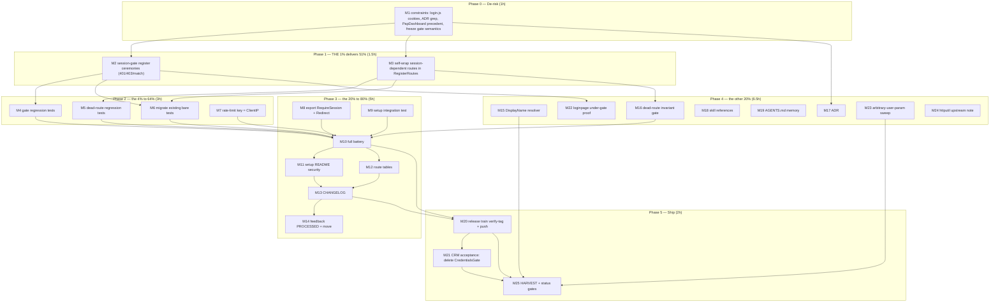

# SUPERB — Identity Auth Hardening Pareto Execution Plan

**Created:** 2026-10-04 12:12
**Scope:** The CRM identity-adapter feedback work — session-gating WebAuthn ceremonies, resurrecting the dead authenticated-route subset, rate-limit key fix, session-gate helpers, DisplayName resolver, plus tests/docs/release. Grounded STRICTLY in the verified findings of `docs/status/2026-10-04_12-09_crm-identity-feedback-verification.md` (every claim source-verified there with file:line).
**Source feedback:** `docs/feedback/new/2026-10-04_crm-identity-adapter-gaps.md` (Ledger CRM)
**Verdict driving this plan:** all 5 claims verified; item 1 is a library-wide vulnerability; item 2's dead-route class is WIDER than reported (6 route groups); loginpage is a first-party constraint on the fix design.

> **OUTCOME (annotated 2026-10-06, docs-health round 18) — FULLY EXECUTED (M1–M25); archived.** Shipped as **usermgmt v4.14.0 + setup v4.14.0 + dashboardui v4.13.0** (patch train usermgmt/v4.14.1 + identity-model/v4.12.1): the owner-match gate + 11-route self-wrap (ADR-0055), `setup.RequireSession`/`RequireSessionRedirect`, `Service.DisplayName`, per-IP rate-limit keys, the `check-session-route-wrappers` invariant gate (check-modules + CI), session-gate/dead-route/loginpage-flow tests, README/CHANGELOG/skill/AGENTS truth-passes, CRM acceptance (`c32d1c0`), and the release wave. Execution + self-review receipt: `docs/status/archived/2026-10-04_15-50_identity-auth-hardening-execution-self-review.md`. Residue routed: battery legs (test-all/coverage/cqrs-lint) → TODO battery row; browser-level ceremony → TODO loginpage test-depth; CRM-repo items → owner.

---

## Context (what we know, with evidence)

1. **Account takeover via unauthenticated credential enrollment.** `POST /auth/webauthn/register/begin` takes the target user from the JSON body (`usermgmt/webauthn_http.go:43`); `register/finish` takes it from the `user_id` query param (`:52`, `:14-21`). No session check anywhere in handler or service (`webauthn_service.go:80-136` checks existence only). Routes mount bare (`usermgmt/http.go:201-202`; `setup/mount.go:45-47`; `Bundle.Middleware()` adds no session — `setup/bundle.go:159-181`). ULIDs are time-ordered → enumerable. **Every consumer ships this.**
2. **The fix is bootstrap-safe.** `POST /auth/register` sets the session cookie BEFORE any ceremony (`http.go:247`), so a session gate does not break first-user enrollment.
3. **Dead-route class (wider than the feedback).** Every `RegisterRoutes` handler that calls `currentUser`/`currentUserWithPathValue` fails 401-forever when mounted bare, because nothing populates the context on that path: `/auth/me` (`http.go:270-276`), `/auth/credentials` + `/auth/credentials/{id}` (`credential_http.go:37,:94`), three TOTP/verification routes (`verification_totp_http.go:62,211,236`), OAuth2 unlink (`oauth2_http.go:73`).
4. **loginpage constrains the design.** `loginpage/assets/login.js:220-237` drives `register → registerBegin → registerFinish` in one flow. A "session user must match target" gate keeps it working (cookie set at register; same-origin fetch sends cookies by default) — a plain 401 gate without the match rule could break the library's own login page. **Verify `postJSON` cookie posture before implementing.**
5. **Rate-limit keys are per-TCP-connection.** `newLimiterFromConfig` pins `KeyExtractorFromRemoteAddr()` (`usermgmt/http.go:118`) = `IP:port`. httputil already ships `KeyExtractorFromClientIP` — one-line fix, usermgmt-local.
6. **No `RequireSession`-style helpers exported.** setup has the 401 flavor UNexported (`setup/mount.go:135-145`).
7. **No `DisplayName` resolver.** Read model has the data (`sql_readmodel.go:41`); consumers re-derive query + prefixed/bare id handling (`user:`-prefixed actor strings from `middleware.go:128` vs bare ids in views).

### Decision gates (open questions from the status report — plan assumes the recommendation)

| Gate | Question                                                                               | Working assumption (flagged, reversible)                                                                                     |
| ---- | -------------------------------------------------------------------------------------- | ---------------------------------------------------------------------------------------------------------------------------- |
| G1   | Any fleet consumer relying on unauthenticated enrollment (headless scripts)?           | None beyond loginpage-compatible flows; ship as **minor train** with CHANGELOG Security note (401 where 200). Lars confirms. |
| G2   | Minor vs v5 for the behavior tightening?                                               | Minor — precedent: behavior fixes ride trains; the tightened response is the secure default.                                 |
| G3   | CRM repo reachable for the acceptance run ("delete CredentialsGate, nothing reddens")? | If yes → M21 executes; if no → M21 records as consumer-side follow-up.                                                       |

### Fix-design decisions (mine, stated so they can be vetoed)

- **Gate semantics:** 401 without session; session user must match the body/query `user_id` (mismatch → 403). Body/query params STAY (compat + explicitness) but are now authorization-checked. NO HTTP-level opt-out flag — the only legitimate unauthenticated flow (first-user bootstrap) is already served by the register-issues-cookie ordering; headless/admin enrollment stays possible via the **service-level** API (`BeginRegistration(ctx, userID)`), which remains open. The "library principle" (no enforced defaults) does not protect authorization invariants.
- **Dead-route fix:** self-wrap the session-dependent subset INSIDE `RegisterRoutes` (usermgmt owns service + cookieName) with an enrich-only session pass — handlers keep their fail-closed 401s; setup inherits the fix with zero consumer action.

---

## Pareto Breakdown

### The 1% that delivers 51% — **M2 + M3** (~90 min total)

Gate the two ceremony handlers + self-wrap the session-dependent route subset. One small diff that simultaneously: closes the account-takeover hole, resurrects 6 dead route groups, and enables the CRM to delete its `CredentialsGate`. This is nearly all the security value and most of the functional value.

### The 4% that delivers 64% — add **M4 + M5 + M6 + M7** (~3.5 h)

Regression tests for the gate + dead routes, migration of the existing bare-mounting tests (CI must stay green — these WILL redden: `handler_webauthn_test.go:24,117`, `coverage_schema_test.go:144`, `fuzz_test.go:69`, `webauthn_ratelimit_test.go:28`), and the one-line rate-limit key fix. Proves the 51% and hardens the same auth surface.

### The 20% that delivers 80% — add **M8 + M9 + M10 + M11 + M12 + M13 + M14** (~5 h)

Exported `RequireSession`/`RequireSessionRedirect` helpers, the setup-level integration test, the full verification battery, README/CHANGELOG truth-telling, and completing the feedback lifecycle (annotate + `git mv`). Consumer-visible polish and process closure.

### The other 20% (to 100%) — **M15 + M16 + M17 + M18 + M19 + M20 + M21 + M22 + M23 + M24 + M25**

DisplayName resolver (item 4), mechanical dead-route invariant gate, ADR, skill/doc updates, AGENTS.md memory, the release train, CRM acceptance, loginpage E2E, arbitrary-user-param audit, upstream httputil doc note, TODO_LIST harvest.

**Execution order = 1% → 4% → 20% → rest. Commit at every phase boundary (gotcha 4).**

---

## Comprehensive Plan — Medium Granularity (30–100 min, 25 tasks)

Sorted by importance/impact/effort/customer-value (execution order within phase).

| #   | Task                                                                                                                               | Module         | Phase | Est | Impact                       | Effort | Customer value                                       | Depends     |
| --- | ---------------------------------------------------------------------------------------------------------------------------------- | -------------- | ----- | --- | ---------------------------- | ------ | ---------------------------------------------------- | ----------- |
| M1  | De-risk: read login.js cookie posture, check ADRs for route-posture decision, read PapDashboard precedent, finalize gate semantics | loginpage/docs | P0    | 30m | H (prevents breaking own UI) | S      | Protects first-party flow                            | —           |
| M2  | F1: session-gate register/begin+finish (401 no session, 403 mismatch, match rule)                                                  | usermgmt       | P1    | 45m | **CRITICAL**                 | S      | Closes account takeover                              | M1          |
| M3  | F2: self-wrap session-dependent subset in RegisterRoutes (me, credentials, TOTP, OAuth2-unlink)                                    | usermgmt       | P1    | 45m | **CRITICAL**                 | S      | Resurrects 6 dead route groups                       | M1          |
| M4  | T1: gate regression tests (no-session 401 / mismatch 403 / self 200, begin+finish)                                                 | usermgmt       | P2    | 30m | H                            | S      | Proves the security fix                              | M2          |
| M5  | T2: dead-route regression tests (bare RegisterRoutes + valid cookie → all 6 groups reachable; no cookie → 401)                     | usermgmt       | P2    | 45m | H                            | M      | Proves the resurrection                              | M3          |
| M6  | T3: migrate existing bare-mounting tests to session-authed requests                                                                | usermgmt       | P2    | 60m | H                            | M      | Keeps CI green                                       | M2          |
| M7  | F3: switch `newLimiterFromConfig` to `KeyExtractorFromClientIP` + proxy-trust docs                                                 | usermgmt       | P2    | 30m | M                            | XS     | Real per-IP budgets on auth surface                  | —           |
| M8  | F4: export `setup.RequireSession` + add `RequireSessionRedirect` + tests                                                           | setup          | P3    | 45m | M                            | S      | Deletes the 15-line-wrapper class for HTML consumers | —           |
| M9  | T5: integration test via `setup.Bundle.Handler` full mount (auth subset reachable end-to-end)                                      | setup          | P3    | 45m | H                            | M      | E2E proof of the whole class fix                     | M3          |
| M10 | Full battery: `nix run .#test` + `.#lint` + `.#check-modules` + scoped fmt                                                         | all            | P3    | 60m | H                            | M      | Gate green before docs/release                       | M2–M9       |
| M11 | D1: setup/README security section — document the session gate next to the no-CSRF note                                             | setup          | P3    | 30m | M                            | S      | Consumers understand new posture                     | M2,M3       |
| M12 | D2: root README + usermgmt route tables — mark authenticated subset                                                                | root/usermgmt  | P3    | 30m | M                            | S      | Docs stop lying by omission                          | M3          |
| M13 | D4: CHANGELOG `[Unreleased]` — Security (1,2), Fixed (5), Added (3)                                                                | usermgmt/setup | P3    | 30m | M                            | S      | Upgrade path visibility                              | M2,M3,M7,M8 |
| M14 | D6: annotate feedback file `> **PROCESSED**` + `git mv` to processed/                                                              | docs           | P3    | 30m | M                            | XS     | Lifecycle closure (gotcha 20)                        | M2,M3       |
| M15 | F5: `Service.DisplayName(ctx, id)` with id-shape contract (bare + `user:`-prefixed) + tests                                        | usermgmt       | P4    | 90m | M                            | M      | Deletes re-derived query+duality bugs                | —           |
| M16 | T6: mechanical invariant — every `currentUser`-calling handler behind session wrapper; flake app + check-modules + CI + self-test  | usermgmt/ci    | P4    | 90m | M                            | L      | Class can never silently regress                     | M3          |
| M17 | D5: ADR "credential ceremonies require owner session" (+ check existing ADR coverage first)                                        | docs/adr       | P4    | 45m | M                            | S      | Decision durability                                  | M1,M2       |
| M18 | D3: skill `references/usermgmt.md` + SKILL.md route/posture updates                                                                | .agents/skills | P4    | 30m | M                            | S      | Future sessions teach correct wiring                 | M3          |
| M19 | D7: AGENTS.md — loginpage same-origin-cookie constraint + class-fixed note                                                         | AGENTS.md      | P4    | 30m | L                            | S      | Durable memory                                       | M3          |
| M20 | R2: release train — verify-tag usermgmt + setup (wave-ordered), push                                                               | release        | P5    | 60m | H                            | M      | Ships the fix to consumers                           | M10,M13     |
| M21 | R3: CRM acceptance — remove `CredentialsGate`, run CRM suite, record evidence                                                      | CRM            | P5    | 30m | H                            | S      | The feedback's own acceptance test                   | M20, G3     |
| M22 | T4: loginpage under-gate verification (cookie posture proof + minimal ceremony test)                                               | loginpage      | P4    | 60m | M                            | M      | First-party flow proven, not assumed                 | M2          |
| M23 | Audit auth routes for OTHER arbitrary-user params (item-1 class sweep)                                                             | usermgmt       | P4    | 45m | M                            | M      | No sibling holes left                                | M2          |
| M24 | Upstream httputil doc note: `KeyExtractorFromRemoteAddr` keys per TCP connection                                                   | httputil       | P4    | 30m | L                            | S      | Fleet learns the trap                                | M7          |
| M25 | HARVEST non-done items into TODO_LIST/ROADMAP + run status gates                                                                   | docs           | P5    | 30m | L                            | S      | Living docs stay source of truth                     | all         |

**Totals:** ~17.5 h medium-granularity. P1 (the 1%): 90 min. P1+P2 (the 4%): ~4.75 h.

---

## Detailed Breakdown — Fine Granularity (≤12 min each, 88 tasks)

| ID   | Micro-task                                                                                                    | Est | Dep         | Done-when                                    |
| ---- | ------------------------------------------------------------------------------------------------------------- | --- | ----------- | -------------------------------------------- |
| 1.1  | Read `loginpage/assets/login.js` `postJSON`/fetch — confirm no `credentials:'omit'`, cookies ride same-origin | 8m  | —           | cookie posture documented in ADR notes       |
| 1.2  | Grep `docs/adr/` for auth-route posture / public-routes decision                                              | 6m  | —           | existing coverage yes/no recorded            |
| 1.3  | Read `docs/feedback/processed/2026-09-29_papdashboard-setup-non-adoption.md` gate section                     | 8m  | —           | precedent claim verified (no claim on faith) |
| 1.4  | Finalize gate semantics (401/403/match rule) + record in plan/ADR draft                                       | 10m | 1.1         | semantics frozen, written down               |
| 2.1  | Add `sessionUserID(w,r)` helper on AuthHandler (reads ctx user, writes 401)                                   | 10m | 1.4         | helper compiles                              |
| 2.2  | Gate `handleWebAuthnBeginRegistration`: session required; body user must match session (403 mismatch)         | 12m | 2.1         | bare POST → 401, mismatch → 403              |
| 2.3  | Gate finish path via `requireUserIDWithWebAuthnRateLimit` caller: session+match before ceremony               | 12m | 2.1         | finish honors same rule                      |
| 2.4  | Error copy + errorfamily compliance pass on new paths (no stdlib errors)                                      | 8m  | 2.2,2.3     | `nix run .#lint` scoped clean                |
| 2.5  | Scoped fmt on touched files (`nix run .#fmt -- <paths>`)                                                      | 6m  | 2.4         | treefmt clean                                |
| 3.1  | Add lazy session wrapper on AuthHandler (reuses service+cookieName, enrich-only)                              | 10m | 1.4         | wrapper exists                               |
| 3.2  | Wrap `/auth/me` + `/auth/credentials` + `/auth/credentials/{id}` registrations                                | 10m | 3.1         | routes receive context                       |
| 3.3  | Wrap TOTP/verification session-dependent routes                                                               | 10m | 3.1         | routes receive context                       |
| 3.4  | Wrap OAuth2 unlink route                                                                                      | 10m | 3.1         | route receives context                       |
| 3.5  | Confirm register + webauthn login ceremonies stay public (login is unauthenticated by nature)                 | 6m  | 3.2         | route table updated in doc comment           |
| 4.1  | Test: `register/begin` without session → 401                                                                  | 8m  | 2.2         | test green                                   |
| 4.2  | Test: `register/begin` session vs mismatched body target → 403                                                | 10m | 2.2         | test green                                   |
| 4.3  | Test: `register/begin` self-target → 200 (options returned)                                                   | 10m | 2.2         | test green                                   |
| 4.4  | Test: finish mirrors begin gates (401/403/200 paths)                                                          | 10m | 2.3         | test green                                   |
| 5.1  | Test: bare `RegisterRoutes` + valid cookie → `GET /auth/me` 200                                               | 10m | 3.2         | test green                                   |
| 5.2  | Test: credentials list reachable with cookie                                                                  | 10m | 3.2         | test green                                   |
| 5.3  | Test: credentials delete reachable with cookie                                                                | 10m | 3.2         | test green                                   |
| 5.4  | Test: TOTP session-dependent routes reachable with cookie                                                     | 10m | 3.3         | test green                                   |
| 5.5  | Test: OAuth2 unlink reachable with cookie                                                                     | 10m | 3.4         | test green                                   |
| 5.6  | Test: no cookie → 401 everywhere in the subset (fail-closed preserved)                                        | 8m  | 3.2         | test green                                   |
| 6.1  | Migrate `handler_webauthn_test.go` register cases to authed sessions                                          | 12m | 2.2         | file compiles, tests green                   |
| 6.2  | Migrate `coverage_schema_test.go:144` case                                                                    | 8m  | 2.2         | green                                        |
| 6.3  | Migrate `fuzz_test.go:69` seeds                                                                               | 10m | 2.2         | green                                        |
| 6.4  | Migrate `webauthn_ratelimit_test.go` (already session-aware — verify still valid)                             | 10m | 2.2         | green                                        |
| 6.5  | `GOEXPERIMENT=jsonv2 go test ./... -count=1 -race` in usermgmt                                                | 10m | 6.1–6.4     | zero red                                     |
| 7.1  | Switch `http.go:118` to `httputil.KeyExtractorFromClientIP()`                                                 | 5m  | —           | one-line diff                                |
| 7.2  | Document proxy-trust caveat in `HandlerConfig` rate-limit docs                                                | 8m  | 7.1         | doc comment                                  |
| 7.3  | Check tests pinning RemoteAddr-shaped keys                                                                    | 10m | 7.1         | none broken or migrated                      |
| 8.1  | Export `RequireSession` in setup (reuse `mount.go:135` body)                                                  | 8m  | —           | exported                                     |
| 8.2  | Add `RequireSessionRedirect(loginURL string)` (303 for browsers)                                              | 10m | 8.1         | exported                                     |
| 8.3  | Unit tests: 401 variant + redirect variant + pass-through                                                     | 12m | 8.2         | green                                        |
| 8.4  | Replace internal `requireSession` usages with exported symbol                                                 | 8m  | 8.1         | no duplicate (no split brain)                |
| 9.1  | Integration test skeleton: `setup.New` + `Bundle.Handler(mux)`                                                | 12m | 3.2         | compiles                                     |
| 9.2  | Register user → assert `/auth/me` + `/auth/credentials` reachable                                             | 12m | 9.1         | green                                        |
| 9.3  | Assert `RequireSessionRedirect` behavior through the bundle                                                   | 10m | 8.2         | green                                        |
| 10.1 | `nix run .#test` (full workspace battery)                                                                     | 12m | M2–M9       | green, candidate count printed               |
| 10.2 | `nix run .#lint`                                                                                              | 12m | 10.1        | green                                        |
| 10.3 | `nix run .#check-modules`                                                                                     | 12m | 10.2        | green                                        |
| 10.4 | Scoped fmt final pass on all touched files                                                                    | 6m  | 10.3        | clean                                        |
| 11.1 | Rewrite setup/README security section: session gate + rationale next to no-CSRF note                          | 12m | M2,M3       | section truthful                             |
| 11.2 | Cross-check consistency with CHANGELOG wording                                                                | 8m  | 11.1,13.x   | no drift                                     |
| 12.1 | Root README route table: mark authenticated subset                                                            | 10m | M3          | table updated                                |
| 12.2 | usermgmt README/doc-comment route notes                                                                       | 10m | M3          | updated                                      |
| 13.1 | CHANGELOG usermgmt: Security (gate) + Fixed (dead routes, rate-limit key)                                     | 8m  | M2,M3,M7    | entry written                                |
| 13.2 | CHANGELOG setup: Added (`RequireSession`/`RequireSessionRedirect`)                                            | 6m  | M8          | entry written                                |
| 13.3 | Root CHANGELOG pointer if consumer-visible posture changed                                                    | 5m  | 13.1        | yes/no decided                               |
| 14.1 | Write `> **PROCESSED** (2026-10-04): …` blockquote with per-item outcomes                                     | 10m | M2,M3,M7,M8 | annotated                                    |
| 14.2 | `git mv docs/feedback/new/… processed/`                                                                       | 3m  | 14.1        | moved                                        |
| 15.1 | Implement `Service.DisplayName(ctx, userID)` over read model (name→email→"" ladder, tombstone-filtered)       | 12m | —           | method exists                                |
| 15.2 | Id-shape parsing: bare ULID + `user:`-prefixed (`PrefixedString` inverse)                                     | 12m | 15.1        | both shapes accepted                         |
| 15.3 | Contract doc comment: accepted shapes, missing-user behavior                                                  | 8m  | 15.2        | documented                                   |
| 15.4 | Tests: both shapes, missing user, tombstoned user, ladder order                                               | 12m | 15.2        | green                                        |
| 16.1 | Script/test listing `currentUser`-calling handlers in usermgmt                                                | 12m | M3          | inventory output                             |
| 16.2 | Assert each is registered behind the session wrapper                                                          | 12m | 16.1        | assertion green                              |
| 16.3 | Flake app + check-modules stage + CI step                                                                     | 12m | 16.2        | wired                                        |
| 16.4 | Fixture self-test (clean passes / broken fails)                                                               | 12m | 16.3        | `#test-…` green                              |
| 17.1 | Check ADR index for existing route-posture ADR                                                                | 6m  | 1.2         | yes/no                                       |
| 17.2 | Draft ADR: owner-session-gated ceremonies, bootstrap ordering, no-HTTP-opt-out rationale                      | 12m | 17.1        | draft                                        |
| 17.3 | Link ADR from setup README + feedback disposition                                                             | 8m  | 17.2        | linked                                       |
| 18.1 | Update skill `references/usermgmt.md`: route table + session requirement                                      | 10m | M3          | updated                                      |
| 18.2 | SKILL.md cheat-sheet/gotchas touch (gate now library-enforced)                                                | 8m  | 18.1        | updated                                      |
| 19.1 | AGENTS.md: record loginpage same-origin-cookie dependency + class-fixed note                                  | 10m | M3          | recorded                                     |
| 19.2 | Review Key Patterns section for staleness re: auth posture                                                    | 8m  | 19.1        | updated/confirmed                            |
| 20.1 | Pre-tag battery re-run (test+lint+check-modules)                                                              | 12m | M10         | green                                        |
| 20.2 | `scripts/verify-tag.sh usermgmt <ver>` (committed tree, no dev replaces)                                      | 10m | 20.1        | tagged                                       |
| 20.3 | `scripts/verify-tag.sh setup <ver>`                                                                           | 10m | 20.2        | tagged                                       |
| 20.4 | Push branch + tags; pre-push release-train gate green                                                         | 8m  | 20.3        | pushed                                       |
| 21.1 | Confirm CRM repo path/access (G3)                                                                             | 5m  | M20         | path or blocked-marker                       |
| 21.2 | Remove CRM `CredentialsGate`, run CRM suite (`credentials_gate_test.go`, BDD, rate-limit contract)            | 12m | 21.1        | nothing reddens                              |
| 21.3 | Record acceptance evidence in feedback disposition                                                            | 8m  | 21.2        | recorded                                     |
| 22.1 | httptest-level proof: cookie rides loginpage-equivalent fetches under gate                                    | 10m | M2          | proof test green                             |
| 22.2 | Minimal Playwright ceremony through rendered page (or scoped-down if env blocks)                              | 12m | 22.1        | E2E green/recorded                           |
| 22.3 | loginpage README: document the flow's session-cookie dependency                                               | 8m  | 22.1        | documented                                   |
| 23.1 | Sweep auth handlers for other body/query user-id params (item-1 class)                                        | 10m | M2          | inventory                                    |
| 23.2 | Apply match rule to any found; tests                                                                          | 12m | 23.1        | none left unhandled                          |
| 24.1 | Draft httputil doc-comment note (per-TCP-connection semantics + ClientIP pointer)                             | 10m | M7          | draft verified against source                |
| 24.2 | File upstream via verify-before-filing + github-voice skills                                                  | 10m | 24.1        | filed/parked with reason                     |
| 25.1 | HARVEST remaining non-done items into TODO_LIST/ROADMAP                                                       | 12m | all         | docs updated                                 |
| 25.2 | Run status gates (`check-status-annotations.sh`, `check-status-rows.py`)                                      | 6m  | 25.1        | green                                        |

**Micro totals:** 88 tasks, ~13.5 h summed (estimates overlap with medium totals where battery runs are shared).

---

## Execution Graph

**Phase-boundary commits (gotcha 4):** after P1, P2, P3, P5 — each with detailed messages; never batch a whole phase tail into one daemon-shredded commit.

---

## Verification Checklist (definition of done for the whole plan)

- [ ] Bare `POST /auth/webauthn/register/begin` without session → 401; mismatched target → 403; self → 200 (M4).
- [ ] Bare-mounted `RegisterRoutes` + valid cookie: `/auth/me`, credentials list/delete, TOTP, OAuth2 unlink all reachable; without cookie all 401 (M5).
- [ ] `nix run .#test` + `.#lint` + `.#check-modules` green (M10) — full-workspace battery, not a root-module false green (gotcha 2).
- [ ] loginpage register ceremony still works end-to-end (M22).
- [ ] Feedback file annotated + moved; CRM `CredentialsGate` deleted with nothing reddening (M14, M21).
- [ ] CHANGELOG truthfully describes the behavior tightening; ADR records the decision (M13, M17).
- [ ] Invariant gate in CI so the dead-route class can never return silently (M16).

## Out of scope (deliberately — do NOT verschlimmbessern)

- No refactor of the auth handler structure beyond the minimal wrapper (no middleware framework rewrite).
- No TOTP/WebAuthn/OAuth2 module API changes — the gate lives in usermgmt HTTP layer only.
- No v5 re-export retirement coupling — this rides the current train shape.
- No speculative extra flags/options (YAGNI; no HTTP opt-out — see decision above).
