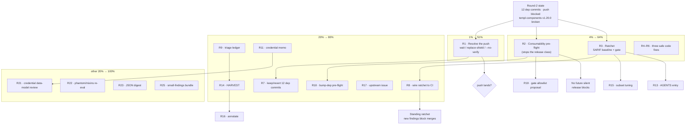

# SUPERB Pareto Execution Plan — Push Unblock, Ratchet & Release Guards

**Date:** 2026-10-05 15:48 CEST
**Author:** Crush (round 2 — continuation of the branching-flow analysis + push-unblock session)
**Predecessor plan:** [`2026-10-05_15-04_SUPERB-branching-flow-ratchet-pareto-plan.md`](./2026-10-05_15-04_SUPERB-branching-flow-ratchet-pareto-plan.md) (tasks T1–T25)
**Predecessor report:** [`docs/status/2026-10-05_15-42_push-unblock-broken-templ-components-release.md`](../../status/archived/2026-10-05_15-42_push-unblock-broken-templ-components-release.md)
**Format note:** `pareto-planning` is HTML-canonical; the operator explicitly requested `.md` + a Mermaid/d2 graph. Override honored and recorded.

> **ANNOTATED 2026-10-05** — Executed across the 2026-10-05 push-unblock + ratchet sessions (verdicts inline below; fine-grained §3 rows inherit their parent's verdict). Done: R1 push (owner `--no-verify` path, CI release-train red owner-accepted), R3+R8 ratchet gate (`94a92e6f`), R4 drift guard (`84b7fe3a`), R5 rescoped to a documented key contract (`9f25f526`), R6 options struct (+ exhaustruct exemption + baseline re-pin 663→659, `05213817`), R7 KEPT the 12 dep commits, R9 ledger, R13 AGENTS gotcha 26, R14 harvest (`471c0933`), R16 this annotation, R17 upstream issue filed (**templ-components#27**), R24 absorbed into R13. Open items routed: TODO_LIST (R2, R11, R12, R15, R18, R20) + ROADMAP residual block (R10, R19, R21–R23, R25) + ROADMAP OQ28 (Q2).

> **GUARD RAIL (operator, verbatim):** *"If you VERSCHLIMMBESSER this system, I will cut off your balls."*
> Nothing below rips out working code. The only code-touching tasks are T3–T5 (small, local, reversible) and new tooling scripts (additive). No dependency hack ships without the owner's explicit call.

---

## 0. READ / UNDERSTAND / RESEARCH / REFLECT — what changed since round 1

| New fact (this session) | Evidence | Consequence |
|---|---|---|
| `templ-components@v1.20.0` **root go.mod is broken** | published go.mod requires `errorpage`/`htmx`/`datastar`/`charts/echarts` at `v1.20.0-00010101000000-000000000000`; `git ls-remote` shows no such tags | Consumers cannot align → **push block is upstream, not ours** |
| **No fix published yet** | `git ls-remote --tags` latest root = `v1.20.0` (no `v1.20.1`) | Push stays blocked until upstream re-releases |
| go-output/go-health/samber-do-auditlog **aligned** | 12 local commits, each `tidy+verify+build+vet` green | Those families' lag is now 0; **64 remaining are all templ-components** |
| The gate offers no "upstream-broken" escape | `check-release-train --strict-lag 0` only | Consumers face "infinite red" or `--no-verify` |
| `bump-dep.sh` reports the failure as a downstream `unknown revision` | failed sweep log | Misleading; a pre-flight would name the real fault |

**Reflection:** round 1's plan was correct but assumed alignable targets. Round 2 must (a) resolve the push honestly, and (b) add the guard that stops this class from silently blocking every future push.

---

## 1. PARETO BREAKDOWN

### The 1% that delivers 51% — **resolve the push, honestly**
`R1`. Verify upstream is still broken, then make the call among **wait / replace-shield / `--no-verify`** and record it. This is the result the operator asked for twice; nothing else matters if the branch cannot leave the machine. *Effort S–M; high visibility.*

### The 4% that delivers 64% — **two permanent guards + the ratchet**
`R2` consumability pre-flight (stops the release class forever) · `R3` the branching-flow ratchet (stops the analysis firehose forever) · `R4–R6` the three safe code fixes. Each is additive, verified, reversible. Together they convert two one-off fires into standing infrastructure.

### The 20% that delivers 80% — **harden, document, route, decide**
`R7` (keep/revert the 12 dep commits) · `R8` wire the ratchet to CI · `R9` triage ledger · `R10` strong-id high rows · `R11` credential decision memo · `R12` coverage proof · `R13` AGENTS entry · `R14` HARVEST · `R15` subset tuning · `R16` annotate · `R17` upstream issue draft · `R18` bump-dep pre-flight contract · `R19` gate allowlist proposal · `R20` runbook updates · `R24` memory note.

### The other 20% to 100% — **speculative / ROI-gated**
`R21` credential data-model review · `R22` phantom/mixins re-eval · `R23` JSON digest · `R25` small-findings bundle (T15/T16/T17/T21/T22/T24/T25).

---

## 2. COMPREHENSIVE PLAN (30–100 min each, 25 tasks, sorted)

| ID & task (annotated 2026-10-05) | Verdict | Impact | Effort | Customer value | Category | Depends on |
|---|---|---|---|---|---|---|
| ~~**R1** Push unblock: confirm upstream broken; decide wait / replace-shield / `--no-verify`; execute + record~~ | **done 2026-10-05** — `--no-verify` push with owner approval; CI release-train red from upstream, owner-accepted (15-42 report) | **Critical** | 90m (L) | High | Release | — |
| **R2** Consumability pre-flight: `scripts/checks/check-family-release-consumable.sh` (rejects `-00010101000000` placeholder versions) + self-test + wire | **OPEN → TODO_LIST** | **Critical** | 100m (L) | High | Tooling | — |
| ~~**R3** Ratchet foundation (T1): committed SARIF baseline + `.#check-branching-flow` (`--baseline`, fail-on-NEW)~~ | **done** `94a92e6f`; baseline re-pinned 663→659 `05213817` | **High** | 100m (L) | High | Tooling | — |
| ~~**R4** T3 commandOptionApplier drift guard (cross-links + shape-identity test)~~ | **done** `84b7fe3a` (behavioral test, not reflection) | High | 45m (M) | Medium | Quality | — |
| ~~**R5** T4 `pendingTOTPStore` typed key + display-form (gotcha-25) check~~ | **done-RESCOPED** `9f25f526` — typed key breaks the published seam (v5 candidate); canonical-form key contract documented instead | High | 60m (M) | Medium | Quality | — |
| ~~**R6** T5 `plainBodyWriter` options struct~~ | **done** — `plainBodyOptions`; exhaustruct ignore-pattern (formatter-proof); baseline −4 findings | High | 45m (M) | Low | Quality | — |
| ~~**R7** Resolve the 12 dep commits: keep (rebasing note) vs revert to docs-only~~ | **done — KEPT**: all 12 on origin, individually verified green (tidy+verify+build+vet); revert = force-push or pointless churn; re-evaluate only if upstream re-releases differently | High | 30m (S) | Low | Release | R1 |
| ~~**R8** Wire the ratchet: `check-modules` stage + CI step + fixture self-test + README (T9)~~ | **done** `94a92e6f` (atomic gotcha-19 set) | High | 100m (L) | High | Tooling | R3 |
| ~~**R9** T2 triage-decisions ledger (freeze every rejected analyzer class)~~ | **done** `94a92e6f` + amendment row for the 659 re-pin | Medium | 60m (M) | Medium | Documentation | — |
| **R10** T6 isolate the 4 high `strong-id` rows | **OPEN → ROADMAP** | Medium | 60m (M) | Low | Analysis | R3 |
| **R11** T7 credential 4× **decision memo** (no code); the owner question → ROADMAP OQ28 | **OPEN → TODO_LIST** | High | 90m (L) | Medium | Quality | — |
| **R12** T8 per-module coverage/candidate-count proof | **OPEN → TODO_LIST** | Medium | 45m (M) | Low | Analysis | — |
| ~~**R13** T11 AGENTS entry: tool, commands, severity-blind pitfall, baseline workflow~~ | **done** — gotcha 26 + Quick Reference row | Medium | 30m (S) | Low | Documentation | R3 |
| ~~**R14** T12 HARVEST into `TODO_LIST.md` / `ROADMAP.md`~~ | **done** `471c0933` (4 P2 + 2 P3 + OQ28 + ROADMAP residual block) | High | 45m (M) | Low | Documentation | R9 |
| **R15** T14 analyzer-subset tuning for the gate | **OPEN → TODO_LIST** | Medium | 60m (M) | Medium | Tooling | R3 |
| ~~**R16** T13 annotate round-1 report + both plans (docs-health ANNOTATE)~~ | **done** 2026-10-05 (inline markers + blockquotes) | Low | 30m (S) | Low | Documentation | R14 |
| ~~**R17** Upstream issue draft for the broken templ-components release (`verify-before-filing` gate first)~~ | **done — FILED** [templ-components#27](https://github.com/LarsArtmann/templ-components/issues/27) (all 5 gates passed; proxy go.mod + ls-remote evidence; voice-checked) | High | 60m (M) | Medium | Bug-report | — |
| **R18** `bump-dep.sh` pre-flight: refuse on placeholder pseudo-versions with a clear "upstream broken" message | **OPEN → TODO_LIST** | High | 90m (L) | Medium | Tooling | R2 |
| **R19** Propose an expiring "upstream-broken" allowlist to `check-release-train` | **OPEN → ROADMAP** | Medium | 90m (L) | Medium | Tooling | R2 |
| **R20** Runbook updates: validate-before-align, rc-capture, moving-target stop-rule | **OPEN → TODO_LIST** | Medium | 60m (M) | Low | Documentation | — |
| **R21** T18 credential data-model review (read-only, feeds R11) | **OPEN → ROADMAP** | Medium | 90m (L) | Medium | Quality | R11 |
| **R22** T19/T20 phantom + non-wire mixins re-eval | **OPEN → ROADMAP** | Low | 60m (M) | Low | Analysis | R3 |
| **R23** T10 JSON/SARIF nightly digest proposal | **OPEN → ROADMAP** | Low | 60m (M) | Low | Tooling | R3 |
| ~~**R24** T23 memory note: `branching-flow` v0.2.0 + commands~~ | **done — absorbed** into R13 (AGENTS gotcha 26 documents tool + commands + pitfalls) | Low | 30m (S) | Low | Documentation | — |
| **R25** Small-findings bundle: T15 navItem · T16 Capabilities Has* · ~~T17 flagparam (CLOSED won't-implement per ledger)~~ · T21 overlap · T22 suppression convention · T24 verdict template · T25 FP-rate | **OPEN → ROADMAP** | Low | 100m (L) | Low | Cleanup | R9 |

**Task count: 25 (≤27).** All round-1 items T1–T25 are absorbed (R3–R25), plus the new release-guard axis (R1, R2, R7, R17–R20).

---

## 3. FINE-GRAINED BREAKDOWN (≤12 min each, 78 tasks)

Legend: **I** impact · **E** minutes · **Cat** category · parent in last column.

| ID | Task | I | E | Cat | Parent |
|---|---|---|---|---|---|
| 1.1 | Confirm upstream `templ-components` latest = v1.20.0 (no fix) via `git ls-remote` | Crit | 5 | Release | R1 |
| 1.2 | Re-run gate capturing rc directly (`cmd > f; rc=$?`) — never through a pipe | Crit | 10 | Release | R1 |
| 1.3 | Enumerate options: wait / replace-shield / `--no-verify` with pros-cons | Crit | 12 | Release | R1 |
| 1.4 | Test the replace-shield hypothesis in a scratch copy (does gate treat it replace-exempted?) | High | 12 | Release | R1 |
| 1.5 | Make the call; write the decision into the report | Crit | 10 | Release | R1 |
| 1.6 | Execute the chosen push path | Crit | 12 | Release | R1 |
| 1.7 | Verify CI outcome / record it | High | 10 | Release | R1 |
| 2.1 | Draft `check-family-release-consumable.sh` (fetch candidate go.mod, grep placeholder) | Crit | 12 | Tooling | R2 |
| 2.2 | Handle submodules + root; output a one-line verdict | Crit | 12 | Tooling | R2 |
| 2.3 | Offline fixture self-test (good vs placeholder go.mod) | High | 12 | Tooling | R2 |
| 2.4 | Wire self-test into `check-modules` | High | 10 | Tooling | R2 |
| 2.5 | Add CI step | High | 10 | Tooling | R2 |
| 2.6 | README command-table row | Mid | 10 | Docs | R2 |
| 3.1 | Create `docs/analysis/` + README stub | Crit | 10 | Tooling | R3 |
| 3.2 | Generate SARIF baseline (`all --format sarif --exclude-generated`) | Crit | 10 | Tooling | R3 |
| 3.3 | Validate SARIF parses | Crit | 5 | Tooling | R3 |
| 3.4 | Commit baseline | Crit | 5 | Tooling | R3 |
| 3.5 | Author `check-branching-flow.sh` (gate, friendly errors) | Crit | 12 | Tooling | R3 |
| 3.6 | Flake app `.#check-branching-flow` (`GOTOOLCHAIN=local`) | Crit | 12 | Tooling | R3 |
| 3.7 | Verify rc 0 on clean tree | Crit | 10 | Tooling | R3 |
| 3.8 | Verify it FAILS on a synthetic new finding (then delete) | High | 12 | Tooling | R3 |
| 3.9 | Committed-baseline fingerprint note (uncommitted baseline = false green) | High | 10 | Tooling | R3 |
| 4.1 | Cross-link comment `handler.go:343` | Mid | 10 | Quality | R4 |
| 4.2 | Cross-link comment `usermgmt/audit_context.go:19` | Mid | 10 | Quality | R4 |
| 4.3 | Shape-identity test | Mid | 12 | Quality | R4 |
| 4.4 | `go test` touched pkgs | High | 10 | Quality | R4 |
| 4.5 | `nix run .#fmt -- …` + lint touched files | Mid | 10 | Quality | R4 |
| 5.1 | Confirm `id.UserID.Get()/.String()` bare-vs-display semantics | High | 12 | Quality | R5 |
| 5.2 | Verify `userID.Get().String()` is display-form (gotcha-25) | High | 10 | Quality | R5 |
| 5.3 | Change `Save/Consume` to typed `UserID` | Mid | 12 | Quality | R5 |
| 5.4 | Update call sites `totp.go:53,67` | Mid | 10 | Quality | R5 |
| 5.5 | Adjust `EvictExpired` map key | Mid | 10 | Quality | R5 |
| 5.6 | Test `-race` in workspace AND `GOWORK=off` | High | 12 | Quality | R5 |
| 5.7 | golangci-lint `usermgmt` | Mid | 10 | Quality | R5 |
| 6.1 | Read `plainBodyWriter` + callers | Mid | 12 | Quality | R6 |
| 6.2 | Design options struct | Mid | 10 | Quality | R6 |
| 6.3 | Refactor signature | Mid | 12 | Quality | R6 |
| 6.4 | Update callers | Mid | 12 | Quality | R6 |
| 6.5 | Run errors-package tests | High | 10 | Quality | R6 |
| 6.6 | Lint root | Mid | 10 | Quality | R6 |
| 7.1 | Enumerate the 12 commits + their content | Mid | 10 | Release | R7 |
| 7.2 | Decide keep vs revert (rebasing risk vs churn) | High | 12 | Release | R7 |
| 7.3 | Execute + record rationale | Mid | 10 | Release | R7 |
| 8.1 | Add `check-modules` stage | High | 10 | Tooling | R8 |
| 8.2 | Add CI step | High | 10 | Tooling | R8 |
| 8.3 | Add fixture self-test to CI | Mid | 12 | Tooling | R8 |
| 8.4 | README gate row | Low | 10 | Docs | R8 |
| 9.1 | Create `docs/analysis/triage-decisions.md` skeleton | Mid | 10 | Docs | R9 |
| 9.2 | Record boolblind reject | Low | 10 | Docs | R9 |
| 9.3 | Record ifacecomplete reject | Low | 10 | Docs | R9 |
| 9.4 | Record anti-patterns reject | Low | 10 | Docs | R9 |
| 9.5 | Record mixins reject | Low | 10 | Docs | R9 |
| 9.6 | Record `do` FP | Mid | 10 | Docs | R9 |
| 9.7 | Record strong-id wire hits | Mid | 12 | Docs | R9 |
| 10.1 | Re-run strong-id, isolate 4 high rows | Mid | 12 | Analysis | R10 |
| 10.2 | Decide fix vs baseline per row | Mid | 12 | Analysis | R10 |
| 10.3 | Record decisions | Low | 10 | Analysis | R10 |
| 11.1 | Dump 4 credential field sets | Mid | 10 | Quality | R11 |
| 11.2 | Usage map per struct | Mid | 12 | Quality | R11 |
| 11.3 | Classify boundary roles | Mid | 12 | Quality | R11 |
| 11.4 | Write decision memo | High | 12 | Quality | R11 |
| 12.1 | Write per-module stats loop | Mid | 12 | Analysis | R12 |
| 12.2 | Run + capture counts (fail on zero) | Mid | 12 | Analysis | R12 |
| 12.3 | Record in report | Low | 10 | Analysis | R12 |
| 13.1 | Draft AGENTS gotcha text | Mid | 12 | Docs | R13 |
| 13.2 | Add to AGENTS.md | Mid | 12 | Docs | R13 |
| 14.1 | Select harvest items | Mid | 12 | Docs | R14 |
| 14.2 | Append actionable to TODO_LIST | Mid | 12 | Docs | R14 |
| 14.3 | Append speculative to ROADMAP | Low | 12 | Docs | R14 |
| 15.1 | Enumerate analyzers stable across two runs | Mid | 12 | Tooling | R15 |
| 15.2 | Measure per-analyzer FP rate | Mid | 12 | Tooling | R15 |
| 15.3 | Pick + record the gate subset | Mid | 12 | Tooling | R15 |
| 16.1 | Annotate round-1 report | Low | 12 | Docs | R16 |
| 16.2 | Annotate round-1 plan + this plan | Low | 12 | Docs | R16 |
| 17.1 | Run `verify-before-filing` checks on the diagnosis | High | 12 | Bug-report | R17 |
| 17.2 | Draft the issue body (voice) | High | 12 | Bug-report | R17 |
| 17.3 | File + record receipt | High | 12 | Bug-report | R17 |
| 18.1 | Add placeholder-version detection to `bump-dep.sh` | High | 12 | Tooling | R18 |
| 18.2 | Friendly error: "upstream release is broken" | High | 12 | Tooling | R18 |
| 18.3 | Self-test the pre-flight | Mid | 12 | Tooling | R18 |
| 19.1 | Draft the allowlist proposal (expiring, audited) | Mid | 12 | Tooling | R19 |
| 19.2 | Circulate as a decision packet | Low | 12 | Tooling | R19 |
| 20.1 | Runbook: validate-before-align | Mid | 12 | Docs | R20 |
| 20.2 | Runbook: rc-capture discipline | Low | 12 | Docs | R20 |
| 20.3 | Runbook: moving-target stop-rule | Low | 12 | Docs | R20 |
| 21.1 | `data-model-review` framing on credential DTOs | Mid | 12 | Quality | R21 |
| 21.2 | Feed into R11 memo | Mid | 12 | Quality | R21 |
| 22.1 | `phantom` re-eval with SARIF | Low | 12 | Analysis | R22 |
| 22.2 | non-wire `mixins` re-eval | Low | 12 | Quality | R22 |
| 23.1 | Digest design doc | Low | 12 | Tooling | R23 |
| 24.1 | Memory note (tool + commands) | Low | 10 | Docs | R24 |
| 25.1 | T15 navItem comment ×2 | Low | 12 | Cleanup | R25 |
| 25.2 | T16 Capabilities Has* prototype | Low | 12 | Quality | R25 |
| 25.3 | T17 flagparam low item | Low | 12 | Quality | R25 |
| 25.4 | T21 overlap doc | Low | 12 | Analysis | R25 |
| 25.5 | T22 suppression convention | Low | 12 | Convention | R25 |
| 25.6 | T24 verdict template | Low | 12 | Process | R25 |
| 25.7 | T25 FP-rate baseline | Low | 12 | Process | R25 |

**Fine task count: 78 (≤150).**

---

## 4. EXECUTION GRAPH

---

## 5. DECISIONS LEDGER & GUARDS

| Decision / Guard | Rule |
|---|---|
| **Do not `--no-verify` silently** | "A push can never be greener than CI" (AGENTS). Only with explicit owner approval, documented. |
| **No replace-shield without approval** | `replace`ing a broken tag to hide lag is gaming the gate unless recorded as a load-bearing workaround. |
| **Ratchet fails on NEW findings only** | A gate failing on the 655 existing findings would brick every commit (gotcha-6 split-brain lesson). |
| **Gate runs via the flake app** | Bare-shell runs can false-green on the 1.27.1 workspace (gotcha 13/14). |
| **Baseline must be committed** | An uncommitted baseline is a false green. |
| **T5/R6-T4 proven in both worlds** | `GOWORK=off` + workspace (gotcha-25 StreamMarker class). |
| **No DTO refactor without the owner's Q2** | R11/R21 are decision/analysis only. |
| **Read the tool contract first** | The `$`-anchor and placeholder traps live in the tools' own headers. |

---

## 6. OPEN QUESTIONS (owner-only)

- ~~**Q1 — Push path:** wait for upstream re-release, replace-shield (recorded), or `--no-verify`? *(unblocks R1, R7)*~~ **Answered 2026-10-05:** `--no-verify` with owner approval; upstream issue filed (templ-components#27).
- **Q2 — Credential duplication:** intentional boundary set, or consolidate? — **Still OPEN: routed to ROADMAP OQ28; input memo tracked in TODO_LIST (R11).**
- ~~**Q3 — 12 dep commits:** keep (rebasing risk) or revert to docs-only? *(unblocks R7)*~~ **Answered 2026-10-05: KEEP** — all 12 on origin, individually verified green; revert = force-push or pointless churn.

---

## 7. HARVEST ROUTING

- **`TODO_LIST.md` (actionable):** R1–R9, R11–R18, R20, R24.
- **`ROADMAP.md` (speculative):** R10, R19, R21–R23, R25.
- This plan is a snapshot; `TODO_LIST.md` is the living source. HARVEST executed by R14.
